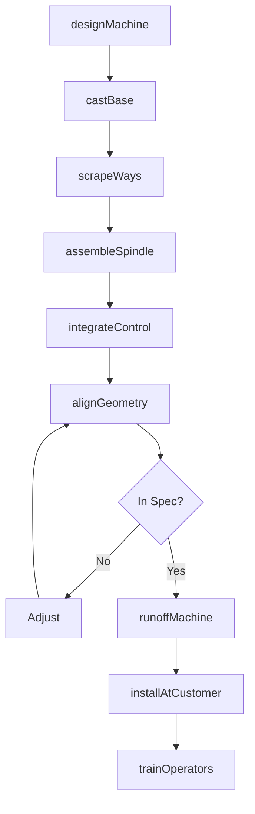

# Machine Tool Manufacturing

> Business-as-Code definition for machine tool manufacturing operations. Models the complete production lifecycle from CNC machine design through customer installation including lathes, mills, grinders, and metal forming equipment.

## Overview

Machine tool manufacturing involves producing metal cutting and metal forming machines including CNC lathes, machining centers, grinders, press brakes, and punch presses. Operations coordinate with precision component suppliers, control system vendors, and manufacturers requiring production machinery. This definition exposes actions for machine engineering, precision assembly, and customer installation with events for automation and searches for machine performance analytics.

## Actors

| Actor | Description |
|-------|-------------|
| CastingSupplier | Provides machine bases and structural castings |
| SpindleVendor | Supplies precision spindles and bearings |
| CNCControlVendor | Provides control systems and software |
| ServoSupplier | Supplies motors and drives |
| MachineDistributor | Sells and services machine tools |
| ManufacturingPlant | End customer producing parts |
| JobShop | Contract machining customer |
| MachineTrade Assoc | Industry standards and trade organization |

## Roles

| Role | Description |
|------|-------------|
| MachineDesigner | Engineers machine structure and kinematics |
| ControlsEngineer | Develops automation and CNC integration |
| AssemblyTechnician | Builds and aligns machine components |
| ApplicationEngineer | Configures machines for customer processes |
| FieldServiceEngineer | Installs and maintains machines |
| SalesEngineer | Supports customer machine selection |

## Entities

| Entity | Description |
|--------|-------------|
| CNCLathe | Computer-controlled turning machine |
| MachiningCenter | Multi-axis milling machine |
| Grinder | Precision material removal machine |
| PressBrake | Sheet metal bending machine |
| PunchPress | Sheet metal blanking machine |
| Spindle | Rotating workholding or tool-holding |
| BallScrew | Linear motion component |
| CNCControl | Computer numerical control system |
| Waycover | Machine protection enclosure |
| ToolChanger | Automatic tool storage and exchange |

## Actions

| Action | Description |
|--------|-------------|
| designMachine | Engineer structure, kinematics, and systems |
| castBase | Pour and machine structural castings |
| scrapeWays | Hand-fit precision slideways |
| assembleSpindle | Build and test spindle assembly |
| integrateControl | Install CNC and electrical systems |
| alignGeometry | Verify and adjust machine accuracy |
| runoffMachine | Test with customer part program |
| installAtCustomer | Set up machine at manufacturing site |
| trainOperators | Certify customer staff on operation |
| performService | Execute maintenance and repairs |
| retrofitControl | Upgrade CNC system on older machine |
| rebuildMachine | Complete overhaul of used equipment |

## Events

| Event | Description |
|-------|-------------|
| designReleased | Machine engineering approved |
| castingsReceived | Structural components delivered |
| waysScraped | Precision surfaces completed |
| spindleAssembled | Spindle ready for installation |
| controlIntegrated | CNC system operational |
| geometryVerified | Machine accuracy confirmed |
| runoffCompleted | Customer acceptance testing done |
| machineInstalled | Operational at customer site |
| operatorsTrained | Staff certified |
| serviceScheduled | Maintenance interval reached |

## Searches

| Search | Description |
|--------|-------------|
| getMachineStatus | Retrieve manufacturing progress |
| findInstalledBase | Query machines by customer |
| getMachineAccuracy | Retrieve geometric measurements |
| trackProductionData | Monitor parts produced |
| findServiceHistory | Get maintenance records |
| getMachineUptime | Track availability metrics |
| findRetrofitCandidates | Query machines for upgrades |
| getWarrantyClaims | Retrieve warranty issues |

## Workflow



## Actor Relationships

```mermaid
graph LR
    M[Manufacturer]

    M -->|buys from| CastingSupplier
    M -->|buys from| SpindleVendor
    M -->|buys from| CNCControlVendor
    M -->|buys from| ServoSupplier
    M -->|sells via| MachineDistributor
    M -->|sells to| ManufacturingPlant
    M -->|sells to| JobShop
    M -->|member of| MachineTrade Assoc
```

## Usage

### Calling Actions

```typescript
import { manufactureMachineTools } from '@headlessly/manufacture-machine-tools'

const factory = manufactureMachineTools()

// Review current status
const status = await factory.getMachineStatus()

// Search catalog
const catalog = await factory.findInstalledBase()

// Design 5-axis machining center
const machine = await factory.designMachine({
  type: 'vertical-machining-center',
  axes: 5,
  travels: { x: 800, y: 500, z: 500 }, // mm
  spindleSpeed: 15000, // rpm
  toolCapacity: 40,
  tableLoad: 500 // kg
})

// Integrate CNC control
await factory.integrateControl({
  machineId: machine.id,
  control: 'fanuc-31i-b5',
  options: ['aicc-2', 'fine-surface', 'smooth-tolerance'],
  probing: 'renishaw-rmp600'
})

// Install at customer
await factory.installAtCustomer({
  machineId: machine.id,
  customerId: 'precision-aerospace-inc',
  location: 'plant-2-cell-7',
  rigging: 'included',
  installation: 'turnkey'
})
```

### Event-Driven Automation

```typescript
// Proactive service scheduling
factory.serviceScheduled(async ({ machineId, serviceType, hoursOperated }) => {
  const parts = await getMachineParts({
    machineId,
    serviceKit: serviceType
  })

  await factory.performService({
    machineId,
    serviceType,
    parts,
    technicianAssignment: 'regional'
  })
})

// Production monitoring alerts
factory.geometryVerified(async ({ machineId, measurements, tolerance }) => {
  if (measurements.volumetricError > tolerance * 0.8) {
    await notifyCustomer({
      machineId,
      alert: 'accuracy-degrading',
      recommendation: 'schedule-geometric-compensation'
    })
  }
})
```

## Related

- [Cutting Tool Manufacturing](./333515-CuttingToolAndMachineToolAccessoryManufacturing.mdx)
- [Rolling Mill Manufacturing](./333519-RollingMillAndOtherMetalworkingMachineryManufacturing.mdx)
- [Industrial Mold Manufacturing](./333511-IndustrialMoldManufacturing.mdx)
