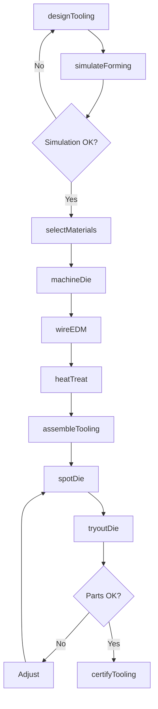
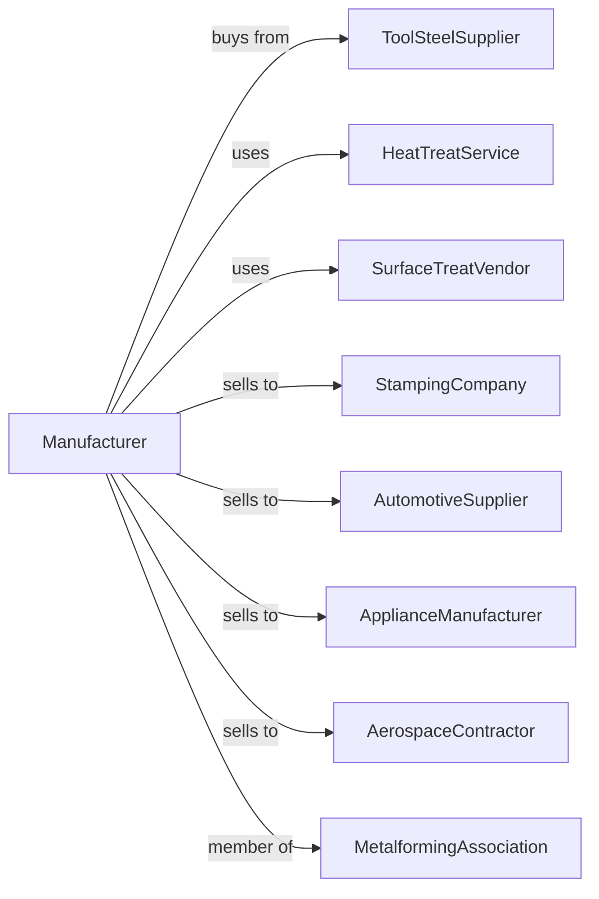

# Special Die and Tool, Die Set, Jig, and Fixture Manufacturing

> Business-as-Code definition for special die and tool manufacturing operations. Models the complete production lifecycle from tooling design through production qualification including stamping dies, progressive dies, jigs, and fixtures for manufacturing automation.

## Overview

Special die and tool manufacturing involves producing stamping dies, forming dies, jigs, fixtures, and gages for manufacturing operations. Tool and die shops coordinate with steel suppliers, heat treat services, and manufacturers requiring custom tooling for production automation. This definition exposes actions for tooling engineering, precision fabrication, and tryout qualification with events for automation and searches for tooling performance analytics.

## Actors

| Actor | Description |
|-------|-------------|
| ToolSteelSupplier | Provides die steels and carbide materials |
| HeatTreatService | Provides hardening and tempering services |
| SurfaceTreatVendor | Supplies coatings and surface treatments |
| StampingCompany | Customer operating press operations |
| AutomotiveSupplier | Automotive tier supplier requiring dies |
| ApplianceManufacturer | Appliance company needing stamping tools |
| AerospaceContractor | Aerospace manufacturer with precision needs |
| MetalformingAssociation | Industry standards and training organization |

## Roles

| Role | Description |
|------|-------------|
| ToolEngineer | Designs dies, jigs, and fixtures |
| DieDesigner | Engineers stamping die geometry |
| DieMaker | Machines and fits die components |
| JigBuilder | Fabricates workholding fixtures |
| TryoutTechnician | Tests tooling in production presses |
| QualityMetrologist | Measures and certifies tooling |

## Entities

| Entity | Description |
|--------|-------------|
| StampingDie | Tool for forming sheet metal |
| ProgressiveDie | Multi-station stamping tool |
| TransferDie | Tool for transfer press operations |
| Jig | Workholding and guiding device |
| Fixture | Workholding for machining or assembly |
| Gage | Inspection and measurement device |
| DieSet | Standard die mounting components |
| DieShoe | Base plate holding die components |
| Punch | Male forming component |
| DieCavity | Female forming component |

## Actions

| Action | Description |
|--------|-------------|
| designTooling | Engineer die, jig, or fixture |
| simulateForming | Model material flow and stresses |
| selectMaterials | Choose steels and coatings |
| machineDie | CNC mill and grind components |
| wireEDM | Cut complex profiles with wire EDM |
| heatTreat | Harden die components |
| assembleTooling | Fit and align components |
| spotDie | Set clearances and timing |
| tryoutDie | Test in press with material |
| certifyTooling | Document and approve for production |
| maintainTooling | Sharpen, repair, and refurbish |
| engineerChange | Modify tooling for design updates |

## Events

| Event | Description |
|-------|-------------|
| designReleased | Tooling engineering approved |
| simulationCompleted | Forming analysis finished |
| machiningCompleted | Components machined |
| heatTreatCompleted | Hardening finished |
| toolingAssembled | Components fitted |
| tryoutCompleted | Press testing finished |
| toolingCertified | Approved for production |
| toolingShipped | Delivered to customer |
| maintenanceRequired | Service interval reached |
| engineeringChangeRequested | Design modification needed |

## Searches

| Search | Description |
|--------|-------------|
| getToolingStatus | Retrieve manufacturing progress |
| findToolingByPart | Query tooling by part number |
| getStrokeCount | Track die cycles |
| getTryoutResults | Retrieve test data |
| findMaintenanceHistory | Get service records |
| getPartQuality | Retrieve produced part metrics |
| findToolingInventory | Query stored tooling |
| getChangeHistory | Track engineering modifications |

## Workflow



## Actor Relationships



## Usage

### Calling Actions

```typescript
import { manufactureSpecialDiesTools } from '@headlessly/manufacture-special-dies-tools'

const toolshop = manufactureSpecialDiesTools()

// Design progressive stamping die
const die = await toolshop.designTooling({
  type: 'progressive-die',
  partNumber: 'bracket-assy-r',
  material: 'galvanized-steel',
  thickness: 0.060, // inches
  stations: 12,
  pressCapacity: 400, // tons
  spm: 40 // strokes per minute
})

// Simulate forming
await toolshop.simulateForming({
  toolingId: die.id,
  software: 'autoform',
  analyses: ['springback', 'thinning', 'wrinkling'],
  iterations: 5
})

// Tryout in press
await toolshop.tryoutDie({
  toolingId: die.id,
  pressId: 'tryout-press-600t',
  coilWidth: 12, // inches
  partsToRun: 500,
  cpkTarget: 1.67
})
```

### Event-Driven Automation

```typescript
// Auto-schedule maintenance
toolshop.maintenanceRequired(async ({ toolingId, strokeCount, interval }) => {
  await toolshop.maintainTooling({
    toolingId,
    serviceType: 'sharpen-and-inspect',
    tasks: ['measure-punch-length', 'sharpen-cutting-edges', 'inspect-springs']
  })
})

// Handle engineering changes
toolshop.engineeringChangeRequested(async ({ toolingId, changeType, partNumber }) => {
  const tooling = await toolshop.getToolingStatus({ toolingId })

  await toolshop.engineerChange({
    toolingId,
    changeType,
    estimatedHours: getChangeEstimate(changeType),
    affectedStations: tooling.stations.filter(s => s.affected)
  })
})
```

## Related

- [Industrial Mold Manufacturing](./333511-IndustrialMoldManufacturing.mdx)
- [Machine Tool Manufacturing](./333517-MachineToolManufacturing.mdx)
- [Cutting Tool Manufacturing](./333515-CuttingToolAndMachineToolAccessoryManufacturing.mdx)
