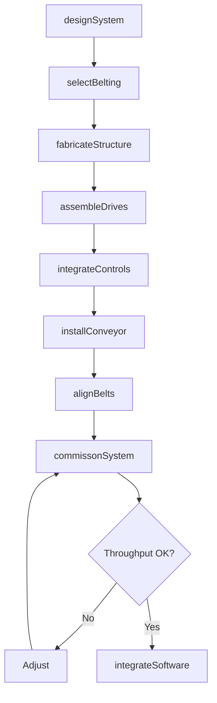
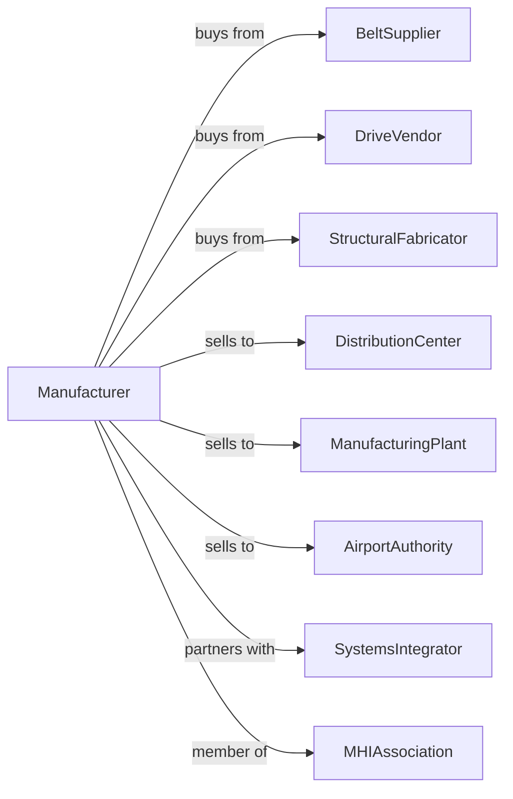

# Conveyor and Conveying Equipment Manufacturing

> Business-as-Code definition for conveyor and conveying equipment manufacturing operations. Models the complete production lifecycle from material handling system design through installation including belt conveyors, roller conveyors, pneumatic systems, and sortation equipment.

## Overview

Conveyor and conveying equipment manufacturing involves producing material handling systems including belt conveyors, roller conveyors, pneumatic tube systems, and automated sortation equipment. Operations coordinate with belt suppliers, drive vendors, and distribution centers requiring efficient material flow. This definition exposes actions for conveyor engineering, system integration, and facility installation with events for automation and searches for throughput analytics.

## Actors

| Actor | Description |
|-------|-------------|
| BeltSupplier | Provides conveyor belting and components |
| DriveVendor | Supplies motors, gearboxes, and controls |
| StructuralFabricator | Provides frames and supports |
| DistributionCenter | Warehouse and fulfillment customer |
| ManufacturingPlant | Factory requiring material handling |
| AirportAuthority | Baggage handling customer |
| SystemsIntegrator | Designs and installs complete systems |
| MHIAssociation | Material handling industry organization |

## Roles

| Role | Description |
|------|-------------|
| ConveyorEngineer | Designs material handling systems |
| ControlsEngineer | Develops automation and sorting logic |
| FabricationTechnician | Builds conveyor structures |
| InstallationCrew | Erects conveyors at customer sites |
| CommissioningEngineer | Starts up and optimizes systems |
| ServiceTechnician | Maintains conveyor equipment |

## Entities

| Entity | Description |
|--------|-------------|
| BeltConveyor | Continuous belt material transport |
| RollerConveyor | Gravity or powered roller system |
| SortationSystem | Automated routing equipment |
| AccumulationConveyor | Buffer and metering system |
| PneumaticConveyor | Air-driven material transport |
| CarouselConveyor | Rotating storage and retrieval |
| DrivePulley | Belt drive component |
| TakeUp | Belt tension adjustment |
| Sensor | Package detection and tracking |
| ControlPanel | System automation interface |

## Actions

| Action | Description |
|--------|-------------|
| designSystem | Engineer material handling layout |
| selectBelting | Choose belt type and construction |
| fabricateStructure | Build frames and supports |
| assembleDrives | Install motors and gearboxes |
| integrateControls | Program automation and sorting |
| installConveyor | Erect at customer facility |
| alignBelts | Set tracking and tension |
| commissonSystem | Start up and verify throughput |
| integrateSoftware | Connect to WMS and WCS |
| performanceMonitored | Track throughput and uptime |
| performMaintenance | Execute scheduled service |
| modifyLayout | Reconfigure for changed needs |

## Events

| Event | Description |
|-------|-------------|
| designApproved | System engineering released |
| beltingSelected | Belt specifications confirmed |
| structureFabricated | Frames and supports built |
| drivesAssembled | Motors and gearboxes installed |
| controlsIntegrated | Automation programmed |
| conveyorInstalled | System erected at site |
| beltsAligned | Tracking and tension set |
| systemCommissioned | Throughput verified |
| softwareIntegrated | WMS connection active |
| performanceDegraded | Equipment performance degraded beyond threshold |
| performanceMonitored | System performance metrics collected and analyzed |

## Searches

| Search | Description |
|--------|-------------|
| getSystemStatus | Retrieve manufacturing progress |
| findByFacility | Query conveyors by location |
| getThroughputData | Retrieve items per hour |
| trackUptime | Monitor availability |
| findServiceHistory | Get maintenance records |
| getJamData | Retrieve fault locations |
| findModificationHistory | Track layout changes |
| getEnergyUsage | Monitor power consumption |

## Workflow



## Actor Relationships



## Usage

### Calling Actions

```typescript
import { manufactureConveyors } from '@headlessly/manufacture-conveyors'

const factory = manufactureConveyors()

// Design e-commerce sortation system
const system = await factory.designSystem({
  type: 'cross-belt-sorter',
  throughput: 20000, // items per hour
  destinations: 150,
  itemSize: { min: 4, max: 24 }, // inches
  weight: { min: 0.1, max: 50 }, // pounds
  accuracy: 99.9 // percent
})

// Integrate controls and sorting logic
await factory.integrateControls({
  systemId: system.id,
  plc: 'allen-bradley',
  sortationLogic: 'destination-based',
  inductionRate: 'variable',
  wmInterface: 'api'
})

// Commission system
await factory.commissonSystem({
  systemId: system.id,
  facilityId: 'fulfillment-east',
  throughputTest: true,
  sortAccuracyTest: true,
  trainingIncluded: true
})
```

### Event-Driven Automation

```typescript
// Performance monitoring
factory.performanceDegraded(async ({ systemId, alertType, location }) => {
  if (alertType === 'jam') {
    await factory.getJamData({
      systemId,
      location,
      timeRange: 'last-24h',
      rootCauseAnalysis: true
    })
  }
})

// Predictive maintenance
factory.performanceMonitored(async ({ systemId, uptimePercent }) => {
  if (uptimePercent < 0.98) {
    await factory.performMaintenance({
      systemId,
      type: 'preventive',
      focus: 'high-fault-areas'
    })
  }
})
```

## Related

- [Elevator Manufacturing](./333921-ElevatorAndMovingStairwayManufacturing.mdx)
- [Crane and Hoist Manufacturing](./333923-OverheadTravelingCraneHoistAndMonorailSystemManufacturing.mdx)
- [Industrial Truck Manufacturing](./333924-IndustrialTruckTractorTrailerAndStackerMachineryManufacturing.mdx)
