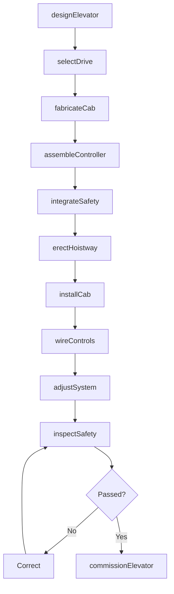
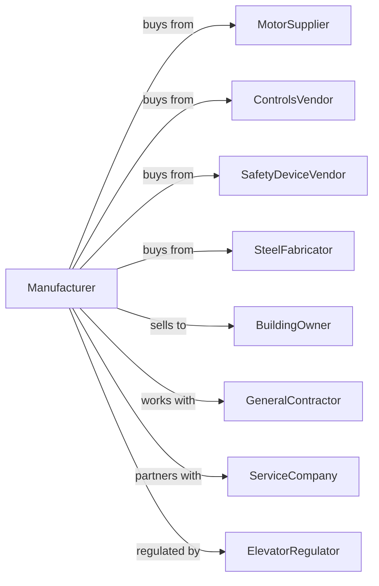

# Elevator and Moving Stairway Manufacturing

> Business-as-Code definition for elevator and escalator manufacturing operations. Models the complete production lifecycle from vertical transportation design through building installation including passenger elevators, freight elevators, escalators, and moving walkways.

## Overview

Elevator and moving stairway manufacturing involves producing vertical and horizontal transportation equipment including traction and hydraulic elevators, escalators, and moving walkways. Operations coordinate with motor suppliers, control system vendors, and building owners requiring reliable vertical transportation. This definition exposes actions for elevator engineering, safety system integration, and building installation with events for automation and searches for performance analytics.

## Actors

| Actor | Description |
|-------|-------------|
| MotorSupplier | Provides hoisting motors and drives |
| ControlsVendor | Supplies elevator control systems |
| SafetyDeviceVendor | Provides governors, buffers, and interlocks |
| SteelFabricator | Supplies guide rails and cab frames |
| BuildingOwner | End customer operating elevators |
| GeneralContractor | Installs elevators during construction |
| ServiceCompany | Maintains and modernizes elevators |
| ElevatorRegulator | Oversees safety codes and inspections |

## Roles

| Role | Description |
|------|-------------|
| ElevatorEngineer | Designs vertical transportation systems |
| ControlsEngineer | Develops elevator control logic |
| SafetyEngineer | Ensures code compliance |
| InstallationTechnician | Erects elevators in buildings |
| AdjusterTechnician | Commissions and fine-tunes systems |
| MaintenanceTechnician | Services installed equipment |

## Entities

| Entity | Description |
|--------|-------------|
| TractionElevator | Cable and counterweight elevator |
| HydraulicElevator | Piston-driven elevator |
| MachineRoomLess | Compact traction elevator |
| Escalator | Moving stairway |
| MovingWalkway | Horizontal people mover |
| Cab | Passenger or freight enclosure |
| Hoistway | Elevator shaft |
| Controller | Elevator operation computer |
| SafetyDevice | Governor, buffer, or interlock |
| MaintenanceContract | Ongoing service agreement |

## Actions

| Action | Description |
|--------|-------------|
| designElevator | Engineer vertical transportation system |
| selectDrive | Choose motor and control system |
| fabricateCab | Build passenger or freight enclosure |
| assembleController | Build elevator control system |
| integrateSafety | Install governors and interlocks |
| erectHoistway | Install guide rails and equipment |
| installCab | Place car in hoistway |
| wireControls | Connect electrical systems |
| adjustSystem | Fine-tune speeds and leveling |
| inspectSafety | Verify code compliance |
| commissionElevator | Approve for passenger use |
| maintenancePerformed | Execute scheduled service |

## Events

| Event | Description |
|-------|-------------|
| designApproved | Elevator engineering released |
| driveSelected | Motor system specified |
| cabFabricated | Enclosure built |
| controllerAssembled | Control system ready |
| safetyIntegrated | Safety devices installed |
| hoistwayErected | Guide rails installed |
| cabInstalled | Car placed in shaft |
| controlsWired | Electrical connected |
| systemAdjusted | Performance optimized |
| inspectionPassed | Code compliance verified |
| maintenancePerformed | Scheduled maintenance service executed |

## Searches

| Search | Description |
|--------|-------------|
| getElevatorStatus | Retrieve manufacturing progress |
| findByBuilding | Query elevators by location |
| getPerformanceData | Retrieve wait times and trips |
| trackServiceHistory | Get maintenance records |
| findInspectionRecords | Query safety documentation |
| getModernizationCandidates | List elevators for upgrade |
| findCallbackData | Retrieve service call history |
| getEnergyUsage | Track power consumption |

## Workflow



## Actor Relationships



## Usage

### Calling Actions

```typescript
import { manufactureElevatorsEscalators } from '@headlessly/manufacture-elevators-escalators'

const factory = manufactureElevatorsEscalators()

// Review current status
const status = await factory.getElevatorStatus()

// Search catalog
const catalog = await factory.findByBuilding()

// Design high-rise traction elevator
const elevator = await factory.designElevator({
  type: 'machine-room-less',
  capacity: 4000, // pounds
  speed: 500, // fpm
  stops: 40,
  rise: 500, // feet
  usage: 'high-rise-office'
})

// Select drive system
await factory.selectDrive({
  elevatorId: elevator.id,
  motor: 'gearless-pm',
  drive: 'regenerative-vvvf',
  control: 'destination-dispatch'
})

// Commission in building
await factory.commissionElevator({
  elevatorId: elevator.id,
  buildingId: 'downtown-tower-1',
  bankId: 'high-rise-bank',
  inspectionAuthority: 'city-elevator-dept',
  witnessTest: true
})
```

### Event-Driven Automation

```typescript
// Safety inspection scheduling
factory.inspectionPassed(async ({ elevatorId, inspectionDate }) => {
  await scheduleNextInspection({
    elevatorId,
    nextDate: addMonths(inspectionDate, 12),
    type: 'annual-safety'
  })
})

// Maintenance callbacks
factory.maintenancePerformed(async ({ elevatorId, serviceType, findings }) => {
  if (findings.length > 0) {
    await factory.trackServiceHistory({
      elevatorId,
      findings,
      resolution: 'scheduled',
      priority: findings.some(f => f.safety) ? 'urgent' : 'routine'
    })
  }
})
```

## Related

- [Conveyor Manufacturing](./333922-ConveyorAndConveyingEquipmentManufacturing.mdx)
- [Crane and Hoist Manufacturing](./333923-OverheadTravelingCraneHoistAndMonorailSystemManufacturing.mdx)
- [Industrial Truck Manufacturing](./333924-IndustrialTruckTractorTrailerAndStackerMachineryManufacturing.mdx)
