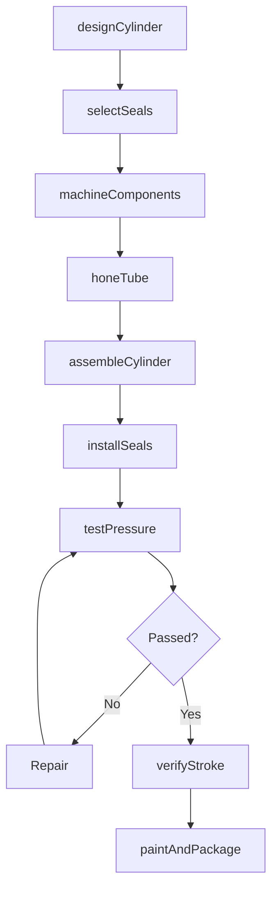
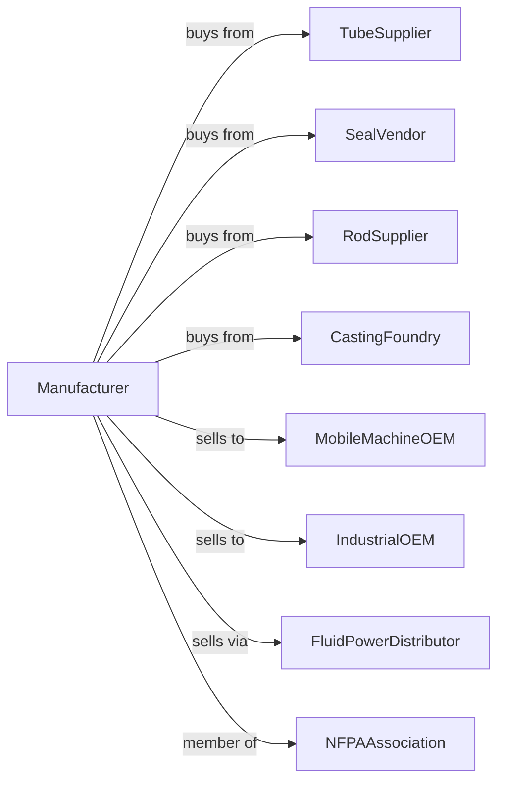

# Fluid Power Cylinder and Actuator Manufacturing

> Business-as-Code definition for hydraulic and pneumatic cylinder manufacturing operations. Models the complete production lifecycle from actuator design through OEM delivery including hydraulic cylinders, pneumatic cylinders, rotary actuators, and linear motion components.

## Overview

Fluid power cylinder and actuator manufacturing involves producing linear and rotary motion devices including hydraulic cylinders, pneumatic cylinders, servo actuators, and electro-hydraulic units. Operations coordinate with tube suppliers, seal vendors, and OEMs requiring reliable motion control. This definition exposes actions for cylinder engineering, precision manufacturing, and application support with events for automation and searches for performance analytics.

## Actors

| Actor | Description |
|-------|-------------|
| TubeSupplier | Provides honed and chrome tubes |
| SealVendor | Supplies piston and rod seals |
| RodSupplier | Provides hardened and chrome rods |
| CastingFoundry | Supplies end caps and mounts |
| MobileMachineOEM | Construction and ag equipment customer |
| IndustrialOEM | Factory automation customer |
| FluidPowerDistributor | Sells to end users and MRO |
| NFPAAssociation | National Fluid Power Association |

## Roles

| Role | Description |
|------|-------------|
| CylinderEngineer | Designs actuator systems |
| ApplicationEngineer | Specifies cylinders for customer needs |
| MachinistOperator | Machines precision components |
| AssemblyTechnician | Builds cylinder units |
| TestTechnician | Validates pressure and performance |
| QualityInspector | Verifies dimensional accuracy |

## Entities

| Entity | Description |
|--------|-------------|
| HydraulicCylinder | Liquid-powered linear actuator |
| PneumaticCylinder | Air-powered linear actuator |
| RotaryActuator | Fluid-powered turning device |
| TieCylinder | Threaded rod assembled cylinder |
| WeldedCylinder | Welded construction cylinder |
| MillCylinder | Heavy-duty industrial cylinder |
| Piston | Internal force transfer element |
| Rod | External motion output element |
| Seal | Pressure containment element |
| Mounting | Cylinder attachment configuration |

## Actions

| Action | Description |
|--------|-------------|
| designCylinder | Engineer actuator specifications |
| selectSeals | Choose seal materials and configurations |
| machineComponents | Produce precision cylinder parts |
| honeTube | Finish bore to seal surface |
| assembleCylinder | Build complete actuator unit |
| installSeals | Fit piston and rod seals |
| testPressure | Verify rated pressure capacity |
| verifyStroke | Confirm travel distance |
| paintAndPackage | Finish and prepare for shipment |
| supportApplication | Assist OEM integration |
| repairCylinder | Rebuild worn unit |
| stockInventory | Maintain standard cylinders |

## Events

| Event | Description |
|-------|-------------|
| designApproved | Cylinder engineering released |
| sealsSelected | Seal configuration specified |
| componentsMachined | Precision parts produced |
| tubeHoned | Bore surface finished |
| cylinderAssembled | Unit built |
| sealsInstalled | Sealing elements fitted |
| pressureTested | Capacity verified |
| strokeVerified | Travel confirmed |
| paintedAndPackaged | Finished for shipment |
| applicationSupported | OEM integration assisted |
| getRepairHistory | Cylinder repair and rebuild records retrieved |

## Searches

| Search | Description |
|--------|-------------|
| getCylinderStatus | Retrieve manufacturing progress |
| findBySpecification | Query cylinders by bore and stroke |
| getPressureTestData | Retrieve test records |
| trackOEMOrders | Monitor customer orders |
| findSealCompatibility | Query seal materials for fluids |
| getRepairHistory | Retrieve rebuild records |
| findStandardCylinders | Query in-stock inventory |
| getMountingOptions | Retrieve available configurations |

## Workflow



## Actor Relationships



## Usage

### Calling Actions

```typescript
import { manufactureHydraulicCylinders } from '@headlessly/manufacture-hydraulic-cylinders'

const factory = manufactureHydraulicCylinders()

// Review current status
const status = await factory.getCylinderStatus()

// Search catalog
const catalog = await factory.findBySpecification()

// Design heavy-duty hydraulic cylinder
const cylinder = await factory.designCylinder({
  type: 'welded-cross-tube',
  bore: 6, // inches
  rod: 3.5, // inches
  stroke: 36, // inches
  pressure: { rated: 3000, proof: 4500 }, // psi
  application: 'excavator-boom',
  mounting: { cap: 'clevis', head: 'cross-tube' }
})

// Select seals for severe duty
await factory.selectSeals({
  cylinderId: cylinder.id,
  piston: {
    material: 'polyurethane',
    backup: 'nylon',
    wearBand: 'bronze-filled-ptfe'
  },
  rod: {
    primary: 'polyurethane-u-cup',
    wiper: 'double-lip',
    buffer: 'nitrile'
  },
  fluid: 'iso-vg-46',
  temperature: { min: -20, max: 200 } // fahrenheit
})

// Test and validate
await factory.testPressure({
  cylinderId: cylinder.id,
  proofTest: 4500, // psi
  leakTest: 3000, // psi
  holdTime: 30, // seconds
  temperature: 'ambient'
})
```

### Event-Driven Automation

```typescript
// OEM order tracking
factory.cylinderAssembled(async ({ cylinderId, orderId, customerId }) => {
  await factory.trackOEMOrders({
    orderId,
    status: 'testing',
    customerId,
    estimatedShipDate: addDays(new Date(), 2)
  })
})

// Rebuild program
factory.getRepairHistory(async ({ serialNumber, failureMode, operatingHours }) => {
  if (failureMode === 'seal-leak') {
    await factory.repairCylinder({
      serialNumber,
      scope: 'reseal',
      seals: 'upgraded',
      testing: 'full',
      warranty: 12 // months
    })
  }
})
```

## Related

- [Fluid Power Pump Manufacturing](./333996-FluidPowerPumpAndMotorManufacturing.mdx)
- [Pump Manufacturing](./333914-MeasuringDispensingAndOtherPumpingEquipmentManufacturing.mdx)
- [Construction Machinery Manufacturing](../3331-AgricultureConstructionAndMiningMachineryManufacturing/333120-ConstructionMachineryManufacturing.mdx)
