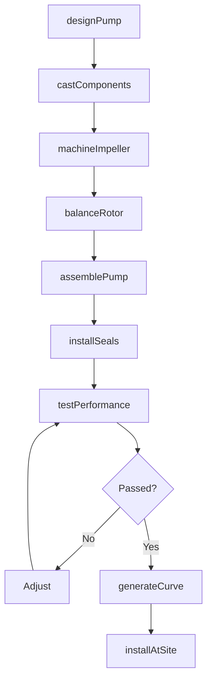
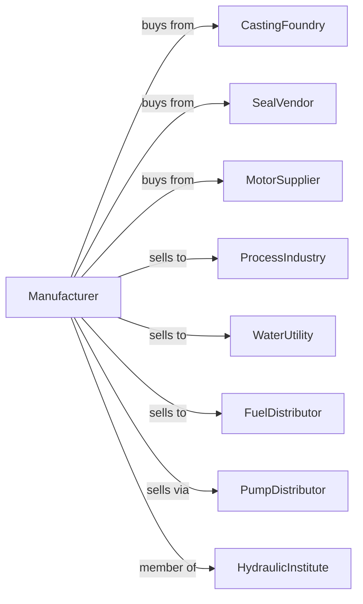

# Measuring, Dispensing, and Other Pumping Equipment Manufacturing

> Business-as-Code definition for pump and dispensing equipment manufacturing operations. Models the complete production lifecycle from pump design through installation including centrifugal, positive displacement, and metering pumps.

## Overview

Pump and dispensing equipment manufacturing involves producing fluid handling equipment including centrifugal pumps, positive displacement pumps, metering pumps, and fuel dispensing systems. Operations coordinate with casting suppliers, seal vendors, and process industries requiring reliable fluid transfer. This definition exposes actions for pump engineering, precision manufacturing, and industrial installation with events for automation and searches for performance analytics.

## Actors

| Actor | Description |
|-------|-------------|
| CastingFoundry | Provides pump housings and impellers |
| SealVendor | Supplies mechanical seals and packings |
| MotorSupplier | Provides electric motors and drives |
| ProcessIndustry | Chemical and petroleum customer |
| WaterUtility | Municipal water and wastewater customer |
| FuelDistributor | Gasoline and diesel dispensing customer |
| PumpDistributor | Sells pumps to end users |
| HydraulicInstitute | Industry standards organization |

## Roles

| Role | Description |
|------|-------------|
| PumpEngineer | Designs pump hydraulics and systems |
| ApplicationEngineer | Selects pumps for customer needs |
| FoundryTechnician | Produces cast pump components |
| AssemblyWorker | Builds pump units |
| TestEngineer | Validates pump performance |
| FieldServiceEngineer | Installs and maintains pumps |

## Entities

| Entity | Description |
|--------|-------------|
| CentrifugalPump | Dynamic impeller-based pump |
| PositiveDisplacementPump | Volume-displacing pump |
| MeteringPump | Precise flow rate pump |
| SubmersiblePump | Submerged operation pump |
| FuelDispenser | Gasoline and diesel pumping equipment |
| Impeller | Rotating hydraulic element |
| MechanicalSeal | Shaft sealing device |
| PumpCurve | Performance characteristic chart |
| MotorMount | Pump-motor connection |
| ControlValve | Flow regulation device |

## Actions

| Action | Description |
|--------|-------------|
| designPump | Engineer hydraulics and construction |
| castComponents | Produce housings and impellers |
| machineImpeller | Precision finish hydraulic elements |
| balanceRotor | Dynamically balance rotating assembly |
| assemblePump | Build complete pump unit |
| installSeals | Fit mechanical seals |
| testPerformance | Verify flow and head |
| generateCurve | Document pump characteristics |
| installAtSite | Set up at customer facility |
| alignPump | Precision align to motor |
| monitorCondition | Track vibration and temperature |
| rebuildPump | Overhaul worn unit |

## Events

| Event | Description |
|-------|-------------|
| designApproved | Pump engineering released |
| componentsCast | Housings and impellers produced |
| impellerMachined | Hydraulic elements finished |
| rotorBalanced | Dynamic balance verified |
| pumpAssembled | Unit built |
| sealsInstalled | Shaft sealing complete |
| performanceTested | Flow and head verified |
| curveGenerated | Characteristics documented |
| pumpInstalled | Operating at customer |
| conditionAlert | Vibration or temperature warning |

## Searches

| Search | Description |
|--------|-------------|
| getPumpStatus | Retrieve manufacturing progress |
| findByApplication | Query pumps by use case |
| getPerformanceCurve | Retrieve pump characteristics |
| trackInstalledBase | Monitor pumps by customer |
| findServiceHistory | Get maintenance records |
| getConditionData | Retrieve vibration and temperature |
| findReplacementParts | Query seal and impeller inventory |
| getEfficiencyData | Track energy consumption |

## Workflow



## Actor Relationships



## Usage

### Calling Actions

```typescript
import { manufacturePumpsDispensingEquipment } from '@headlessly/manufacture-pumps-dispensing-equipment'

const factory = manufacturePumpsDispensingEquipment()

// Review current status
const status = await factory.getPumpStatus()

// Search catalog
const catalog = await factory.findByApplication()

// Design chemical process pump
const pump = await factory.designPump({
  type: 'ansi-centrifugal',
  flow: 500, // gpm
  head: 150, // feet
  fluid: 'sulfuric-acid',
  temperature: 180, // fahrenheit
  material: 'alloy-20'
})

// Machine precision impeller
await factory.machineImpeller({
  pumpId: pump.id,
  material: 'alloy-20',
  balanceGrade: 'g2.5',
  surfaceFinish: 32 // ra
})

// Test and generate curve
await factory.testPerformance({
  pumpId: pump.id,
  testPoints: [0, 25, 50, 75, 100, 125], // percent of BEP
  npsh: true,
  efficiency: true
})
```

### Event-Driven Automation

```typescript
// Condition-based maintenance
factory.conditionAlert(async ({ pumpId, alertType, severity }) => {
  if (severity === 'critical') {
    await factory.rebuildPump({
      pumpId,
      priority: 'emergency',
      parts: ['seals', 'bearings', 'wear-rings']
    })
  }
})

// Performance tracking
factory.pumpInstalled(async ({ pumpId, customerId, applicationId }) => {
  await factory.monitorCondition({
    pumpId,
    customerId,
    metrics: ['vibration', 'temperature', 'flow', 'pressure'],
    alertThresholds: getThresholds(applicationId)
  })
})
```

## Related

- [Air and Gas Compressor Manufacturing](./333912-AirAndGasCompressorManufacturing.mdx)
- [Fluid Power Pump Manufacturing](./333996-FluidPowerPumpAndMotorManufacturing.mdx)
- [Oil and Gas Field Equipment Manufacturing](../3331-AgricultureConstructionAndMiningMachineryManufacturing/333132-OilAndGasFieldMachineryAndEquipmentManufacturing.mdx)
