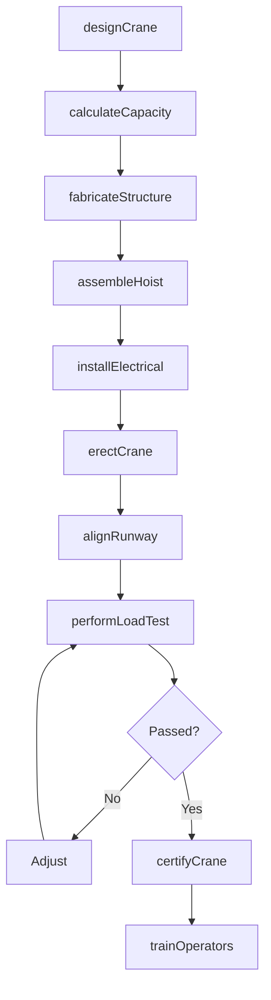
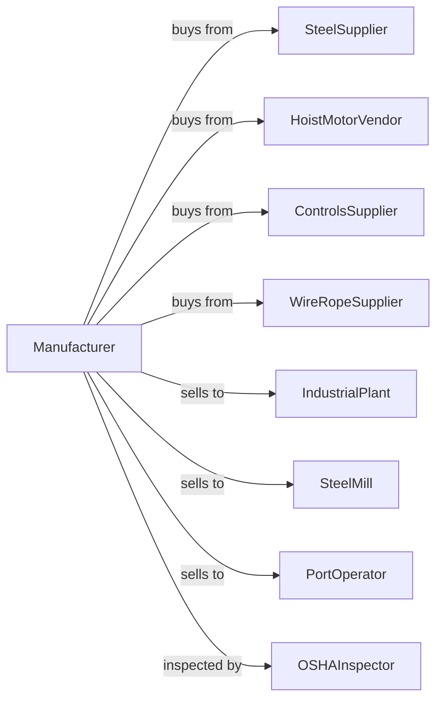

# Overhead Traveling Crane, Hoist, and Monorail System Manufacturing

> Business-as-Code definition for overhead crane, hoist, and monorail system manufacturing operations. Models the complete production lifecycle from lifting equipment design through installation including bridge cranes, jib cranes, hoists, and monorail systems.

## Overview

Overhead crane, hoist, and monorail system manufacturing involves producing lifting and material handling equipment including overhead traveling cranes, electric chain hoists, wire rope hoists, jib cranes, and monorail systems. Operations coordinate with steel suppliers, motor vendors, and industrial customers requiring heavy lifting capabilities. This definition exposes actions for crane engineering, load testing, and facility installation with events for automation and searches for performance analytics.

## Actors

| Actor | Description |
|-------|-------------|
| SteelSupplier | Provides structural steel and fabricated components |
| HoistMotorVendor | Supplies hoisting motors and brakes |
| ControlsSupplier | Provides pendants, radios, and control systems |
| WireRopeSupplier | Supplies wire rope, chains, and rigging |
| IndustrialPlant | Factory requiring overhead lifting |
| SteelMill | Heavy industry customer |
| PortOperator | Terminal and logistics customer |
| OSHAInspector | Oversees crane safety compliance |

## Roles

| Role | Description |
|------|-------------|
| CraneEngineer | Designs lifting systems and structures |
| ElectricalEngineer | Develops power and control systems |
| Fabricator | Welds and assembles steel structures |
| InstallationRigger | Erects cranes at customer sites |
| LoadTestTechnician | Certifies crane capacity |
| ServiceTechnician | Inspects and repairs installed cranes |

## Entities

| Entity | Description |
|--------|-------------|
| BridgeCrane | Overhead traveling crane on runway |
| GantryCrane | Floor-mounted traveling crane |
| JibCrane | Rotating boom crane |
| ElectricHoist | Motorized lifting device |
| Monorail | Single-rail transport system |
| Trolley | Hoist carrier on bridge or monorail |
| Runway | Structural support for crane travel |
| PendantControl | Handheld crane operator interface |
| LoadBlock | Hook and sheave assembly |
| Festoon | Cable management system |

## Actions

| Action | Description |
|--------|-------------|
| designCrane | Engineer lifting system and structure |
| calculateCapacity | Determine safe working load |
| fabricateStructure | Weld bridge, end trucks, and runway |
| assembleHoist | Build motorized lifting unit |
| installElectrical | Wire motors, controls, and power |
| erectCrane | Install at customer facility |
| alignRunway | Set rail straightness and level |
| performLoadTest | Verify rated capacity |
| certifyCrane | Issue compliance documentation |
| trainOperators | Educate customer personnel |
| inspectCrane | Perform periodic safety inspection |
| rebuildHoist | Overhaul worn lifting unit |

## Events

| Event | Description |
|-------|-------------|
| designApproved | Crane engineering released |
| capacityCalculated | Safe working load determined |
| structureFabricated | Steel components built |
| hoistAssembled | Lifting unit complete |
| electricalInstalled | Power and controls wired |
| craneErected | System installed at site |
| runwayAligned | Rail geometry verified |
| loadTestPassed | Capacity certified |
| craneCertified | Compliance documented |
| operatorsTrained | Customer qualified |
| getUtilizationData | Crane usage statistics retrieved |

## Searches

| Search | Description |
|--------|-------------|
| getCraneStatus | Retrieve manufacturing progress |
| findByFacility | Query cranes by customer location |
| getLoadTestData | Retrieve certification records |
| trackInspectionSchedule | Monitor upcoming inspections |
| findServiceHistory | Get maintenance records |
| getUtilizationData | Retrieve crane usage statistics |
| findReplacementParts | Query hoist and component inventory |
| getComplianceRecords | Retrieve OSHA documentation |

## Workflow



## Actor Relationships



## Usage

### Calling Actions

```typescript
import { manufactureCranesHoists } from '@headlessly/manufacture-cranes-hoists'

const factory = manufactureCranesHoists()

// Design double-girder bridge crane
const crane = await factory.designCrane({
  type: 'double-girder-bridge',
  capacity: 50, // tons
  span: 80, // feet
  liftHeight: 40, // feet
  speeds: {
    hoist: 20, // fpm
    trolley: 80, // fpm
    bridge: 200 // fpm
  },
  service: 'class-d' // heavy
})

// Calculate and verify capacity
await factory.calculateCapacity({
  craneId: crane.id,
  designFactor: 5,
  dynamicLoad: true,
  sideLoad: 0.2 // 20% of rated
})

// Perform load test for certification
await factory.performLoadTest({
  craneId: crane.id,
  testLoad: 62.5, // tons (125% of rated)
  witnessedBy: 'third-party-inspector',
  motions: ['hoist', 'trolley', 'bridge'],
  deflectionMeasurement: true
})
```

### Event-Driven Automation

```typescript
// Inspection scheduling
factory.craneCertified(async ({ craneId, certificationDate, interval }) => {
  await scheduleInspection({
    craneId,
    nextDate: addMonths(certificationDate, interval),
    type: 'periodic-inspection',
    compliance: 'osha-1910.179'
  })
})

// Proactive maintenance
factory.getUtilizationData(async ({ craneId, hoistCycles }) => {
  if (hoistCycles > 500000) {
    await factory.rebuildHoist({
      craneId,
      components: ['motor', 'brake', 'gearbox', 'rope'],
      priority: 'scheduled'
    })
  }
})
```

## Related

- [Elevator Manufacturing](./333921-ElevatorAndMovingStairwayManufacturing.mdx)
- [Conveyor Manufacturing](./333922-ConveyorAndConveyingEquipmentManufacturing.mdx)
- [Industrial Truck Manufacturing](./333924-IndustrialTruckTractorTrailerAndStackerMachineryManufacturing.mdx)
