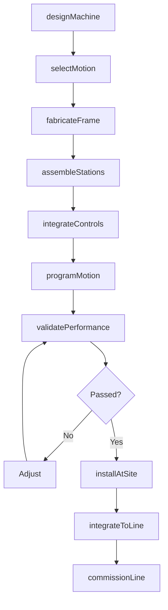
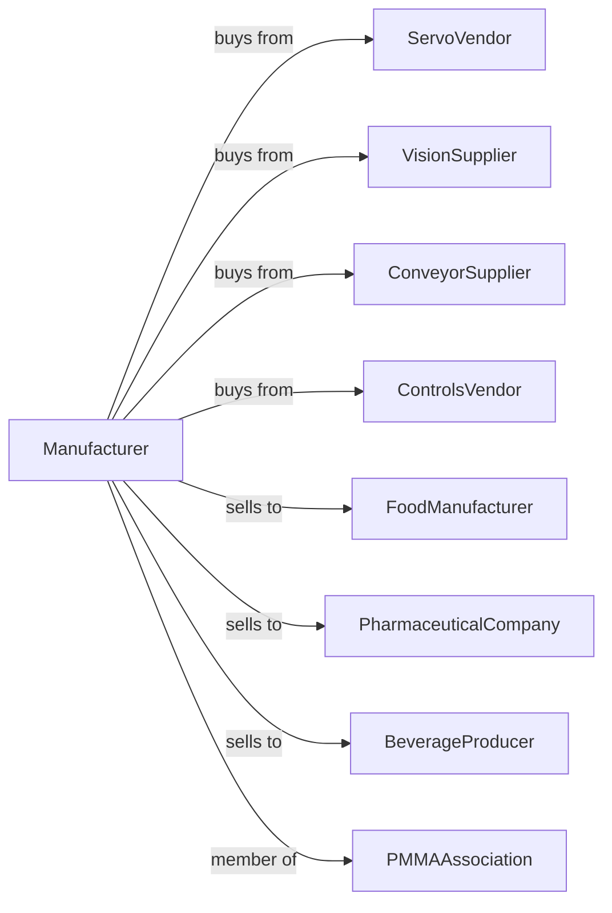

# Packaging Machinery Manufacturing

> Business-as-Code definition for packaging machinery manufacturing operations. Models the complete production lifecycle from machine design through installation including filling machines, labeling systems, cartoners, case packers, and palletizers.

## Overview

Packaging machinery manufacturing involves producing equipment for product packaging including filling machines, capping systems, labelers, cartoners, case packers, shrink wrappers, and palletizers. Operations coordinate with servo vendors, vision system suppliers, and consumer goods companies requiring high-speed packaging lines. This definition exposes actions for machinery engineering, line integration, and production optimization with events for automation and searches for performance analytics.

## Actors

| Actor | Description |
|-------|-------------|
| ServoVendor | Provides motion control systems |
| VisionSupplier | Supplies inspection and guidance systems |
| ConveyorSupplier | Provides transport systems |
| ControlsVendor | Supplies PLC and HMI systems |
| FoodManufacturer | CPG and food industry customer |
| PharmaceuticalCompany | Drug packaging customer |
| BeverageProducer | Bottling and canning customer |
| PMMAAssociation | Packaging machinery industry organization |

## Roles

| Role | Description |
|------|-------------|
| PackagingEngineer | Designs packaging machinery |
| AutomationEngineer | Develops control and motion systems |
| MechanicalDesigner | Creates mechanical assemblies |
| AssemblyTechnician | Builds packaging machines |
| ApplicationEngineer | Configures for customer products |
| FieldServiceEngineer | Installs and supports equipment |

## Entities

| Entity | Description |
|--------|-------------|
| FillingMachine | Product dispensing equipment |
| CappingMachine | Closure application system |
| LabelingSystem | Product marking equipment |
| Cartoner | Box forming and loading machine |
| CasePacker | Secondary packaging equipment |
| ShrinkWrapper | Film wrapping system |
| Palletizer | Layer building equipment |
| CheckWeigher | Weight verification system |
| MetalDetector | Contamination detection |
| VisionInspection | Quality verification system |

## Actions

| Action | Description |
|--------|-------------|
| designMachine | Engineer packaging equipment |
| selectMotion | Choose servo and actuator systems |
| fabricateFrame | Build machine structure |
| assembleStations | Construct functional modules |
| integrateControls | Install PLC and HMI |
| programMotion | Develop servo profiles |
| validatePerformance | Verify speed and accuracy |
| installAtSite | Erect at customer facility |
| integrateToLine | Connect to upstream/downstream equipment |
| commissionLine | Start up and optimize production |
| supportChangeover | Assist product format changes |
| performMaintenance | Execute scheduled service |

## Events

| Event | Description |
|-------|-------------|
| designApproved | Machine engineering released |
| motionSelected | Servo systems specified |
| frameFabricated | Structure built |
| stationsAssembled | Modules constructed |
| controlsIntegrated | PLC installed |
| motionProgrammed | Servo profiles complete |
| performanceValidated | Speed verified |
| installedAtSite | Erected at customer |
| lineIntegrated | Connected to production |
| lineCommissioned | Production optimized |
| getDowntimeData | Machine fault and stop analysis retrieved |

## Searches

| Search | Description |
|--------|-------------|
| getMachineStatus | Retrieve manufacturing progress |
| findByApplication | Query machines by package type |
| getPerformanceData | Retrieve OEE metrics |
| trackInstalledBase | Monitor machines by customer |
| findChangeoverRecords | Query format change history |
| getDowntimeData | Retrieve fault and stop analysis |
| findReplacementParts | Query spare part inventory |
| getValidationRecords | Retrieve qualification documentation |

## Workflow



## Actor Relationships



## Usage

### Calling Actions

```typescript
import { manufacturePackagingMachinery } from '@headlessly/manufacture-packaging-machinery'

const factory = manufacturePackagingMachinery()

// Design high-speed bottle filler
const machine = await factory.designMachine({
  type: 'rotary-filler',
  product: 'carbonated-beverage',
  containerSize: { min: 8, max: 32 }, // oz
  fillHeads: 72,
  speed: 1200, // cpm (containers per minute)
  accuracy: 0.25, // percent
  cleanInPlace: true
})

// Select precision motion system
await factory.selectMotion({
  machineId: machine.id,
  mainDrive: 'servo-gearbox',
  fillValves: 'servo-pneumatic',
  indexing: 'electronic-cam',
  synchronization: 'ether-cat'
})

// Validate performance
await factory.validatePerformance({
  machineId: machine.id,
  tests: [
    { type: 'speed', target: 1200, duration: 8 }, // hours
    { type: 'fill-accuracy', samples: 1000 },
    { type: 'changeover', formats: 3, targetTime: 30 }, // minutes
    { type: 'sanitation', protocol: 'cip-sip' }
  ],
  standard: 'fda-21cfr'
})
```

### Event-Driven Automation

```typescript
// OEE monitoring
factory.lineCommissioned(async ({ machineId, lineId, targetOEE }) => {
  await factory.getPerformanceData({
    machineId,
    metrics: ['availability', 'performance', 'quality'],
    interval: 'shift',
    alertThreshold: targetOEE * 0.9
  })
})

// Predictive maintenance
factory.getDowntimeData(async ({ machineId, faultHistory }) => {
  const prediction = analyzeFaultPatterns(faultHistory)
  if (prediction.failureRisk > 0.7) {
    await factory.performMaintenance({
      machineId,
      components: prediction.atRiskComponents,
      type: 'preventive',
      scheduledWindow: 'next-changeover'
    })
  }
})
```

## Related

- [Food Product Machinery Manufacturing](../3332-IndustrialMachineryManufacturing/333241-FoodProductMachineryManufacturing.mdx)
- [Conveyor Manufacturing](./333922-ConveyorAndConveyingEquipmentManufacturing.mdx)
- [Industrial Furnace Manufacturing](./333994-IndustrialProcessFurnaceAndOvenManufacturing.mdx)
