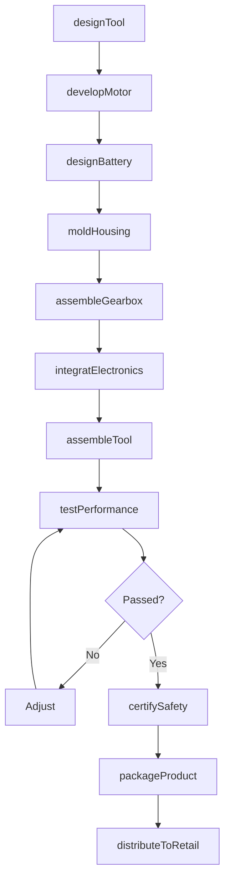
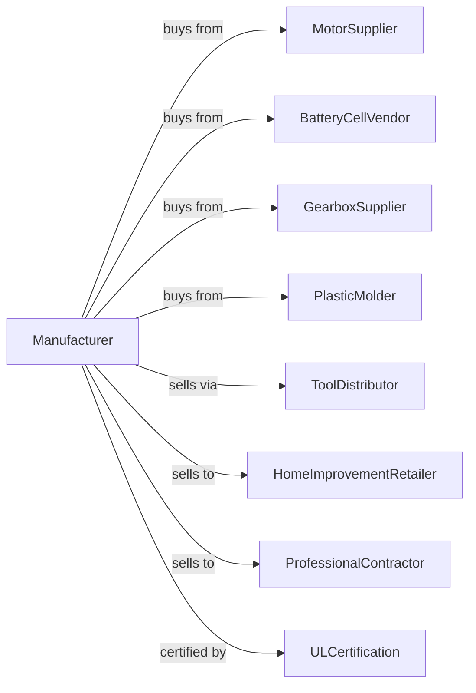

# Power-Driven Handtool Manufacturing

> Business-as-Code definition for power tool manufacturing operations. Models the complete production lifecycle from tool design through retail distribution including cordless drills, circular saws, impact drivers, and pneumatic tools.

## Overview

Power-driven handtool manufacturing involves producing portable powered equipment including cordless drills, impact drivers, circular saws, reciprocating saws, grinders, and pneumatic tools. Operations coordinate with motor suppliers, battery vendors, and professional contractors requiring reliable job-site tools. This definition exposes actions for tool engineering, quality testing, and retail distribution with events for automation and searches for product analytics.

## Actors

| Actor | Description |
|-------|-------------|
| MotorSupplier | Provides brushless and universal motors |
| BatteryCellVendor | Supplies lithium-ion battery cells |
| GearboxSupplier | Provides transmission components |
| PlasticMolder | Supplies housings and grips |
| ToolDistributor | Wholesale channel to retailers |
| HomeImprovementRetailer | Big-box store customer |
| ProfessionalContractor | Tradesperson end user |
| ULCertification | Product safety certification body |

## Roles

| Role | Description |
|------|-------------|
| ToolEngineer | Designs power tool mechanisms |
| ElectricalEngineer | Develops motor and battery systems |
| IndustrialDesigner | Creates ergonomics and aesthetics |
| AssemblyWorker | Builds power tool units |
| QualityTechnician | Tests performance and durability |
| ProductManager | Manages tool portfolio strategy |

## Entities

| Entity | Description |
|--------|-------------|
| CordlessDrill | Battery-powered drilling tool |
| ImpactDriver | High-torque fastening tool |
| CircularSaw | Portable cutting tool |
| ReciprocatingSaw | Push-pull cutting tool |
| AngleGrinder | Abrasive cutting and grinding tool |
| PneumaticNailer | Air-powered fastening tool |
| BatteryPack | Removable power source |
| BrushlessMotor | Efficient electronic motor |
| ChuckAssembly | Bit holding mechanism |
| TriggerSwitch | Variable speed control |

## Actions

| Action | Description |
|--------|-------------|
| designTool | Engineer power tool mechanism |
| developMotor | Create brushless motor system |
| designBattery | Engineer battery pack platform |
| moldHousing | Produce plastic components |
| assembleGearbox | Build transmission unit |
| integratElectronics | Install motor controller and sensors |
| assembleTool | Build complete power tool |
| testPerformance | Verify torque, speed, and runtime |
| certifySafety | Obtain UL and regulatory approval |
| packageProduct | Prepare retail packaging |
| distributeToRetail | Ship to stores and distributors |
| processWarranty | Handle defect claims |

## Events

| Event | Description |
|-------|-------------|
| designApproved | Tool engineering released |
| motorDeveloped | Brushless system complete |
| batteryDesigned | Battery platform finalized |
| housingMolded | Plastic components produced |
| gearboxAssembled | Transmission built |
| electronicsIntegrated | Controller installed |
| toolAssembled | Complete unit built |
| performanceTested | Specifications verified |
| safetyCertified | UL approval obtained |
| productPackaged | Retail ready |
| trackSalesData | Retail sales performance data collected |

## Searches

| Search | Description |
|--------|-------------|
| getToolStatus | Retrieve manufacturing progress |
| findByCategory | Query tools by type |
| getPerformanceData | Retrieve test measurements |
| trackSalesData | Monitor retail performance |
| findWarrantyClaims | Query defect reports |
| getInventoryLevels | Check stock by location |
| findCompatibleAccessories | Query bits and blades |
| getCompetitorBenchmark | Retrieve market comparison |

## Workflow



## Actor Relationships



## Usage

### Calling Actions

```typescript
import { manufacturePowerTools } from '@headlessly/manufacture-power-tools'

const factory = manufacturePowerTools()

// Design professional-grade impact driver
const tool = await factory.designTool({
  type: 'impact-driver',
  voltage: 20, // V
  torque: 2000, // in-lbs
  speed: 3200, // rpm
  impacts: 4000, // ipm
  brushless: true,
  grade: 'professional'
})

// Develop optimized brushless motor
await factory.developMotor({
  toolId: tool.id,
  type: 'brushless-dc',
  efficiency: 0.85,
  thermalManagement: 'active',
  sensors: ['temperature', 'current', 'position']
})

// Test and certify
await factory.testPerformance({
  toolId: tool.id,
  tests: [
    { type: 'torque', cycles: 50000 },
    { type: 'drop', height: 6 }, // feet
    { type: 'runtime', continuous: true },
    { type: 'temperature', ambient: 104 } // fahrenheit
  ],
  standard: 'ansi-b175.1'
})
```

### Event-Driven Automation

```typescript
// Quality monitoring
factory.performanceTested(async ({ toolId, results, passRate }) => {
  if (passRate < 0.99) {
    await factory.findWarrantyClaims({
      toolId,
      correlate: results.failures,
      rootCauseAnalysis: true
    })
  }
})

// Inventory management
factory.trackSalesData(async ({ toolId, velocity, stockLevel }) => {
  if (stockLevel < velocity * 4) { // 4 weeks supply
    await factory.assembleTool({
      toolId,
      quantity: velocity * 8,
      priority: 'expedite'
    })
  }
})
```

## Related

- [Welding Equipment Manufacturing](./333992-WeldingAndSolderingEquipmentManufacturing.mdx)
- [Machine Tool Manufacturing](../3335-MetalworkingMachineryManufacturing/333517-MachineToolManufacturing.mdx)
- [Cutting Tool Manufacturing](../3335-MetalworkingMachineryManufacturing/333515-CuttingToolAndMachineToolAccessoryManufacturing.mdx)
