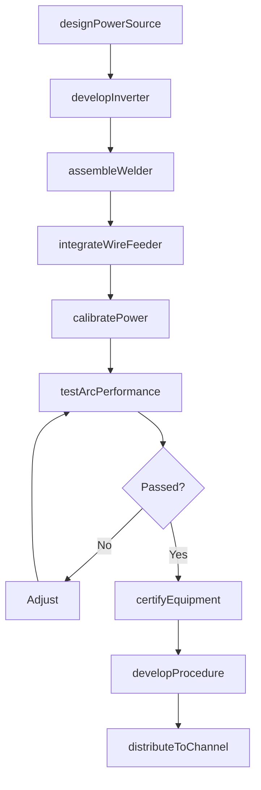
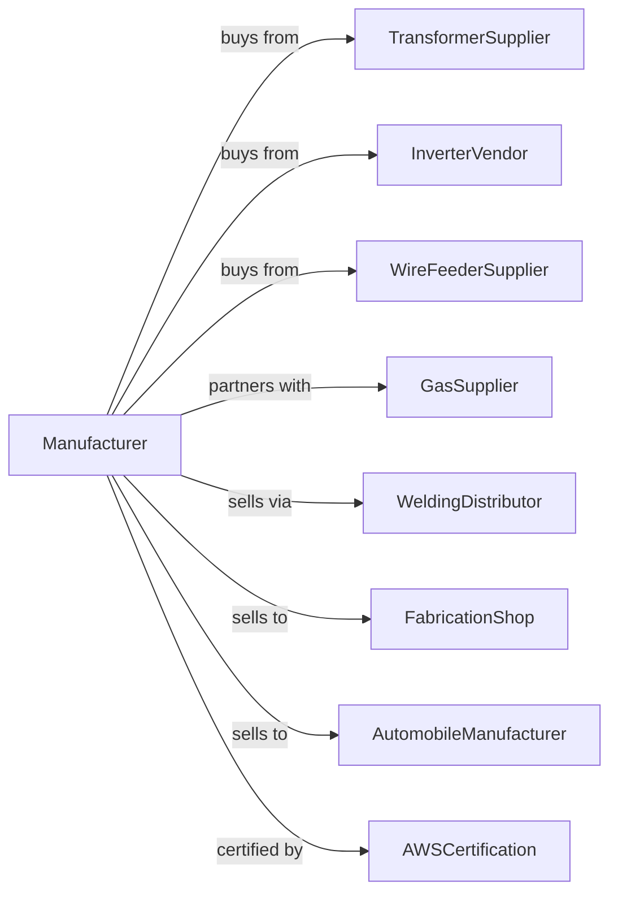

# Welding and Soldering Equipment Manufacturing

> Business-as-Code definition for welding and soldering equipment manufacturing operations. Models the complete production lifecycle from power source design through distributor delivery including arc welders, MIG/TIG systems, plasma cutters, and robotic welding cells.

## Overview

Welding and soldering equipment manufacturing involves producing metal joining equipment including arc welders, MIG and TIG systems, resistance welders, plasma cutters, laser welders, and soldering stations. Operations coordinate with transformer suppliers, wire feeder vendors, and fabrication shops requiring reliable joining solutions. This definition exposes actions for welder engineering, process development, and distribution with events for automation and searches for application analytics.

## Actors

| Actor | Description |
|-------|-------------|
| TransformerSupplier | Provides power source components |
| InverterVendor | Supplies electronic power modules |
| WireFeederSupplier | Provides welding wire delivery systems |
| GasSupplier | Supplies shielding gases |
| WeldingDistributor | Sells equipment to end users |
| FabricationShop | Metal fabrication customer |
| AutomobileManufacturer | Automotive welding customer |
| AWSCertification | American Welding Society standards body |

## Roles

| Role | Description |
|------|-------------|
| WeldingEngineer | Designs welding power sources |
| ProcessEngineer | Develops welding procedures |
| ElectronicsEngineer | Designs inverter and control systems |
| AssemblyTechnician | Builds welding equipment |
| ApplicationSpecialist | Supports customer welding applications |
| ServiceTechnician | Repairs and calibrates equipment |

## Entities

| Entity | Description |
|--------|-------------|
| ArcWelder | Stick welding power source |
| MIGWelder | Gas metal arc welding system |
| TIGWelder | Gas tungsten arc welding system |
| ResistanceWelder | Spot and seam welding machine |
| PlasmaCutter | Plasma arc cutting system |
| LaserWelder | Laser beam welding system |
| WireFeeder | Consumable delivery mechanism |
| WeldingTorch | Hand-held welding applicator |
| WeldingElectrode | Consumable filler material |
| WeldController | Process parameter computer |

## Actions

| Action | Description |
|--------|-------------|
| designPowerSource | Engineer welding power system |
| developInverter | Create high-frequency power module |
| assembleWelder | Build complete welding system |
| integrateWireFeeder | Install consumable delivery |
| calibratePower | Set output parameters |
| testArcPerformance | Verify welding characteristics |
| developProcedure | Create welding parameters for application |
| certifyEquipment | Obtain safety and performance approval |
| trainOperators | Educate welders on equipment use |
| distributeToChannel | Ship to distributors and dealers |
| supportApplication | Assist customer welding challenges |
| performCalibration | Verify and adjust equipment accuracy |

## Events

| Event | Description |
|-------|-------------|
| designApproved | Power source engineering released |
| inverterDeveloped | Electronic module complete |
| welderAssembled | System built |
| wireFeederIntegrated | Delivery installed |
| powerCalibrated | Output set |
| arcPerformanceTested | Welding verified |
| procedureDeveloped | Parameters documented |
| equipmentCertified | Approval obtained |
| operatorsTrained | Welders educated |
| distributedToChannel | Shipped to sales network |
| consumableUsageRetrieved | Wire and electrode consumption data retrieved |

## Searches

| Search | Description |
|--------|-------------|
| getWelderStatus | Retrieve manufacturing progress |
| findByProcess | Query equipment by welding type |
| getPerformanceData | Retrieve arc characteristics |
| trackInstalledBase | Monitor equipment by customer |
| findWeldingProcedures | Query approved parameters |
| consumableUsageRetrieved | Track wire and electrode consumption |
| findServiceHistory | Get calibration records |
| getApplicationData | Retrieve welding application details |

## Workflow



## Actor Relationships



## Usage

### Calling Actions

```typescript
import { manufactureWeldingEquipment } from '@headlessly/manufacture-welding-equipment'

const factory = manufactureWeldingEquipment()

// Review current status
const status = await factory.getWelderStatus()

// Search catalog
const catalog = await factory.findByProcess()

// Design multi-process inverter welder
const welder = await factory.designPowerSource({
  type: 'multi-process-inverter',
  processes: ['mig', 'tig', 'stick'],
  output: {
    maxAmps: 350,
    dutyCycle: 60, // percent at max
    voltage: '208-575v'
  },
  features: ['pulse', 'synergic', 'remote-control']
})

// Develop inverter technology
await factory.developInverter({
  welderId: welder.id,
  frequency: 100, // kHz
  topology: 'resonant',
  efficiency: 0.88,
  powerFactor: 0.95
})

// Test arc performance
await factory.testArcPerformance({
  welderId: welder.id,
  processes: [
    { type: 'mig', wire: '0.035-er70s6', gas: '90-10-argon-co2' },
    { type: 'tig', electrode: '3-32-thoriated', gas: 'argon' },
    { type: 'stick', electrode: '7018' }
  ],
  metrics: ['arc-stability', 'spatter', 'penetration']
})
```

### Event-Driven Automation

```typescript
// Procedure development automation
factory.equipmentCertified(async ({ welderId, processes }) => {
  for (const process of processes) {
    await factory.developProcedure({
      welderId,
      process,
      materials: ['carbon-steel', 'stainless', 'aluminum'],
      positions: ['flat', 'horizontal', 'vertical', 'overhead'],
      awsCompliant: true
    })
  }
})

// Consumable tracking
factory.consumableUsageRetrieved(async ({ customerId, wireUsage, electrodeUsage }) => {
  const reorderPoint = calculateReorderPoint(wireUsage)
  if (wireUsage.remaining < reorderPoint) {
    await notifyDistributor({
      customerId,
      product: wireUsage.type,
      suggestedQuantity: wireUsage.monthlyAverage * 2
    })
  }
})
```

## Related

- [Power Tool Manufacturing](./333991-PowerDrivenHandtoolManufacturing.mdx)
- [Industrial Furnace Manufacturing](./333994-IndustrialProcessFurnaceAndOvenManufacturing.mdx)
- [Machine Tool Manufacturing](../3335-MetalworkingMachineryManufacturing/333517-MachineToolManufacturing.mdx)
