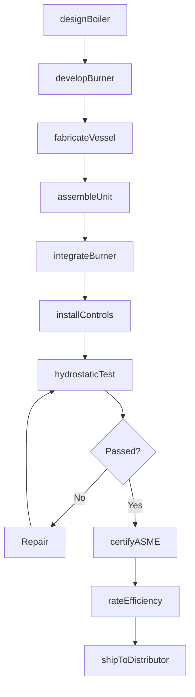
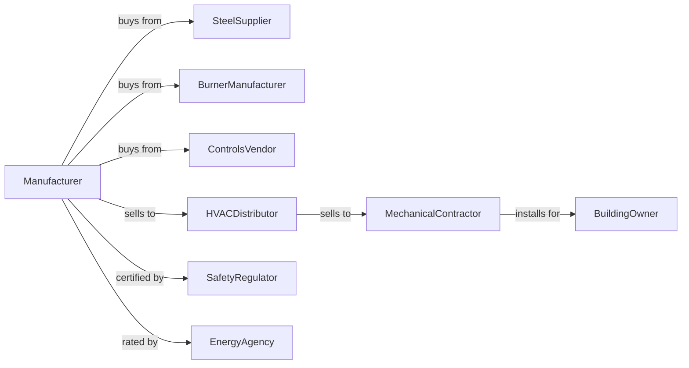

# Heating Equipment (except Warm Air Furnaces) Manufacturing

> Business-as-Code definition for heating equipment manufacturing operations. Models the complete production lifecycle from boiler and hydronic system design through installation including commercial boilers, radiant heating, and baseboard systems.

## Overview

Heating equipment manufacturing involves producing boilers, hydronic heating systems, radiant heaters, and baseboard units for residential and commercial applications. Operations coordinate with steel suppliers, burner manufacturers, and HVAC distributors serving contractors and building owners. This definition exposes actions for heating equipment engineering, pressure vessel fabrication, and distribution channel management with events for automation and searches for efficiency analytics.

## Actors

| Actor | Description |
|-------|-------------|
| SteelSupplier | Provides boiler plate and pressure vessel materials |
| BurnerManufacturer | Supplies gas and oil burners |
| ControlsVendor | Provides thermostats, aquastats, and automation |
| HVACDistributor | Distributes heating equipment to contractors |
| MechanicalContractor | Installs boilers and heating systems |
| BuildingOwner | End customer operating heated facilities |
| SafetyRegulator | Certifies pressure vessels and gas equipment |
| EnergyAgency | Promotes efficiency standards and rebates |

## Roles

| Role | Description |
|------|-------------|
| BoilerEngineer | Designs pressure vessels and heat exchangers |
| CombustionEngineer | Develops burner systems and efficiency |
| WeldingTechnician | Fabricates pressure vessel components |
| AssemblyWorker | Builds heating equipment units |
| TestEngineer | Verifies safety and performance |
| ApplicationSpecialist | Supports contractor and owner applications |

## Entities

| Entity | Description |
|--------|-------------|
| Boiler | Pressure vessel for heating water or steam |
| HeatExchanger | Component transferring thermal energy |
| Burner | Fuel combustion assembly |
| BasedboardUnit | Hydronic room heating element |
| RadiantPanel | Infrared or hydronic radiant heater |
| ControlSystem | Thermostat and automation components |
| PressureCert | ASME or other pressure certification |
| EfficiencyRating | AFUE or thermal efficiency specification |
| InstallationKit | Mounting and piping accessories |
| WarrantyProgram | Equipment coverage terms |

## Actions

| Action | Description |
|--------|-------------|
| designBoiler | Engineer pressure vessel and heat exchanger |
| developBurner | Create combustion system |
| fabricateVessel | Weld and form pressure components |
| assembleUnit | Build complete heating equipment |
| integrateBurner | Install combustion system |
| installControls | Add thermostats and automation |
| hydrostaticTest | Pressure test vessel integrity |
| certifyASME | Obtain pressure vessel certification |
| rateEfficiency | Document AFUE and thermal performance |
| shipToDistributor | Deliver to distribution channel |
| supportInstallation | Assist contractor with setup |
| provideWarranty | Process claims and replacements |

## Events

| Event | Description |
|-------|-------------|
| designCompleted | Boiler engineering finalized |
| vesselFabricated | Pressure components welded |
| burnerIntegrated | Combustion system installed |
| unitAssembled | Equipment built and ready |
| hydrostaticPassed | Pressure test successful |
| asmeCertified | Pressure certification obtained |
| efficiencyRated | Performance documented |
| unitShipped | Equipment dispatched to distributor |
| installationCompleted | System operational at building |
| warrantyClaimFiled | Customer reported issue |

## Searches

| Search | Description |
|--------|-------------|
| getProductionStatus | Retrieve manufacturing progress |
| findDistributorInventory | Query stock at channel partners |
| getInstalledBase | List equipment by building |
| getCertificationRecords | Retrieve ASME documentation |
| getEfficiencyData | Query performance ratings |
| trackServiceHistory | Get maintenance records |
| getWarrantyClaims | Retrieve claims by model |
| findReplacementParts | Check spare inventory |

## Workflow



## Actor Relationships



## Usage

### Calling Actions

```typescript
import { manufactureHeatingEquipment } from '@headlessly/manufacture-heating-equipment'

const factory = manufactureHeatingEquipment()

// Design high-efficiency condensing boiler
const boiler = await factory.designBoiler({
  type: 'condensing-gas',
  capacity: 2000000, // btu/hr
  efficiency: 96, // percent AFUE
  modulation: '10:1',
  venting: 'direct-vent'
})

// Develop low-NOx burner
await factory.developBurner({
  boilerId: boiler.id,
  burnerType: 'premix-modulating',
  fuel: 'natural-gas',
  nox: 'ultra-low',
  turndown: '10:1'
})

// Certify for installation
await factory.certifyASME({
  boilerId: boiler.id,
  code: 'section-iv',
  pressure: 160, // psi
  witnessTest: true
})
```

### Event-Driven Automation

```typescript
// Auto-process warranty claims
factory.warrantyClaimFiled(async ({ serialNumber, issueType, installerId }) => {
  const equipment = await factory.getInstalledBase({ serialNumber })

  if (equipment.warrantyExpiration > new Date()) {
    await factory.provideWarranty({
      serialNumber,
      issueType,
      resolution: determineResolution(issueType),
      installerId
    })
  }
})

// Efficiency upgrade notifications
factory.efficiencyRated(async ({ modelId, afue, previousAfue }) => {
  if (afue > previousAfue) {
    await notifyDistributors({
      modelId,
      message: `Efficiency improved to ${afue}% AFUE`,
      rebateEligible: afue >= 95
    })
  }
})
```

## Related

- [Air-Conditioning Equipment Manufacturing](./333415-AirConditioningAndWarmAirHeatingEquipmentAndCommercialAndIndustrialRefrigerationEquipmentManufacturing.mdx)
- [Industrial Fan and Blower Manufacturing](./333413-IndustrialAndCommercialFanAndBlowerAndAirPurificationEquipmentManufacturing.mdx)
- [Industrial Process Furnace Manufacturing](../3339-OtherGeneralPurposeMachineryManufacturing/333994-IndustrialProcessFurnaceAndOvenManufacturing.mdx)
