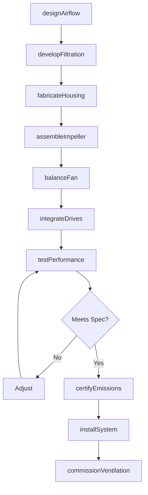
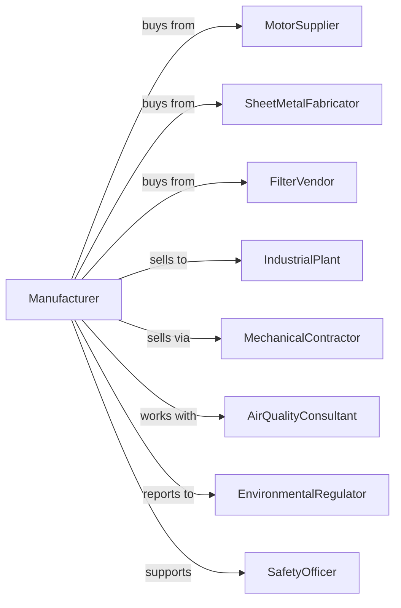

# Industrial and Commercial Fan and Blower and Air Purification Equipment Manufacturing

> Business-as-Code definition for industrial fan, blower, and air purification equipment manufacturing operations. Models the complete production lifecycle from airflow equipment design through industrial installation including dust collection, fume extraction, and ventilation systems.

## Overview

Industrial and commercial fan, blower, and air purification equipment manufacturing involves producing ventilation equipment, dust collectors, electrostatic precipitators, and industrial air handling systems. Operations coordinate with motor suppliers, sheet metal fabricators, and industrial facilities requiring air quality and ventilation solutions. This definition exposes actions for airflow equipment engineering, fabrication, and industrial installation with events for automation and searches for air quality analytics.

## Actors

| Actor | Description |
|-------|-------------|
| MotorSupplier | Provides electric motors and variable drives |
| SheetMetalFabricator | Supplies housings, ducts, and enclosures |
| FilterVendor | Provides filter media and cartridges |
| IndustrialPlant | Manufacturing facility requiring ventilation |
| MechanicalContractor | Installs HVAC and ventilation systems |
| AirQualityConsultant | Designs ventilation and filtration solutions |
| EnvironmentalRegulator | Oversees air emissions compliance |
| SafetyOfficer | Monitors workplace air quality |

## Roles

| Role | Description |
|------|-------------|
| AerodynamicsEngineer | Designs fan blades and airflow systems |
| FiltrationEngineer | Develops dust collection and purification |
| ProductionManager | Oversees manufacturing operations |
| QualityTechnician | Tests airflow and filtration performance |
| ApplicationEngineer | Configures systems for customer needs |
| FieldServiceEngineer | Installs and maintains equipment |

## Entities

| Entity | Description |
|--------|-------------|
| CentrifugalFan | Radial flow air moving equipment |
| AxialFan | Inline propeller-type air mover |
| DustCollector | Particulate filtration system |
| Precipitator | Electrostatic particle removal system |
| AirWasher | Wet scrubber air cleaning system |
| Blower | High-pressure air handling equipment |
| FilterMedia | Replaceable filtration element |
| Ductwork | Air distribution and collection system |
| ControlDamper | Airflow regulation device |
| EmissionsPermit | Regulatory air quality authorization |

## Actions

| Action | Description |
|--------|-------------|
| designAirflow | Engineer fan and blower systems |
| developFiltration | Create dust collection solutions |
| fabricateHousing | Build sheet metal enclosures |
| assembleImpeller | Construct fan wheels and blades |
| balanceFan | Dynamically balance rotating assembly |
| integrateDrives | Install motors and variable speed drives |
| testPerformance | Verify airflow and pressure |
| certifyEmissions | Document regulatory compliance |
| installSystem | Set up at industrial facility |
| commissionVentilation | Start up and optimize airflow |
| replaceFilters | Service filtration media |
| monitorAirQuality | Track particulate and emissions |

## Events

| Event | Description |
|-------|-------------|
| designCompleted | Airflow engineering finalized |
| housingFabricated | Enclosures and ductwork built |
| impellerBalanced | Fan assembly dynamically balanced |
| drivesIntegrated | Motors and controls installed |
| performanceTested | Airflow specifications verified |
| emissionsCertified | Regulatory compliance documented |
| systemInstalled | Equipment operational at plant |
| ventilationCommissioned | Airflow optimized |
| filterChangeRequired | Media replacement due |
| airQualityDegraded | Air quality parameters fell outside acceptable range |

## Searches

| Search | Description |
|--------|-------------|
| getEquipmentStatus | Retrieve manufacturing progress |
| findInstalledSystems | Query equipment by facility |
| getAirflowData | Retrieve fan performance metrics |
| trackFilterLife | Monitor media condition |
| getEmissionsRecords | Query compliance documentation |
| findServiceHistory | Get maintenance records |
| getAirQualityMetrics | Retrieve particulate measurements |
| findReplacementParts | Check spare inventory |

## Workflow



## Actor Relationships



## Usage

### Calling Actions

```typescript
import { manufactureIndustrialFanBlowerEquipment } from '@headlessly/manufacture-industrial-fan-blower-equipment'

const factory = manufactureIndustrialFanBlowerEquipment()

// Design dust collection system for woodworking
const collector = await factory.designAirflow({
  application: 'woodworking-dust',
  airVolume: 15000, // cfm
  particleSize: 0.5, // microns
  efficiency: 99.9, // percent
  explosionProof: true
})

// Develop filtration system
await factory.developFiltration({
  systemId: collector.id,
  filterType: 'cartridge',
  mediaType: 'nanofiber',
  pulseClean: true,
  hopper: 'rotary-airlock'
})

// Commission at facility
await factory.commissionVentilation({
  systemId: collector.id,
  facilityId: 'cabinet-shop-midwest',
  ductworkDesign: 'balanced-branch',
  airBalance: true,
  emissionsTest: true
})
```

### Event-Driven Automation

```typescript
// Auto-schedule filter replacement
factory.filterChangeRequired(async ({ systemId, filterType, facilityId }) => {
  const filters = await factory.findReplacementParts({
    systemId,
    partType: filterType
  })

  await factory.replaceFilters({
    systemId,
    facilityId,
    filters: filters.required,
    technicianSchedule: 'next-available'
  })
})

// Air quality compliance monitoring
factory.airQualityDegraded(async ({ facilityId, particleLevel, threshold }) => {
  if (particleLevel > threshold * 0.9) {
    await notifyFacility({
      facilityId,
      alert: 'emissions-approaching-limit',
      currentLevel: particleLevel,
      threshold,
      recommendation: 'increase-airflow-or-replace-filters'
    })
  }
})
```

## Related

- [Heating Equipment Manufacturing](./333414-HeatingEquipmentExceptWarmAirFurnacesManufacturing.mdx)
- [Air-Conditioning Equipment Manufacturing](./333415-AirConditioningAndWarmAirHeatingEquipmentAndCommercialAndIndustrialRefrigerationEquipmentManufacturing.mdx)
- [Industrial Process Furnace Manufacturing](../3339-OtherGeneralPurposeMachineryManufacturing/333994-IndustrialProcessFurnaceAndOvenManufacturing.mdx)
