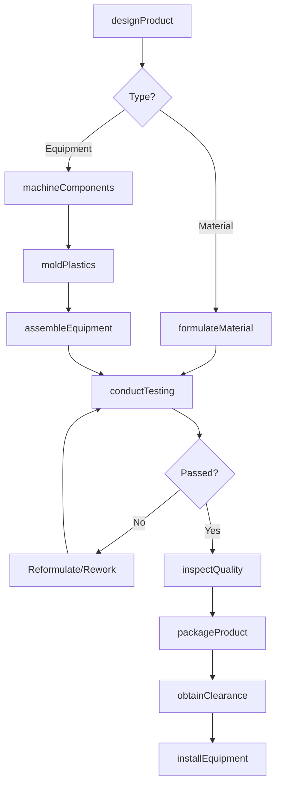
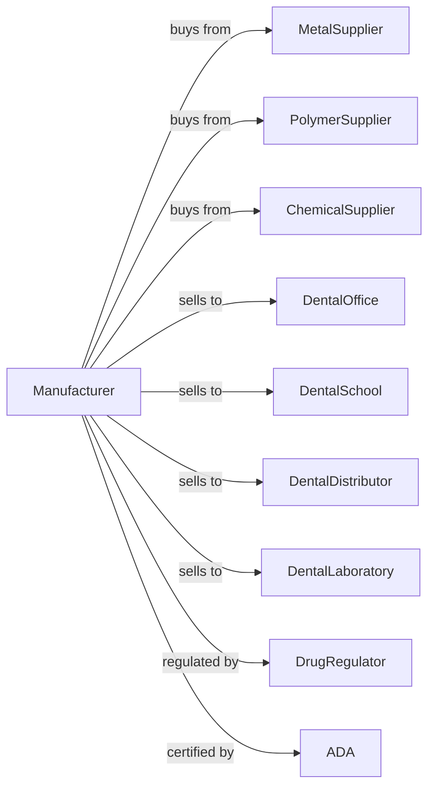

# Dental Equipment and Supplies Manufacturing

> Business-as-Code definition for dental equipment and supplies manufacturing operations. Models the complete production lifecycle for dental chairs, instruments, and consumables.

## Overview

Dental equipment and supplies manufacturing involves producing dental chairs, instrument delivery systems, hand instruments, impression materials, dental cements, and diagnostic equipment. This definition exposes actions for precision manufacturing, quality control, and regulatory compliance, events for workflow automation, and searches for specifications and inventory.

## Actors

| Actor | Description |
|-------|-------------|
| MetalSupplier | Provides stainless steel and titanium for instruments |
| PolymerSupplier | Supplies dental-grade plastics and silicones |
| ChemicalSupplier | Provides raw materials for cements and impression materials |
| DentalOffice | Purchases equipment and supplies for patient care |
| DentalSchool | Orders for educational and clinical training |
| DentalDistributor | Purchases for resale to dental practices |
| DentalLaboratory | Orders materials for prosthetic fabrication |
| DrugRegulator | Regulates dental device safety and efficacy |
| ADA | Sets standards and provides seal of acceptance |

## Roles

| Role | Description |
|------|-------------|
| ProductionManager | Oversees manufacturing operations and schedules |
| ProductEngineer | Designs equipment and formulates materials |
| CNCMachinist | Manufactures precision instrument components |
| ChemicalTechnician | Mixes and tests dental materials |
| Assembler | Combines components into finished equipment |
| QualityTechnician | Tests products against specifications |
| RegulatoryAffairs | Manages regulatory clearances and ADA evaluations |
| ServiceTechnician | Installs and repairs dental equipment |

## Entities

| Entity | Description |
|--------|-------------|
| DentalChair | Patient positioning and examination unit |
| DeliverySystem | Instrument mounting and air/water system |
| Handpiece | High and low-speed dental drills |
| Instrument | Hand tools including explorers and scalers |
| ImpressionMaterial | Alginate or silicone for dental molds |
| DentalCement | Adhesive for crowns, bridges, and restorations |
| CuringLight | Device for hardening composite resins |
| Specification | Product requirements and formulation |
| Lot | Production batch with traceability number |

## Actions

| Action | Description |
|--------|-------------|
| designProduct | Create specifications for equipment or materials |
| machineComponents | CNC manufacture precision metal parts |
| formulateMaterial | Develop and mix chemical compositions |
| moldPlastics | Injection mold equipment housings and components |
| assembleEquipment | Combine mechanical and electronic components |
| conductTesting | Perform functional and material property tests |
| inspectQuality | Verify compliance with specifications |
| packageProduct | Prepare for distribution with instructions |
| obtainClearance | Submit 510(k) or registration to regulator |
| seekADASeal | Apply for ADA Seal of Acceptance |
| installEquipment | Set up and calibrate at dental office |
| provideService | Perform maintenance and repairs |

## Events

| Event | Description |
|-------|-------------|
| designApproved | Product specifications finalized |
| componentsMachined | Metal parts manufactured |
| materialFormulated | Chemical composition validated |
| equipmentAssembled | Product construction completed |
| testingPassed | Performance verification approved |
| qualityReleased | Lot authorized for distribution |
| clearanceReceived | Regulatory marketing authorization obtained |
| ADASealGranted | ADA acceptance seal awarded |
| equipmentInstalled | Unit set up at customer site |
| serviceCompleted | Maintenance or repair finished |

## Searches

| Search | Description |
|--------|-------------|
| findOrders | List purchase orders by customer or status |
| getComponentInventory | Query parts and materials stock |
| findLotRecords | Search production records by lot number |
| getSpecifications | Retrieve product requirements |
| getRegulatoryStatus | Check regulatory and ADA approval status |
| findServiceRecords | View equipment maintenance history |
| getCustomerEquipment | List installed equipment by customer |

## Workflow

## Actor Relationships

