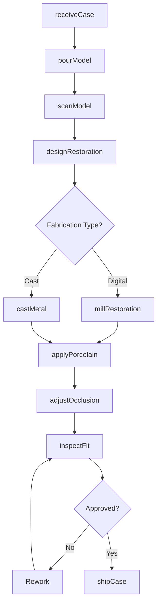
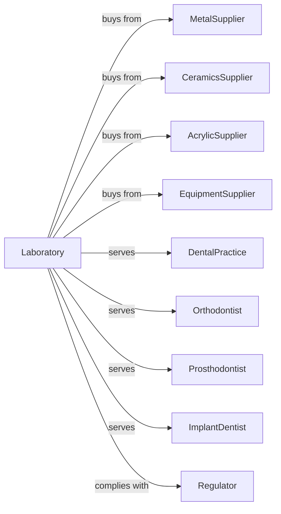

# Dental Laboratories

> Business-as-Code definition for dental laboratory operations. Models the complete production lifecycle for custom dentures, crowns, bridges, and orthodontic appliances.

## Overview

Dental laboratories manufacture customized dental prosthetics including dentures, crowns, bridges, veneers, and orthodontic appliances based on prescriptions and impressions from dentists. This definition exposes actions for fabrication, fitting, and delivery, events for workflow automation, and searches for cases and materials.

## Actors

| Actor | Description |
|-------|-------------|
| MetalSupplier | Provides dental alloys and precious metals |
| CeramicsSupplier | Supplies porcelain and zirconia materials |
| AcrylicSupplier | Provides denture base and orthodontic resins |
| EquipmentSupplier | Supplies CAD/CAM systems and furnaces |
| DentalPractice | Orders prosthetics for patient treatment |
| Orthodontist | Orders retainers, aligners, and appliances |
| Prosthodontist | Orders complex restorations and dentures |
| ImplantDentist | Orders implant-supported restorations |
| Regulator | Enforces laboratory standards and practices |

## Roles

| Role | Description |
|------|-------------|
| LabManager | Oversees laboratory operations and workflow |
| CrownAndBridgeTech | Fabricates single and multi-unit restorations |
| DentureTech | Creates removable full and partial dentures |
| CeramicArtist | Applies porcelain and creates lifelike aesthetics |
| CADDesigner | Creates digital designs using dental software |
| CAMOperator | Operates milling machines for restorations |
| OrthodonticTech | Fabricates retainers and orthodontic appliances |
| QualityChecker | Inspects fit, shade, and accuracy |
| ModelTech | Pours and trims dental models from impressions |

## Entities

| Entity | Description |
|--------|-------------|
| Crown | Cap restoration covering damaged tooth |
| Bridge | Multi-unit restoration spanning missing teeth |
| Denture | Removable replacement for missing teeth |
| Veneer | Thin shell covering tooth surface |
| Implant | Restoration attached to osseointegrated post |
| Retainer | Orthodontic device maintaining tooth position |
| Aligner | Clear plastic orthodontic tray |
| Impression | Mold of patient dentition |
| Model | Plaster or digital representation of dentition |
| Prescription | Dentist specifications for prosthetic |

## Actions

| Action | Description |
|--------|-------------|
| receiveCase | Accept prescription and impressions from dentist |
| pourModel | Create plaster model from impression |
| scanModel | Digitize impression or model using scanner |
| designRestoration | Create digital design in CAD software |
| millRestoration | CNC machine zirconia or wax patterns |
| castMetal | Pour molten alloy into investment mold |
| applyPorcelain | Layer and fire ceramic material |
| processAcrylic | Cure denture base material |
| adjustOcclusion | Refine bite contacts on articulator |
| inspectFit | Verify margin adaptation and contacts |
| shipCase | Package and deliver to dental practice |
| handleRemake | Process returns requiring refabrication |

## Events

| Event | Description |
|-------|-------------|
| caseReceived | Prescription and impressions logged |
| modelPoured | Physical model completed |
| modelScanned | Digital file created |
| designCompleted | CAD design approved |
| restorationMilled | Component machined from block |
| metalCast | Framework cast successfully |
| porcelainFired | Ceramic layering completed |
| acrylicProcessed | Denture base cured |
| occlusionVerified | Bite adjustment completed |
| fitApproved | Quality inspection passed |
| caseShipped | Prosthetic delivered to practice |
| remakeAuthorized | Refabrication approved |

## Searches

| Search | Description |
|--------|-------------|
| findCases | List open cases by status or dentist |
| getMaterialInventory | Query alloy and ceramic stock |
| findPrescriptions | Search past cases by patient or tooth |
| getProductionQueue | View work in progress by technician |
| trackCase | Monitor case progress through laboratory |
| getRemakeHistory | View remake and adjustment records |
| getAccountActivity | Check billing and payment status |

## Workflow

## Actor Relationships

