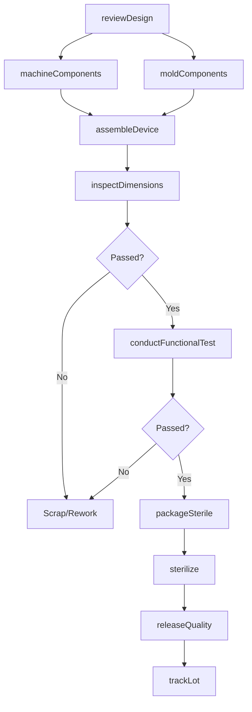
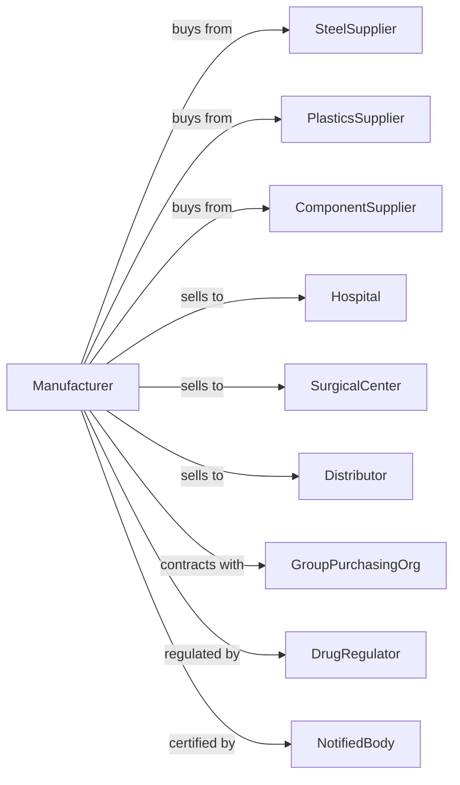

# Surgical and Medical Instrument Manufacturing

> Business-as-Code definition for surgical and medical instrument manufacturing operations. Models the complete production lifecycle from design through sterilization-ready delivery.

## Overview

Surgical and medical instrument manufacturing involves producing syringes, hypodermic needles, catheters, surgical clamps, forceps, scalpels, and diagnostic apparatus. This definition exposes actions for precision machining, assembly, sterilization, and regulatory compliance, events for workflow automation, and searches for specifications and lot tracking.

## Actors

| Actor | Description |
|-------|-------------|
| SteelSupplier | Provides surgical-grade stainless steel and titanium |
| PlasticsSupplier | Supplies medical-grade polymers and resins |
| ComponentSupplier | Provides seals, gaskets, and precision components |
| Hospital | Purchases instruments for surgical and diagnostic use |
| SurgicalCenter | Orders instruments for outpatient procedures |
| Distributor | Purchases for resale to healthcare facilities |
| GroupPurchasingOrg | Negotiates contracts on behalf of healthcare networks |
| DrugRegulator | Regulates device safety, efficacy, and manufacturing |
| NotifiedBody | Provides CE marking certification for international markets |

## Roles

| Role | Description |
|------|-------------|
| ProductionManager | Oversees manufacturing schedules and compliance |
| QualityEngineer | Develops and maintains quality management systems |
| CNCMachinist | Operates precision machining equipment |
| Assembler | Combines components in cleanroom environment |
| SterilizationTech | Operates sterilization equipment and validates cycles |
| RegulatoryAffairs | Manages regulatory submissions and international registrations |
| ValidationEngineer | Conducts process and equipment validation |
| PackagingTech | Prepares sterile barrier packaging |

## Entities

| Entity | Description |
|--------|-------------|
| Instrument | The surgical or diagnostic device being manufactured |
| Component | Individual part such as blade, handle, or tip |
| Lot | Production batch with unique traceability number |
| DeviceMasterRecord | Complete specifications and procedures for product |
| DeviceHistoryRecord | Production documentation for specific lot |
| Sterilization | Process to eliminate microbial contamination |
| Packaging | Sterile barrier system maintaining product integrity |
| Clearance | Regulatory 510(k) or PMA authorization to market |
| Specification | Engineering requirements and tolerances |

## Actions

| Action | Description |
|--------|-------------|
| reviewDesign | Analyze engineering specifications and requirements |
| machineComponents | CNC manufacture precision metal parts |
| moldComponents | Injection mold plastic components |
| assembleDevice | Join components in controlled environment |
| inspectDimensions | Verify measurements against specifications |
| conductFunctionalTest | Verify device operates as intended |
| packageSterile | Seal in validated sterile barrier packaging |
| sterilize | Process through validated sterilization cycle |
| releaseQuality | Review batch records and authorize distribution |
| submitRegulatory | File 510(k) or technical documentation |
| trackLot | Record production data for traceability |
| handleComplaint | Process and investigate product complaints |

## Events

| Event | Description |
|-------|-------------|
| designApproved | Engineering specifications finalized |
| componentsMachined | Metal parts manufactured |
| componentsMolded | Plastic parts produced |
| deviceAssembled | Product assembled and complete |
| dimensionsVerified | Inspection measurements passed |
| functionalTestPassed | Performance testing approved |
| devicePackaged | Sealed in sterile barrier packaging |
| sterilizationCompleted | Sterilization cycle validated and released |
| lotReleased | Quality authorization for distribution |
| clearanceReceived | Regulatory authorization obtained |
| complaintReceived | Customer issue reported and logged |

## Searches

| Search | Description |
|--------|-------------|
| findLots | List production lots by status or date |
| getComponentInventory | Query raw material and component stock |
| findDeviceRecords | Search device history records by lot |
| getSpecifications | Retrieve engineering requirements |
| trackSterilization | View sterilization cycle records |
| getComplaintHistory | Access product complaint records |
| getRegulatoryStatus | Check clearance and registration status |

## Workflow

## Actor Relationships

