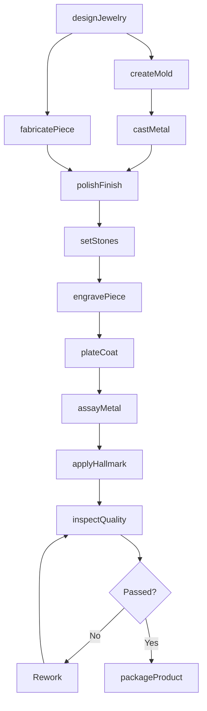
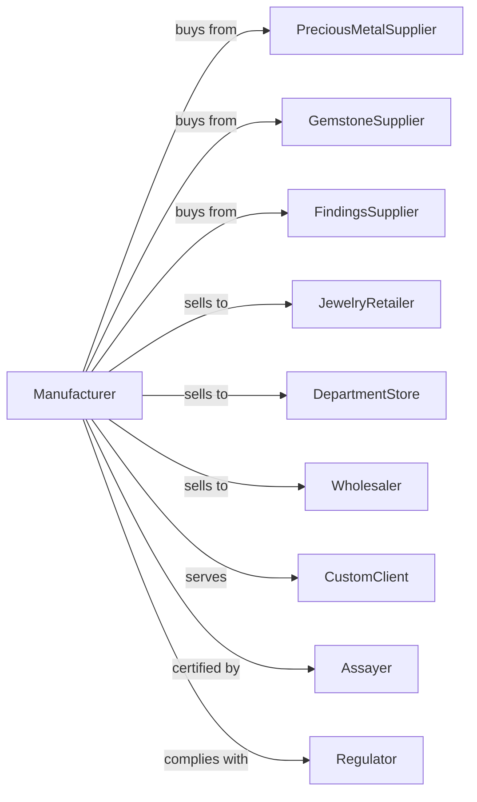

# Jewelry and Silverware Manufacturing

> Business-as-Code definition for jewelry and silverware manufacturing operations. Models the complete production lifecycle from precious metal processing through finished goods.

## Overview

Jewelry and silverware manufacturing involves producing fine and costume jewelry, personal metal goods, flatware, hollowware, and coins. This definition exposes actions for casting, stone setting, polishing, and engraving, events for workflow automation, and searches for materials and inventory.

## Actors

| Actor | Description |
|-------|-------------|
| PreciousMetalSupplier | Provides gold, silver, platinum, and alloys |
| GemstoneSupplier | Supplies diamonds, colored stones, and pearls |
| FindingsSupplier | Provides clasps, settings, chains, and components |
| JewelryRetailer | Purchases finished goods for consumer sales |
| DepartmentStore | Orders jewelry for retail department displays |
| Wholesaler | Buys in volume for distribution to retailers |
| CustomClient | Commissions bespoke jewelry pieces |
| Assayer | Verifies metal purity and quality |
| Regulator | Enforces hallmarking and consumer protection laws |

## Roles

| Role | Description |
|------|-------------|
| MasterJeweler | Designs and oversees production of fine pieces |
| Caster | Produces metal forms using lost wax casting |
| StoneSetter | Mounts gemstones securely in settings |
| Polisher | Creates high luster finishes on metal surfaces |
| Engraver | Adds decorative or personalized inscriptions |
| Benchworker | Performs fabrication and assembly operations |
| QualityInspector | Verifies craftsmanship and specifications |
| Appraiser | Evaluates finished pieces for value and authenticity |

## Entities

| Entity | Description |
|--------|-------------|
| Ring | Finger jewelry often featuring gemstones |
| Necklace | Neck jewelry including chains and pendants |
| Bracelet | Wrist jewelry in various styles |
| Earring | Jewelry worn on ears |
| Flatware | Utensils including forks, knives, and spoons |
| Hollowware | Vessels including bowls, trays, and pitchers |
| Gemstone | Precious or semi-precious stone for mounting |
| Setting | Metal structure holding gemstones |
| Hallmark | Official mark certifying metal purity |

## Actions

| Action | Description |
|--------|-------------|
| designJewelry | Create sketches and CAD models for pieces |
| createMold | Produce rubber or silicone molds for casting |
| castMetal | Pour molten metal into investment molds |
| fabricatePiece | Hand form metal using tools and techniques |
| setStones | Mount gemstones into prepared settings |
| polishFinish | Achieve desired surface luster |
| engravePiece | Add decorative or custom inscriptions |
| plateCoat | Apply gold, rhodium, or other plating |
| assayMetal | Test and certify metal purity |
| applyHallmark | Stamp official purity marks |
| inspectQuality | Verify craftsmanship meets standards |
| packageProduct | Prepare in presentation boxes for sale |

## Events

| Event | Description |
|-------|-------------|
| designApproved | Jewelry design finalized for production |
| moldCreated | Casting mold prepared |
| metalCast | Raw casting completed |
| piecesFabricated | Hand fabrication finished |
| stonesSet | All gemstones mounted |
| polishCompleted | Surface finishing achieved |
| engravingCompleted | Decorative work finished |
| assayCertified | Metal purity verified |
| hallmarkApplied | Official marks stamped |
| qualityApproved | Inspection passed |
| productPackaged | Ready for distribution |

## Searches

| Search | Description |
|--------|-------------|
| findOrders | List orders by status or customer |
| getMetalInventory | Query precious metal stock and prices |
| getGemstoneStock | Check stone inventory by type and quality |
| findDesigns | Search jewelry designs by style or collection |
| getProductionSchedule | View craftsman availability |
| trackOrder | Monitor piece progress through production |
| getAppraisalRecords | Access valuation history |

## Workflow

## Actor Relationships

