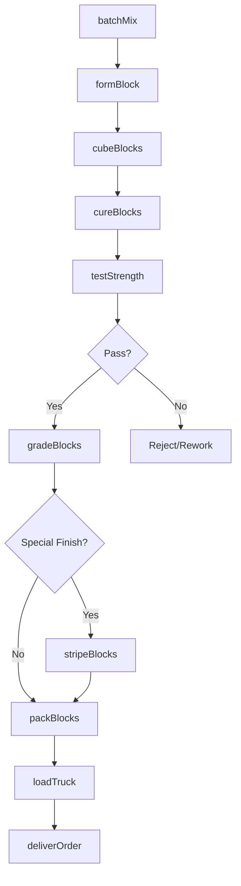
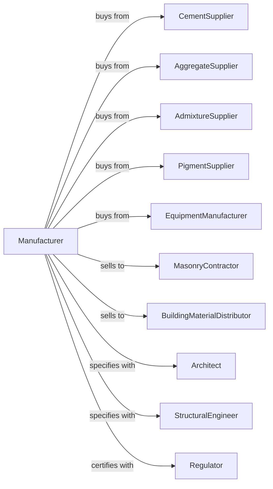

# Concrete Block and Brick Manufacturing

> Business-as-Code definition for concrete block and brick manufacturing operations. Models the complete production lifecycle from raw material batching through cured product delivery.

## Overview

Concrete block and brick manufacturing involves batching cement, aggregates, and water into zero-slump mixes, forming products in high-speed block machines, and curing to achieve required strength. Products include standard concrete masonry units (CMU), architectural blocks, concrete bricks, and specialty shapes. This definition exposes actions for each phase of production, events for workflow automation, and searches for data retrieval.

## Actors

| Actor | Description |
|-------|-------------|
| CementSupplier | Provides Portland cement for block production |
| AggregateSupplier | Supplies sand, lightweight aggregate, and stone |
| AdmixtureSupplier | Provides integral water repellents and coloring agents |
| PigmentSupplier | Supplies iron oxide and other coloring pigments |
| EquipmentManufacturer | Sells block machines, mixers, and curing systems |
| MasonryContractor | Purchases blocks for construction projects |
| BuildingMaterialDistributor | Distributes blocks to retail and contractor markets |
| Architect | Specifies block types for building designs |
| StructuralEngineer | Specifies load-bearing block requirements |
| Regulator | Oversees product standards and testing requirements |

## Roles

| Role | Description |
|------|-------------|
| PlantManager | Directs manufacturing operations and production planning |
| QualityManager | Ensures products meet ASTM specifications |
| MixerOperator | Batches materials according to mix designs |
| BlockMachineOperator | Runs block forming equipment and cuber |
| CuringOperator | Manages autoclave or low-pressure steam curing |
| ForkiftOperator | Moves pallets and loads trucks |
| MaintenanceTechnician | Maintains block machines and automated systems |
| SalesCoordinator | Manages orders and customer relationships |

## Entities

| Entity | Description |
|--------|-------------|
| MixDesign | Proportioned recipe for specific block properties |
| BlockMachine | High-speed equipment forming concrete masonry units |
| Mold | Steel form determining block shape and dimensions |
| GreenBlock | Freshly formed block before curing |
| CuredBlock | Block after steam or autoclave curing |
| Pallet | Board holding blocks through production and curing |
| Cube | Stacked unit of blocks for handling and shipping |
| CuringChamber | Enclosure for steam or autoclave curing |
| ProductionLine | Integrated system from mixer through cuber |
| QualityTest | Strength, absorption, and dimensional testing |

## Actions

| Action | Description |
|--------|-------------|
| batchMix | Proportion cement, aggregate, water, and admixtures |
| formBlock | Mold and vibrate mix into block shapes |
| cubeBlocks | Stack formed blocks on pallets automatically |
| cureBlocks | Apply steam or autoclave treatment for strength |
| stripeBlocks | Apply surface textures or split-face finish |
| testStrength | Break samples to verify compressive strength |
| testAbsorption | Measure water absorption for specification compliance |
| gradeBlocks | Sort blocks by quality and appearance |
| packBlocks | Prepare cubes for shipping with strapping or wrap |
| loadTruck | Transfer cubes to delivery vehicles |
| deliverOrder | Transport blocks to customer job sites |
| trackInventory | Monitor stock levels by product type and color |

## Events

| Event | Description |
|-------|-------------|
| batchCompleted | Mix prepared and delivered to block machine |
| blocksFormed | Blocks molded and transferred to curing |
| curingComplete | Blocks reached target strength |
| strengthApproved | Samples pass compressive strength test |
| strengthFailed | Samples below specification strength |
| blocksGraded | Products sorted by quality level |
| orderReceived | Customer order entered into system |
| orderShipped | Blocks delivered to customer |
| machineDown | Block machine requires maintenance |
| moldChange | Mold swap completed for different product |
| inventoryLow | Stock below reorder threshold |

## Searches

| Search | Description |
|--------|-------------|
| findProducts | List blocks by size, type, color, and specification |
| getInventory | Query stock levels by product and location |
| findOrders | Retrieve orders by customer, product, or delivery date |
| getProductionSchedule | View planned runs and mold change schedules |
| checkQualityData | Access strength tests, absorption, and dimensions |
| getMoldStatus | Query mold wear and replacement schedules |
| getMaterialInventory | Query cement, aggregate, and pigment stock |
| getProductionMetrics | Analyze output rates and machine efficiency |

## Workflow



## Actor Relationships



## Usage

### Calling Actions

```typescript
import { manufactureConcreteBlock } from '@headlessly/manufacture-concrete-block'

const plant = manufactureConcreteBlock()

// Check available stock
const stock = await plant.findProducts({ status: 'available' })

// Check finished goods inventory
const inventory = await plant.getInventory({ lowStockOnly: true })

// Batch mix for standard gray CMU
const mix = await plant.batchMix({
  cement: 250,
  sand: 1200,
  aggregate: 800,
  water: 180,
  admixture: 2
})

// Form 8x8x16 standard blocks
const run = await plant.formBlock({
  mixId: mix.id,
  moldId: '8x8x16-standard',
  cycleRate: 8,
  vibrationIntensity: 'high',
  quantity: 5000
})

// Cure blocks in low-pressure steam chamber
await plant.cureBlocks({
  runId: run.id,
  method: 'low-pressure-steam',
  temperature: 150,
  duration: 12,
  humidity: 95
})
```

### Event-Driven Automation

```typescript
// Auto-alert on strength failure
plant.strengthFailed(async ({ runId, actualStrength, targetStrength }) => {
  await plant.quarantineBlocks({
    runId,
    reason: 'below-spec-strength',
    notifyQuality: true
  })
  await plant.reviewMixDesign({
    runId,
    issue: 'strength-failure'
  })
})

// Auto-reorder materials when inventory low
plant.inventoryLow(async ({ materialId, currentLevel, reorderPoint }) => {
  await plant.createPurchaseOrder({
    materialId,
    quantity: reorderPoint * 2,
    priority: 'standard'
  })
})
```
