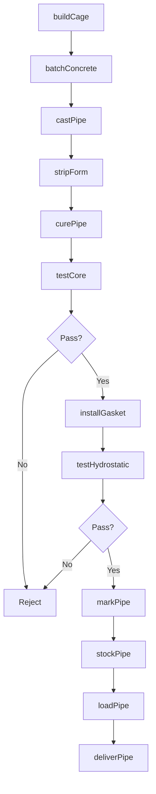
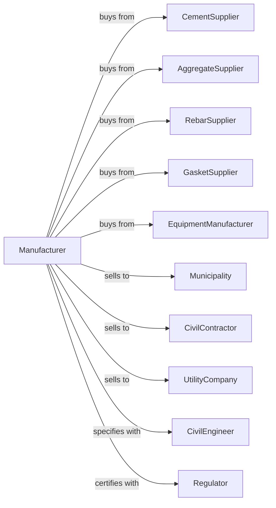

# Concrete Pipe Manufacturing

> Business-as-Code definition for concrete pipe manufacturing operations. Models the complete production lifecycle from raw material batching through cured pipe delivery.

## Overview

Concrete pipe manufacturing involves producing reinforced and non-reinforced concrete pipes for storm drainage, sanitary sewers, culverts, and irrigation systems. Production methods include dry-cast, wet-cast, and centrifugal spinning processes with steel reinforcement cages. This definition exposes actions for each phase of production, events for workflow automation, and searches for data retrieval.

## Actors

| Actor | Description |
|-------|-------------|
| CementSupplier | Provides Portland cement for pipe production |
| AggregateSupplier | Supplies sand, gravel, and crushed stone |
| RebarSupplier | Provides steel wire and reinforcement cages |
| GasketSupplier | Supplies rubber gaskets for pipe joints |
| EquipmentManufacturer | Sells pipe machines, forms, and curing systems |
| Municipality | Purchases pipe for public infrastructure projects |
| CivilContractor | Uses pipe for private development projects |
| UtilityCompany | Purchases pipe for water and sewer systems |
| CivilEngineer | Specifies pipe sizes and strength classes |
| Regulator | Oversees ASTM and AASHTO product standards |

## Roles

| Role | Description |
|------|-------------|
| PlantManager | Directs manufacturing operations and production planning |
| QualityManager | Ensures products meet specification requirements |
| MixerOperator | Batches concrete according to mix designs |
| PipeMachineOperator | Runs dry-cast, wet-cast, or spinning equipment |
| CageBuilder | Fabricates steel reinforcement cages |
| CuringOperator | Manages steam curing and strength development |
| CraneOperator | Handles pipe movement and loading |
| MaintenanceTechnician | Maintains forms, machines, and equipment |

## Entities

| Entity | Description |
|--------|-------------|
| MixDesign | Proportioned recipe for pipe concrete |
| ReinforcementCage | Steel wire cage providing tensile strength |
| PipeForm | Steel mold determining pipe dimensions |
| GreenPipe | Freshly cast pipe before curing |
| CuredPipe | Pipe after curing reaching design strength |
| Gasket | Rubber seal for watertight pipe joints |
| CuringBed | Steam-heated area for pipe strength development |
| HydrostaticTest | Pressure test verifying joint and wall integrity |
| CoreTest | Strength sample from pipe wall |
| LoadRating | Structural classification for burial depth |

## Actions

| Action | Description |
|--------|-------------|
| buildCage | Fabricate steel reinforcement cage for pipe diameter |
| batchConcrete | Proportion cement, aggregate, and water for mix |
| castPipe | Form pipe using dry-cast, wet-cast, or spinning method |
| stripForm | Remove outer form from freshly cast pipe |
| curePipe | Apply steam curing for strength development |
| installGasket | Place rubber gasket in pipe bell joint |
| testHydrostatic | Pressure test pipe for leak integrity |
| testCore | Extract and break sample from pipe wall |
| markPipe | Apply identification stamps and date codes |
| stockPipe | Store cured pipe in yard by size and class |
| loadPipe | Transfer pipe to delivery trucks |
| deliverPipe | Transport pipe to project job sites |

## Events

| Event | Description |
|-------|-------------|
| cageBuilt | Reinforcement cage fabricated and ready |
| pipeCast | Concrete placed and compacted in form |
| pipeStripped | Form removed and pipe transferred to curing |
| curingComplete | Pipe reached design strength |
| hydrostaticPassed | Pipe passed pressure test |
| hydrostaticFailed | Pipe failed leak test |
| coreStrengthApproved | Wall sample meets strength specification |
| pipeStocked | Pipe moved to inventory yard |
| orderReceived | Customer order entered into system |
| orderShipped | Pipe delivered to job site |
| formDamaged | Form requires repair or replacement |

## Searches

| Search | Description |
|--------|-------------|
| findProducts | List pipe by diameter, length, class, and joint type |
| getInventory | Query stock levels by pipe size and strength class |
| findOrders | Retrieve orders by customer, project, or delivery date |
| getProductionSchedule | View planned runs by pipe size |
| checkQualityData | Access hydrostatic tests, core breaks, and certifications |
| getFormStatus | Query form condition and availability |
| getMaterialInventory | Query cement, aggregate, and steel stock |
| getProductionMetrics | Analyze output rates and form utilization |

## Workflow



## Actor Relationships



## Usage

### Calling Actions

```typescript
import { manufactureConcretePipe } from '@headlessly/manufacture-concrete-pipe'

const plant = manufactureConcretePipe()

// Check available stock
const stock = await plant.findProducts({ status: 'available' })

// Check finished goods inventory
const inventory = await plant.getInventory({ lowStockOnly: true })

// Build reinforcement cage for 48" pipe
const cage = await plant.buildCage({
  diameter: 48,
  wallClass: 'Class-IV',
  wireGauge: 6,
  circumSpacing: 3,
  longSpacing: 4
})

// Cast pipe using dry-cast method
const pipe = await plant.castPipe({
  cageId: cage.id,
  formId: '48x8-dc',
  method: 'dry-cast',
  mixDesignId: 'dc-4000',
  jointType: 'bell-spigot'
})

// Cure and test pipe
await plant.curePipe({
  pipeId: pipe.id,
  method: 'steam',
  temperature: 150,
  duration: 16
})
```

### Event-Driven Automation

```typescript
// Auto-quarantine on hydrostatic failure
plant.hydrostaticFailed(async ({ pipeId, pressure, location }) => {
  await plant.quarantinePipe({
    pipeId,
    reason: 'hydrostatic-failure',
    testPressure: pressure,
    failureLocation: location
  })
  await plant.notifyQuality({
    issue: 'hydrostatic-failure',
    pipeId,
    priority: 'high'
  })
})

// Auto-schedule form maintenance
plant.formDamaged(async ({ formId, damageType, severity }) => {
  await plant.scheduleFormRepair({
    formId,
    damageType,
    priority: severity === 'critical' ? 'immediate' : 'scheduled'
  })
})
```
