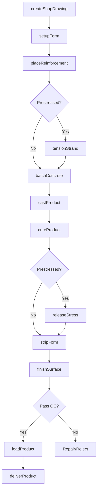
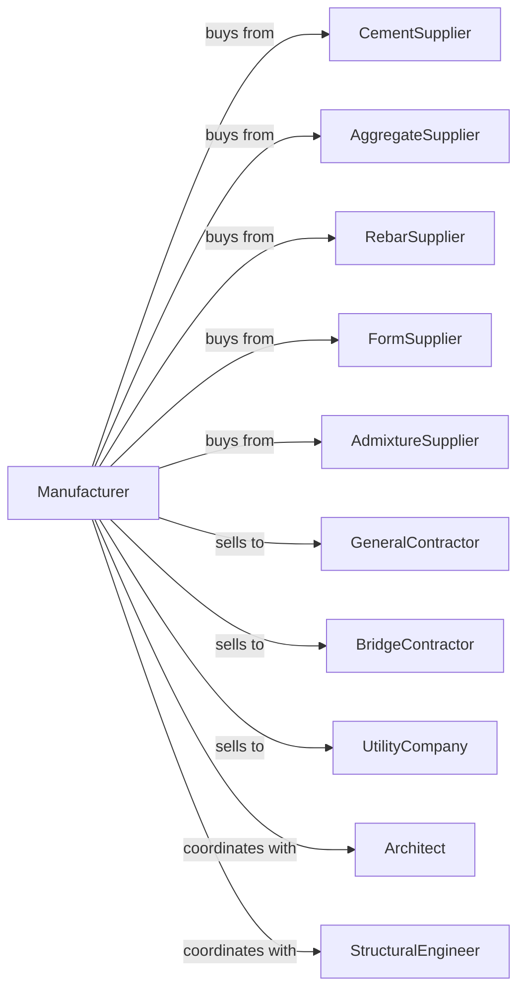

# Other Concrete Product Manufacturing

> Business-as-Code definition for other concrete product manufacturing operations. Models the complete production lifecycle from design through fabrication of precast and prestressed concrete products.

## Overview

Other concrete product manufacturing encompasses precast structural members, prestressed beams, architectural panels, utility vaults, septic tanks, burial vaults, and specialty concrete products. Operations involve form design, reinforcement placement, concrete casting, curing, and finishing. This definition exposes actions for each phase of production, events for workflow automation, and searches for data retrieval.

## Actors

| Actor | Description |
|-------|-------------|
| CementSupplier | Provides Portland cement and supplementary materials |
| AggregateSupplier | Supplies sand, gravel, and lightweight aggregates |
| RebarSupplier | Provides reinforcing steel and prestressing strand |
| FormSupplier | Supplies steel and fiberglass form systems |
| AdmixtureSupplier | Provides plasticizers, accelerators, and retarders |
| GeneralContractor | Purchases precast for building construction |
| BridgeContractor | Uses prestressed beams for infrastructure |
| UtilityCompany | Purchases vaults, manholes, and utility structures |
| Architect | Specifies architectural precast panels |
| StructuralEngineer | Designs precast and prestressed structural elements |

## Roles

| Role | Description |
|------|-------------|
| PlantManager | Directs manufacturing operations and project coordination |
| ProjectEngineer | Develops shop drawings and production details |
| QualityManager | Ensures products meet specifications and tolerances |
| FormSetter | Prepares and maintains casting forms |
| RebarPlacer | Installs reinforcement and embeds |
| PrestressOperator | Tensions and releases prestressing strand |
| FinishingCrew | Applies surface treatments and repairs |
| CraneOperator | Handles heavy precast elements |

## Entities

| Entity | Description |
|--------|-------------|
| ShopDrawing | Detailed production drawing with dimensions and details |
| CastingBed | Long-line bed for prestressed element production |
| Form | Mold defining product shape and surface finish |
| ReinforcementCage | Steel assembly providing tensile strength |
| PrestressStrand | High-strength wire providing pre-compression |
| Embed | Hardware cast into concrete for connections |
| CuredProduct | Concrete element after strength development |
| FinishedProduct | Element with applied finishes and repairs |
| ProductionLot | Group of elements cast together |
| QualityCertificate | Documentation of test results and compliance |

## Actions

| Action | Description |
|--------|-------------|
| createShopDrawing | Develop detailed production drawings from design |
| setupForm | Prepare casting form with release agent and embeds |
| placeReinforcement | Install rebar cage, strand, and hardware |
| tensionStrand | Apply prestress force to high-strength strand |
| batchConcrete | Mix concrete according to approved design |
| castProduct | Place and consolidate concrete in forms |
| cureProduct | Apply steam or wet curing for strength |
| releaseStress | Transfer prestress force to hardened concrete |
| stripForm | Remove product from casting form |
| finishSurface | Apply repairs, coatings, and surface treatments |
| loadProduct | Transfer products to delivery vehicles |
| deliverProduct | Transport products to project sites |

## Events

| Event | Description |
|-------|-------------|
| drawingApproved | Shop drawing accepted for production |
| formSetup | Casting form prepared and inspected |
| reinforcementPlaced | Steel assembly installed and verified |
| strandTensioned | Prestress force applied and recorded |
| productCast | Concrete placed and consolidated |
| curingComplete | Product reached release strength |
| stressReleased | Prestress transferred to concrete |
| formStripped | Product removed from form |
| qualityApproved | Product passes final inspection |
| orderShipped | Products delivered to project site |
| formDamaged | Form requires repair |
| concreteRejected | Mix fails specification tests |

## Searches

| Search | Description |
|--------|-------------|
| findProducts | List products by type, size, and project |
| getInventory | Query completed products awaiting shipment |
| findOrders | Retrieve orders by customer, project, or delivery date |
| getProductionSchedule | View casting schedules and bed assignments |
| checkQualityData | Access strength tests, dimensions, and certifications |
| getFormStatus | Query form availability and condition |
| getMaterialInventory | Query cement, aggregate, strand, and rebar stock |
| getProjectStatus | Track production progress by project |

## Workflow



## Actor Relationships



## Usage

### Calling Actions

```typescript
import { manufactureConcreteProduct } from '@headlessly/manufacture-concrete-product'

const plant = manufactureConcreteProduct()

// Check available stock
const stock = await plant.findProducts({ status: 'available' })

// Check finished goods inventory
const inventory = await plant.getInventory({ lowStockOnly: true })

// Create shop drawing for double-tee beam
const drawing = await plant.createShopDrawing({
  projectId: 'parking-garage-phase-2',
  productType: 'double-tee',
  span: 60,
  width: 12,
  depth: 32,
  prestressPattern: '14-0.6-strand'
})

// Setup casting bed and tension strand
await plant.setupForm({
  drawingId: drawing.id,
  bedId: 'bed-3',
  releaseAgent: 'form-oil-standard'
})

await plant.tensionStrand({
  drawingId: drawing.id,
  strandPattern: '14-0.6',
  jacking: 0.75,
  targetForce: 31000
})

// Cast and cure product
await plant.castProduct({
  drawingId: drawing.id,
  mixDesignId: 'scc-6000',
  placementMethod: 'self-consolidating'
})
```

### Event-Driven Automation

```typescript
// Auto-schedule strand release on cure complete
plant.curingComplete(async ({ productId, strength, targetStrength }) => {
  if (strength >= targetStrength * 0.75) {
    await plant.releaseStress({
      productId,
      method: 'gradual',
      recordCamber: true
    })
  }
})

// Auto-notify on quality rejection
plant.concreteRejected(async ({ batchId, parameter, reading, spec }) => {
  await plant.notifyQuality({
    batchId,
    issue: `${parameter} out of spec`,
    reading,
    specification: spec,
    priority: 'high'
  })
})
```
