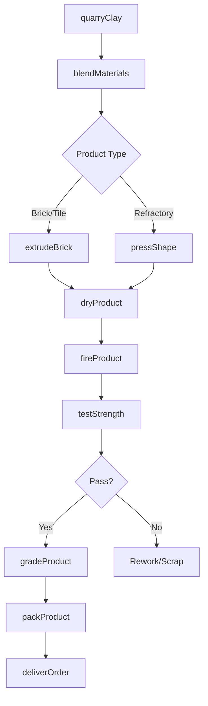
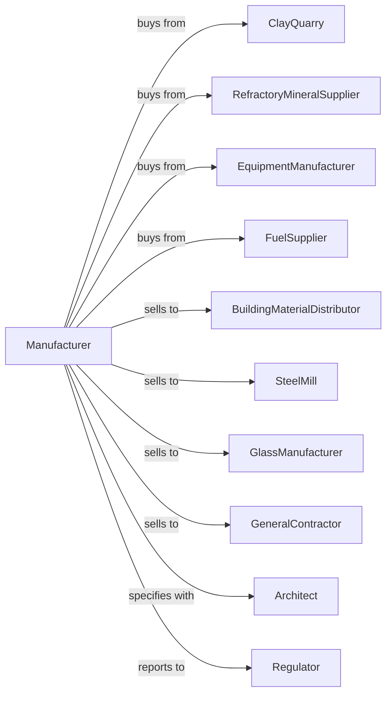

# Clay Building Material and Refractories Manufacturing

> Business-as-Code definition for clay building material and refractories manufacturing operations. Models the complete production lifecycle from raw material processing through finished product delivery.

## Overview

Clay building material and refractories manufacturing involves shaping, molding, baking, burning, or hardening clay and non-clay materials into bricks, structural tiles, ceramic floor tiles, and refractory products. Refractories are materials that retain shape and chemical identity at extreme temperatures, used in furnace linings, kilns, and industrial heating applications. This definition exposes actions for each phase of production, events for workflow automation, and searches for data retrieval.

## Actors

| Actor | Description |
|-------|-------------|
| ClayQuarry | Supplies raw clay, shale, and fire clay materials |
| RefractoryMineralSupplier | Provides alumina, magnite, chromite, and specialty minerals |
| EquipmentManufacturer | Sells extruders, kilns, and brick-making machinery |
| FuelSupplier | Provides natural gas, coal, or other kiln fuels |
| BuildingMaterialDistributor | Distributes bricks and tiles to construction markets |
| SteelMill | Purchases refractories for blast furnace and ladle linings |
| GlassManufacturer | Uses refractories in glass melting furnaces |
| GeneralContractor | Installs brick and tile in construction projects |
| Architect | Specifies clay products for building designs |
| Regulator | Oversees emissions, workplace safety, and product standards |

## Roles

| Role | Description |
|------|-------------|
| PlantManager | Directs manufacturing operations and production planning |
| ProcessEngineer | Optimizes forming, drying, and firing processes |
| KilnOperator | Controls tunnel and periodic kiln firing operations |
| QualityEngineer | Ensures products meet strength and dimensional specifications |
| MaterialsScientist | Develops refractory formulations for specific applications |
| ExtrusionOperator | Operates brick and tile extrusion equipment |
| MaintenanceManager | Oversees equipment upkeep and kiln repairs |

## Entities

| Entity | Description |
|--------|-------------|
| ClayMix | Formulated blend of clays and additives for specific products |
| RefractoryMix | High-temperature resistant material formulation |
| Brick | Standard or custom clay building unit |
| Tile | Structural or decorative ceramic floor and wall covering |
| RefractoryShape | Formed refractory product for furnace construction |
| TunnelKiln | Continuous firing system for high-volume production |
| PeriodicKiln | Batch firing system for specialty products |
| Mold | Form for shaping specialty bricks and refractories |
| ProductionRun | Scheduled manufacturing batch with specifications |
| TestSample | Product samples for quality testing |

## Actions

| Action | Description |
|--------|-------------|
| quarryClay | Extract raw clay and shale from deposits |
| blendMaterials | Mix clays, minerals, and additives to specification |
| extrudeBrick | Form brick shapes through continuous extrusion |
| pressShape | Mold refractory shapes using hydraulic presses |
| dryProduct | Remove moisture in controlled drying chambers |
| fireProduct | Heat products in kilns to achieve hardness and strength |
| testStrength | Measure compressive strength and thermal resistance |
| gradeProduct | Sort products by quality, color, and dimensional tolerance |
| packProduct | Prepare products for shipping on pallets or in bundles |
| deliverOrder | Transport products to customer job sites or warehouses |
| installRefractory | Provide technical support for refractory installation |
| monitorEmissions | Track kiln emissions for environmental compliance |

## Events

| Event | Description |
|-------|-------------|
| materialBlended | Raw materials processed and ready for forming |
| productFormed | Brick or tile extruded or pressed to shape |
| productDried | Moisture removed and product ready for firing |
| firingComplete | Kiln cycle finished and products cooled |
| qualityApproved | Products pass strength and dimensional tests |
| qualityRejected | Products fail specifications and require sorting |
| orderReceived | Customer order entered for production scheduling |
| orderShipped | Products dispatched to customer location |
| kilnScheduled | Firing cycle planned and kiln loaded |
| maintenanceRequired | Equipment needs service or repair |
| emissionsAlert | Environmental threshold exceeded |

## Searches

| Search | Description |
|--------|-------------|
| findProducts | List bricks, tiles, or refractories by type and specification |
| getInventory | Query stock levels by product, grade, and location |
| findOrders | Retrieve orders by customer, product, or delivery date |
| getProductionSchedule | View planned runs and kiln schedules |
| checkQualityData | Access test results and defect rates by batch |
| getMaterialInventory | Query raw material stock and purchase orders |
| findCustomers | List customers by industry, region, or purchase history |
| getEmissionsData | Retrieve environmental monitoring records |

## Workflow



## Actor Relationships



## Usage

### Calling Actions

```typescript
import { manufactureClayBrickRefractories } from '@headlessly/manufacture-clay-brick-refractories'

const plant = manufactureClayBrickRefractories()

// Blend materials for face brick production
const clayMix = await plant.blendMaterials({
  product: 'face-brick',
  components: ['shale', 'fire-clay', 'mangite'],
  ratios: [0.6, 0.3, 0.1],
  moisture: 18
})

// Extrude standard modular bricks
const run = await plant.extrudeBrick({
  mixId: clayMix.id,
  size: 'modular',
  dimensions: { length: 194, width: 92, height: 57 },
  texture: 'wire-cut',
  quantity: 50000
})

// Fire in tunnel kiln
await plant.fireProduct({
  runId: run.id,
  kiln: 'tunnel-kiln-1',
  peakTemp: 1050,
  duration: 48,
  atmosphere: 'oxidizing'
})
```

### Event-Driven Automation

```typescript
// Auto-schedule maintenance on kiln issues
plant.maintenanceRequired(async ({ equipmentId, issueType, severity }) => {
  if (severity === 'critical') {
    await plant.scheduleEmergencyRepair({
      equipmentId,
      priority: 'immediate',
      notifyProduction: true
    })
  }
})

// Auto-alert on emissions threshold
plant.emissionsAlert(async ({ kilnId, pollutant, reading, limit }) => {
  await plant.adjustKilnOperation({
    kilnId,
    action: 'reduce-firing-rate',
    notifyEnvironmental: true
  })
})
```
