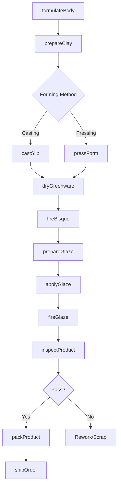
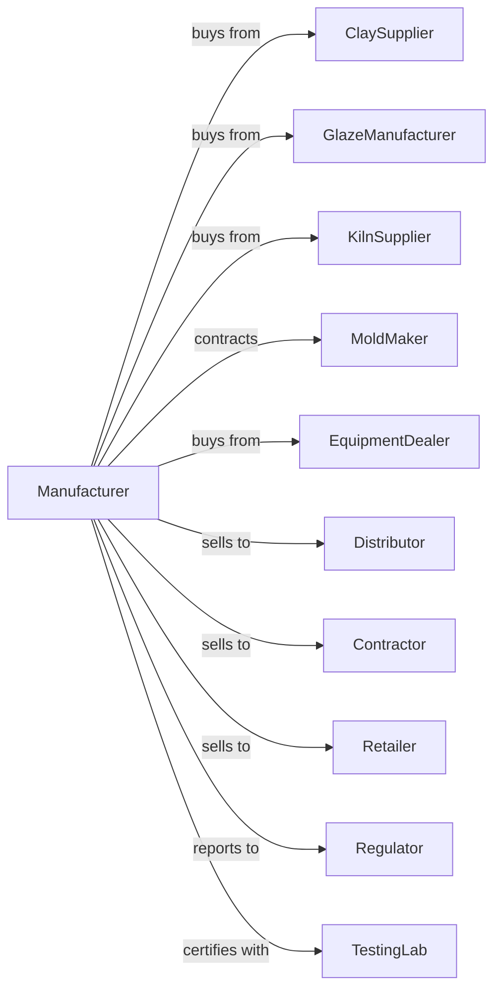

# Pottery, Ceramics, and Plumbing Fixture Manufacturing

> Business-as-Code definition for pottery, ceramics, and plumbing fixture manufacturing operations. Models the complete production lifecycle from clay preparation through finished product distribution.

## Overview

Pottery, ceramics, and plumbing fixture manufacturing involves shaping, molding, glazing, and firing clay and ceramic materials into finished products. Operations include producing bathroom fixtures, tableware, decorative ceramics, electrical porcelain insulators, and industrial ceramic components. This definition exposes actions for each phase of the manufacturing process, events for workflow automation, and searches for data retrieval.

## Actors

| Actor | Description |
|-------|-------------|
| ClaySupplier | Provides raw clay, kaolin, feldspar, and other ceramic materials |
| GlazeManufacturer | Supplies glazes, frits, and ceramic colorants |
| KilnSupplier | Provides kilns, furnaces, and firing equipment |
| MoldMaker | Fabricates molds and dies for ceramic forming |
| EquipmentDealer | Sells and services forming, mixing, and handling machinery |
| Distributor | Purchases products for resale to retailers and contractors |
| Contractor | Installs plumbing fixtures in residential and commercial buildings |
| Retailer | Sells tableware and decorative ceramics to consumers |
| Regulator | Oversees safety standards, lead content, and water efficiency |
| TestingLab | Provides quality certification and compliance testing |

## Roles

| Role | Description |
|------|-------------|
| PlantManager | Oversees daily manufacturing operations and production schedules |
| CeramicEngineer | Develops formulations, processes, and quality specifications |
| KilnOperator | Manages firing schedules and kiln temperature profiles |
| GlazeSpecialist | Prepares and applies glazes to ceramic bodies |
| MoldTechnician | Operates slip casting and press forming equipment |
| QualityInspector | Tests products for strength, absorption, and finish quality |
| MaintenanceTechnician | Maintains and repairs production equipment |

## Entities

| Entity | Description |
|--------|-------------|
| ClayBody | Formulated mixture of clays and minerals for specific products |
| Glaze | Vitreous coating applied to ceramic surfaces |
| Mold | Form used to shape clay into specific product geometry |
| Kiln | High-temperature furnace for firing ceramic products |
| Greenware | Unfired clay products in dried state |
| Bisqueware | Once-fired ceramic ready for glazing |
| Batch | Production lot of ceramic products |
| ProductSpec | Technical specification for product performance |
| QualityReport | Test results and inspection findings |
| Order | Customer purchase request with product specifications |

## Actions

| Action | Description |
|--------|-------------|
| formulateBody | Develop clay body recipes for specific product requirements |
| prepareClay | Mix, blend, and condition raw materials for forming |
| castSlip | Pour liquid clay into plaster molds for shaping |
| pressForm | Shape clay using hydraulic or mechanical presses |
| dryGreenware | Remove moisture from formed products before firing |
| fireBisque | Initial firing to harden clay body |
| prepareGlaze | Mix and quality-check glaze formulations |
| applyGlaze | Coat bisqueware with glaze by dipping, spraying, or brushing |
| fireGlaze | Final firing to vitrify glaze and complete product |
| inspectProduct | Test for dimensional accuracy, finish, and structural integrity |
| packProduct | Prepare finished goods for shipping and storage |
| shipOrder | Deliver products to customers and distributors |

## Events

| Event | Description |
|-------|-------------|
| clayPrepared | Raw materials processed and ready for forming |
| productFormed | Clay shaped into greenware configuration |
| greenwareDried | Moisture removed and product ready for bisque firing |
| bisqueFired | Initial firing completed |
| glazeApplied | Product coated with glaze |
| glazeFired | Final firing completed and product finished |
| inspectionPassed | Product meets quality specifications |
| inspectionFailed | Product rejected due to defects |
| orderReceived | New customer order entered into system |
| orderShipped | Products delivered to customer |
| inventoryDepleted | Stock fell below threshold |
| kilnMaintenancePerformed | Scheduled or emergency kiln service required |

## Searches

| Search | Description |
|--------|-------------|
| findProducts | List products by type, size, color, or specification |
| getBatches | Retrieve production batches by date, status, or product line |
| getInventory | Query current stock levels by product and location |
| findOrders | List orders by customer, status, or delivery date |
| getQualityMetrics | Retrieve defect rates, rejection data, and test results |
| checkKilnSchedule | View firing schedules and kiln availability |
| getMaterialStock | Query raw material inventory and reorder status |
| findSuppliers | List suppliers by material type and lead time |

## Workflow



## Actor Relationships



## Usage

### Calling Actions

```typescript
import { manufacturePottery } from '@headlessly/manufacture-pottery'

const plant = manufacturePottery()

// Formulate clay body for vitreous china fixtures
const clayBody = await plant.formulateBody({
  productType: 'toilet',
  absorption: 0.5,
  strength: 'high',
  ingredients: ['ball-clay', 'kaolin', 'feldspar', 'silica']
})

// Prepare clay for production
const batch = await plant.prepareClay({
  bodyId: clayBody.id,
  quantity: 5000,
  moisture: 22
})

// Cast toilet bowls in plaster molds
await plant.castSlip({
  batchId: batch.id,
  moldType: 'toilet-bowl-standard',
  drainTime: 45,
  wallThickness: 12
})
```

### Event-Driven Automation

```typescript
// Auto-alert on inspection failures
plant.inspectionFailed(async ({ batchId, defectType, quantity }) => {
  if (quantity > 50) {
    await plant.notifyQuality({
      batchId,
      issue: defectType,
      priority: 'high',
      action: 'stop-production-line'
    })
  }
})

// Auto-reorder materials when inventory low
plant.inventoryDepleted(async ({ materialId, currentStock, reorderPoint }) => {
  const supplier = await plant.findSuppliers({ materialId, preferred: true })
  await plant.createPurchaseOrder({
    supplierId: supplier[0].id,
    materialId,
    quantity: reorderPoint * 2
  })
})
```
