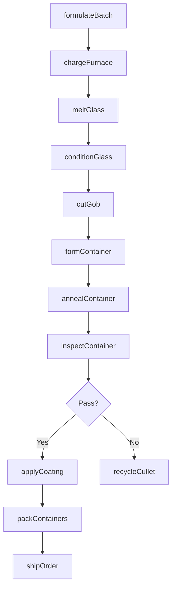
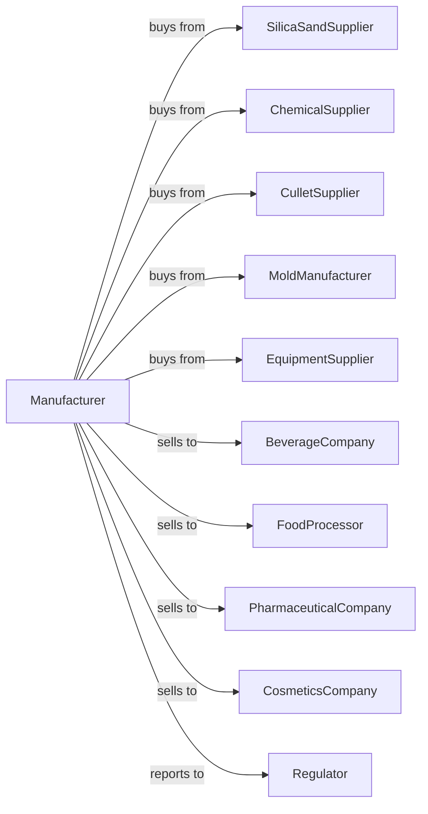

# Glass Container Manufacturing

> Business-as-Code definition for glass container manufacturing operations. Models the complete production lifecycle from raw material melting through finished bottle and jar production.

## Overview

Glass container manufacturing involves melting silica sand, soda ash, limestone, and cullet to produce bottles, jars, and other packaging containers. Operations use high-speed individual section (IS) machines to form containers through blow-and-blow or press-and-blow processes. This definition exposes actions for each phase of container production, events for workflow automation, and searches for data retrieval.

## Actors

| Actor | Description |
|-------|-------------|
| SilicaSandSupplier | Provides high-purity silica sand for glass batch |
| ChemicalSupplier | Supplies soda ash, limestone, and colorants |
| CulletSupplier | Provides recycled glass for batch formulation |
| MoldManufacturer | Fabricates blank and blow molds for container forming |
| EquipmentSupplier | Sells IS machines, furnaces, and inspection equipment |
| BeverageCompany | Purchases bottles for beer, wine, spirits, and soft drinks |
| FoodProcessor | Uses jars for sauces, preserves, and condiments |
| PharmaceuticalCompany | Purchases vials and bottles for medications |
| CosmeticsCompany | Uses glass containers for perfumes and cosmetics |
| Regulator | Oversees food contact safety and environmental compliance |

## Roles

| Role | Description |
|------|-------------|
| PlantManager | Directs manufacturing operations and customer programs |
| BatchEngineer | Formulates glass composition for color and properties |
| FurnaceOperator | Manages melting temperature, pull rate, and glass quality |
| ISMachineOperator | Controls forming machine speed and timing |
| MoldTechnician | Installs, lubricates, and maintains forming molds |
| QualityEngineer | Operates inspection systems and analyzes defect data |
| PackagingEngineer | Designs containers to customer specifications |
| MaintenanceManager | Oversees equipment upkeep and repairs |

## Entities

| Entity | Description |
|--------|-------------|
| Batch | Formulated mixture of raw materials for specific glass color |
| Furnace | High-temperature melting tank for continuous production |
| Forehearth | Channel distributing molten glass to forming machines |
| ISMachine | Individual section machine for high-speed container forming |
| BlankMold | Initial mold forming the parison shape |
| BlowMold | Final mold determining container shape |
| Gob | Measured portion of molten glass for forming |
| Lehr | Annealing oven for stress relief cooling |
| InspectionLine | Automated systems checking container quality |
| Pallet | Unit load of packed containers for shipping |

## Actions

| Action | Description |
|--------|-------------|
| formulateBatch | Calculate and mix raw materials for target glass color |
| chargeFurnace | Feed batch materials into the melting furnace |
| meltGlass | Heat batch to form homogeneous molten glass |
| conditionGlass | Adjust temperature in forehearth for forming |
| cutGob | Shear measured portions of molten glass |
| formContainer | Shape containers using IS machine blow or press process |
| annealContainer | Cool containers through lehr to relieve stress |
| inspectContainer | Check for cracks, bubbles, and dimensional accuracy |
| applyCoating | Apply protective or decorative surface treatments |
| packContainers | Palletize containers for shipping |
| shipOrder | Deliver containers to customer filling plants |
| recycleCullet | Process rejected containers for reuse in batch |

## Events

| Event | Description |
|-------|-------------|
| batchCharged | Raw materials loaded into furnace |
| glassMelted | Batch fully melted and conditioned |
| gobCut | Molten glass portion sheared for forming |
| containerFormed | Container shaped in IS machine |
| containerAnnealed | Container stress-relieved in lehr |
| inspectionPassed | Container meets quality specifications |
| inspectionFailed | Container rejected for defects |
| palletCompleted | Full pallet packed and ready for shipping |
| orderShipped | Containers delivered to customer |
| moldChanged | Mold replacement completed for new product |
| machineJammed | IS machine stoppage requiring intervention |
| furnaceAnomalyDetected | Furnace operating parameters deviated from acceptable range |

## Searches

| Search | Description |
|--------|-------------|
| findProducts | List containers by type, size, color, and finish |
| getInventory | Query stock levels by product and warehouse location |
| findOrders | Retrieve orders by customer, product, or delivery date |
| getProductionSchedule | View planned runs and mold change schedules |
| checkQualityData | Access defect rates, inspection data, and trends |
| getMachineStatus | Monitor IS machine efficiency and uptime |
| getMaterialInventory | Query raw material and cullet stock levels |
| getCustomerPrograms | View container specifications by customer |

## Workflow



## Actor Relationships



## Usage

### Calling Actions

```typescript
import { manufactureGlassContainer } from '@headlessly/manufacture-glass-container'

const plant = manufactureGlassContainer()

// Check available stock
const stock = await plant.findProducts({ status: 'available' })

// Check finished goods inventory
const inventory = await plant.getInventory({ lowStockOnly: true })

// Formulate batch for amber beer bottles
const batch = await plant.formulateBatch({
  color: 'amber',
  composition: {
    silicaSand: 71,
    sodaAsh: 14,
    limestone: 11,
    cullet: 50,
    ironOxide: 0.3,
    sulfur: 0.1
  }
})

// Form 12oz beer bottles at high speed
const run = await plant.formContainer({
  batchId: batch.id,
  moldId: 'beer-12oz-longneck',
  process: 'blow-and-blow',
  machineSpeed: 320,
  gobWeight: 195,
  quantity: 500000
})

// Apply scratch-resistant coating
await plant.applyCoating({
  runId: run.id,
  coatingType: 'hot-end',
  material: 'tin-oxide'
})
```

### Event-Driven Automation

```typescript
// Auto-respond to machine jams
plant.machineJammed(async ({ machineId, section, cause }) => {
  await plant.alertMaintenance({
    machineId,
    issue: cause,
    priority: 'immediate'
  })
  await plant.routeGobsToSpare({ machineId, section })
})

// Auto-adjust on quality trends
plant.inspectionFailed(async ({ runId, defectType, rate }) => {
  if (rate > 0.02) {
    await plant.adjustFormingParams({
      runId,
      defectType,
      notifyQuality: true
    })
  }
})
```
