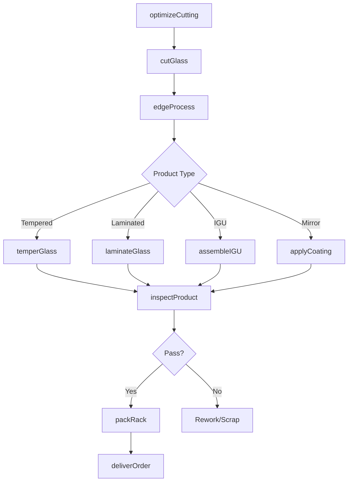
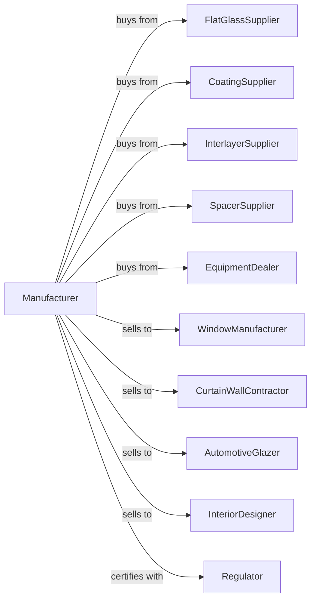

# Glass Product Manufacturing Made of Purchased Glass

> Business-as-Code definition for glass product manufacturing from purchased glass. Models the complete fabrication lifecycle from raw glass procurement through finished product delivery.

## Overview

Glass product manufacturing from purchased glass involves coating, laminating, tempering, bending, and shaping flat glass into finished products. Operations include producing insulated glass units, tempered safety glass, laminated glass, mirrors, and decorative glass products. This definition exposes actions for each phase of fabrication, events for workflow automation, and searches for data retrieval.

## Actors

| Actor | Description |
|-------|-------------|
| FlatGlassSupplier | Provides raw float glass sheets in various thicknesses |
| CoatingSupplier | Supplies low-E films, reflective coatings, and adhesives |
| InterlayerSupplier | Provides PVB and SGP interlayers for lamination |
| SpacerSupplier | Supplies spacer bars and desiccants for insulated units |
| EquipmentDealer | Sells cutting, tempering, and laminating equipment |
| WindowManufacturer | Purchases fabricated glass for window assembly |
| CurtainWallContractor | Installs glass in commercial building facades |
| AutomotiveGlazer | Uses fabricated glass for vehicle replacement |
| InteriorDesigner | Specifies decorative glass for interior applications |
| Regulator | Oversees safety glazing and energy performance standards |

## Roles

| Role | Description |
|------|-------------|
| PlantManager | Directs fabrication operations and customer service |
| ProductionScheduler | Plans cutting and processing to optimize yield |
| CuttingOperator | Operates CNC cutting tables and breakout equipment |
| TemperingOperator | Runs tempering furnaces and quench systems |
| LaminatingTechnician | Operates autoclaves and lamination lines |
| IGUAssembler | Builds insulated glass units with spacers and sealants |
| QualityInspector | Tests products for strength, optical quality, and seal integrity |
| ShippingCoordinator | Manages delivery logistics and rack loading |

## Entities

| Entity | Description |
|--------|-------------|
| RawSheet | Purchased flat glass sheet for fabrication |
| CutLite | Individual glass piece cut to customer dimensions |
| TemperedGlass | Heat-strengthened glass with enhanced impact resistance |
| LaminatedGlass | Multi-layer glass bonded with plastic interlayer |
| IGU | Insulated glass unit with sealed air or gas space |
| Mirror | Glass with reflective metallic coating |
| CuttingPattern | Optimized layout for cutting multiple pieces from sheet |
| WorkOrder | Customer order with specifications and delivery requirements |
| Rack | Shipping container for glass transport |
| QualityReport | Test results and certification documentation |

## Actions

| Action | Description |
|--------|-------------|
| optimizeCutting | Generate patterns to maximize yield from raw sheets |
| cutGlass | Score and break glass to specified dimensions |
| edgeProcess | Grind, polish, or bevel glass edges |
| drillGlass | Create holes for hardware and fittings |
| temperGlass | Heat and quench glass for safety tempering |
| laminateGlass | Bond multiple layers with interlayer material |
| assembleIGU | Build insulated units with spacers, gas fill, and sealants |
| applyCoating | Add reflective, low-E, or decorative coatings |
| inspectProduct | Test for strength, seal integrity, and optical quality |
| packRack | Load finished products onto shipping racks |
| deliverOrder | Transport products to customer job sites |
| trackWarranty | Manage warranty claims and replacement orders |

## Events

| Event | Description |
|-------|-------------|
| glassReceived | Raw glass sheets arrived and inventoried |
| glassCut | Pieces cut to specified dimensions |
| edgesProcessed | Edge grinding and polishing completed |
| glassTempered | Tempering process completed |
| glassLaminated | Lamination bonding completed |
| iguAssembled | Insulated unit sealed and filled |
| inspectionPassed | Product meets quality specifications |
| inspectionFailed | Product rejected for defects |
| orderPacked | Products loaded on delivery racks |
| orderDelivered | Products arrived at customer location |
| warrantyClaimReceived | Customer reported product issue |
| sealFailure | IGU seal integrity compromised |

## Searches

| Search | Description |
|--------|-------------|
| findProducts | List products by type, size, and specification |
| getInventory | Query raw glass and finished goods stock |
| findOrders | Retrieve work orders by customer, status, or delivery date |
| getProductionSchedule | View cutting and processing schedules |
| checkQualityData | Access test results and defect rates |
| getYieldData | Analyze cutting efficiency and waste rates |
| findCustomers | List customers by type, region, or purchase history |
| getWarrantyClaims | Retrieve warranty issues and resolution status |

## Workflow



## Actor Relationships



## Usage

### Calling Actions

```typescript
import { manufactureGlassProduct } from '@headlessly/manufacture-glass-product'

const plant = manufactureGlassProduct()

// Check available stock
const stock = await plant.findProducts({ status: 'available' })

// Check finished goods inventory
const inventory = await plant.getInventory({ lowStockOnly: true })

// Optimize cutting for commercial project
const pattern = await plant.optimizeCutting({
  orderId: 'office-tower-phase-1',
  sheets: [{ thickness: 6, size: '3210x2440', quantity: 50 }],
  pieces: [
    { width: 1500, height: 2200, quantity: 80 },
    { width: 900, height: 2200, quantity: 40 }
  ]
})

// Cut and temper facade panels
const lites = await plant.cutGlass({
  patternId: pattern.id,
  autoBreakout: true
})

await plant.temperGlass({
  liteIds: lites.map(l => l.id),
  furnaceTemp: 680,
  quenchPressure: 4.5
})

// Assemble into IGUs with argon fill
await plant.assembleIGU({
  innerLite: lites[0].id,
  outerLite: lites[1].id,
  spacerWidth: 16,
  gasFill: 'argon',
  fillPercent: 95
})
```

### Event-Driven Automation

```typescript
// Auto-schedule rework on inspection failure
plant.inspectionFailed(async ({ productId, defectType, severity }) => {
  if (severity === 'minor') {
    await plant.scheduleRework({
      productId,
      defectType,
      priority: 'standard'
    })
  } else {
    await plant.scrapProduct({
      productId,
      reason: defectType,
      notifyScheduler: true
    })
  }
})

// Auto-process warranty claims
plant.warrantyClaimReceived(async ({ claimId, productId, issueType }) => {
  if (issueType === 'seal-failure') {
    await plant.scheduleReplacement({
      claimId,
      productId,
      priority: 'high',
      expedite: true
    })
  }
})
```
