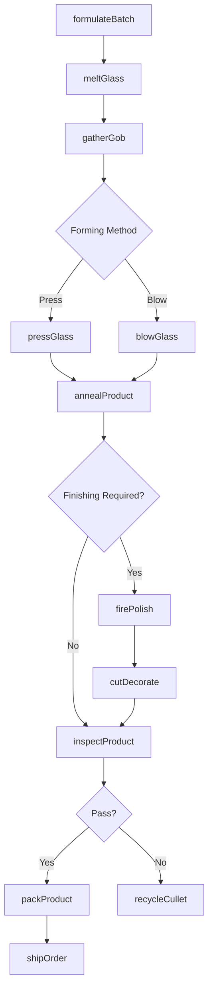
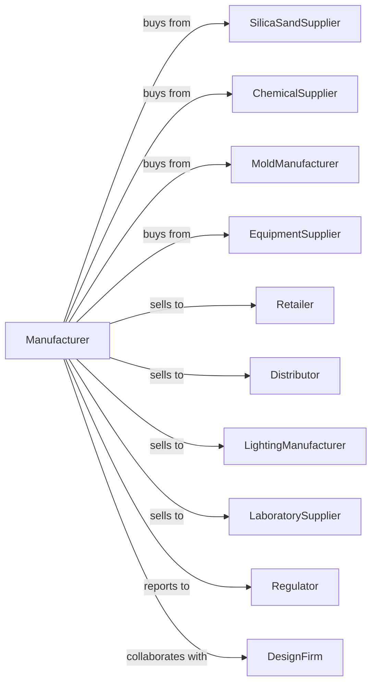

# Other Pressed and Blown Glass and Glassware Manufacturing

> Business-as-Code definition for pressed and blown glass and glassware manufacturing operations. Models the complete production lifecycle from glass melting through finished product fabrication.

## Overview

Pressed and blown glass manufacturing involves melting silica sand and cullet to produce shaped glassware through pressing, blowing, and molding techniques. Products include tableware, cookware, lighting fixtures, scientific glassware, decorative items, and industrial glass components. This definition exposes actions for each phase of production, events for workflow automation, and searches for data retrieval.

## Actors

| Actor | Description |
|-------|-------------|
| SilicaSandSupplier | Provides high-purity silica sand for glass batch |
| ChemicalSupplier | Supplies soda ash, lead oxide, borosilicate, and specialty additives |
| MoldManufacturer | Fabricates molds and dies for glass forming |
| EquipmentSupplier | Sells furnaces, presses, and blowing machines |
| Retailer | Sells tableware and decorative glassware to consumers |
| Distributor | Distributes glassware to retail and hospitality markets |
| LightingManufacturer | Purchases glass components for fixture assembly |
| LaboratorySupplier | Distributes scientific and laboratory glassware |
| Regulator | Oversees product safety and environmental compliance |
| DesignFirm | Creates product designs and patterns for glassware |

## Roles

| Role | Description |
|------|-------------|
| PlantManager | Oversees manufacturing operations and production planning |
| GlassEngineer | Develops glass formulations and process parameters |
| FurnaceOperator | Manages melting furnace temperature and glass quality |
| PressMachineOperator | Operates hydraulic and mechanical glass presses |
| Glassblower | Forms glass using hand or machine blowing techniques |
| MoldSetter | Installs and maintains forming molds |
| FinishingTechnician | Applies fire polishing, cutting, and decoration |
| QualityInspector | Tests products for strength, clarity, and dimensional accuracy |

## Entities

| Entity | Description |
|--------|-------------|
| Batch | Formulated mixture of raw materials for specific glass type |
| Furnace | High-temperature tank for melting glass batch |
| Mold | Form determining the shape of pressed or blown products |
| Gob | Measured portion of molten glass for forming |
| BlowMold | Mold used with compressed air for hollow forming |
| PressMold | Mold used with mechanical pressure for solid forming |
| AnnealingOven | Controlled cooling chamber for stress relief |
| Pattern | Design template for decorative glassware |
| Batch | Production lot with specific formulation and parameters |
| QualitySpec | Standards for optical clarity, strength, and dimensions |

## Actions

| Action | Description |
|--------|-------------|
| formulateBatch | Calculate and mix raw materials for target glass properties |
| meltGlass | Heat batch in furnace to form molten glass |
| gatherGob | Collect measured portion of molten glass for forming |
| pressGlass | Form glass using mechanical pressure in molds |
| blowGlass | Shape glass using compressed air in blow molds |
| annealProduct | Cool formed glass to relieve internal stresses |
| firePolish | Heat-treat surface for improved clarity and smoothness |
| cutDecorate | Apply cutting, etching, or decorative patterns |
| inspectProduct | Check for defects, dimensions, and optical quality |
| packProduct | Prepare finished goods for shipping |
| shipOrder | Deliver products to customers and distributors |
| recycleCullet | Process defective glass for reuse in batch |

## Events

| Event | Description |
|-------|-------------|
| batchMelted | Glass fully melted and ready for forming |
| gobGathered | Molten glass portion collected for forming |
| productPressed | Glass formed using press mold |
| productBlown | Glass formed using blow mold |
| productAnnealed | Glass cooled and stress-relieved |
| finishingComplete | Polishing and decoration applied |
| inspectionPassed | Product meets quality specifications |
| inspectionFailed | Product rejected for defects |
| orderReceived | New customer order entered into system |
| orderShipped | Products delivered to customer |
| moldWorn | Mold requires replacement or repair |
| furnaceIssue | Temperature or quality anomaly detected |

## Searches

| Search | Description |
|--------|-------------|
| findProducts | List glassware by type, pattern, and size |
| getInventory | Query stock levels by product and location |
| findOrders | Retrieve orders by customer, product, or delivery date |
| getProductionSchedule | View planned runs and furnace schedules |
| checkQualityData | Access defect rates and test results |
| getMoldStatus | Query mold condition and replacement schedules |
| getMaterialInventory | Query raw material and cullet stock |
| findPatterns | List available decorative patterns and designs |

## Workflow



## Actor Relationships



## Usage

### Calling Actions

```typescript
import { manufactureGlassware } from '@headlessly/manufacture-glassware'

const plant = manufactureGlassware()

// Formulate batch for borosilicate laboratory glass
const batch = await plant.formulateBatch({
  glassType: 'borosilicate',
  composition: {
    silicaSand: 80,
    boricOxide: 13,
    sodaAsh: 4,
    alumina: 2
  },
  quantity: 200
})

// Blow laboratory beakers
const run = await plant.blowGlass({
  batchId: batch.id,
  moldId: 'beaker-500ml',
  gobWeight: 180,
  blowPressure: 2.5,
  quantity: 1000
})

// Apply graduation marks
await plant.cutDecorate({
  runId: run.id,
  decoration: 'graduation-marks',
  positions: [100, 200, 300, 400, 500],
  unit: 'ml'
})
```

### Event-Driven Automation

```typescript
// Auto-schedule mold replacement
plant.moldWorn(async ({ moldId, wearLevel, productionCount }) => {
  if (wearLevel > 0.8) {
    await plant.scheduleMoldChange({
      moldId,
      priority: 'high',
      orderReplacement: true
    })
  }
})

// Auto-adjust furnace on quality issues
plant.furnaceIssue(async ({ furnaceId, parameter, reading }) => {
  await plant.adjustFurnace({
    furnaceId,
    parameter,
    notifyOperator: true,
    logIncident: true
  })
})
```
