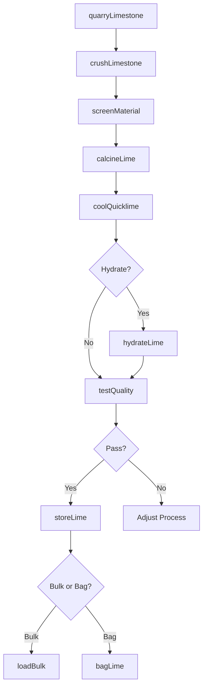
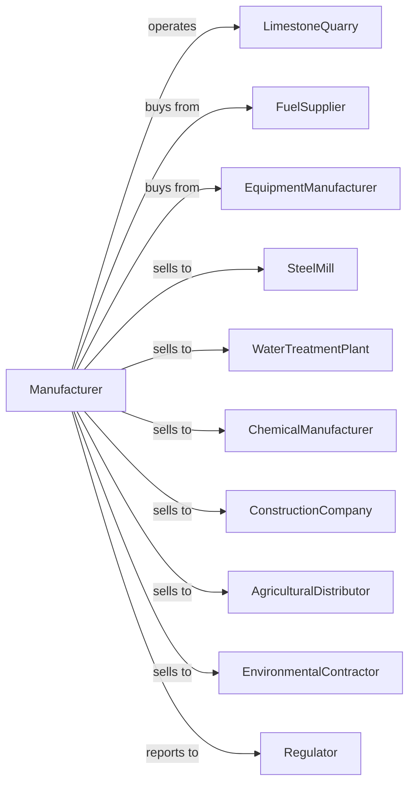

# Lime Manufacturing

> Business-as-Code definition for lime manufacturing operations. Models the complete production lifecycle from limestone extraction through finished lime product distribution.

## Overview

Lime manufacturing involves calcining limestone, dolomitic limestone, or other calcareous materials at high temperatures to produce quicklime (calcium oxide) and hydrated lime (calcium hydroxide). Products serve steel production, water treatment, construction, agriculture, and chemical manufacturing. This definition exposes actions for each phase of production, events for workflow automation, and searches for data retrieval.

## Actors

| Actor | Description |
|-------|-------------|
| LimestoneQuarry | Supplies high-calcium and dolomitic limestone |
| FuelSupplier | Provides coal, natural gas, or petroleum coke for kilns |
| EquipmentManufacturer | Sells kilns, crushers, and hydration equipment |
| SteelMill | Purchases lime for steel refining and slag treatment |
| WaterTreatmentPlant | Uses lime for pH adjustment and softening |
| ChemicalManufacturer | Purchases lime for industrial chemical processes |
| ConstructionCompany | Uses lime in soil stabilization and mortar |
| AgriculturalDistributor | Distributes agricultural lime for soil amendment |
| EnvironmentalContractor | Uses lime for flue gas desulfurization |
| Regulator | Oversees emissions, mining permits, and product quality |

## Roles

| Role | Description |
|------|-------------|
| PlantManager | Directs lime manufacturing operations and strategy |
| ProcessEngineer | Optimizes kiln efficiency and product quality |
| QualityManager | Ensures lime meets chemical specifications |
| KilnOperator | Controls calcination temperature and feed rates |
| HydrationOperator | Manages quicklime slaking and hydrate production |
| QuarryManager | Oversees limestone mining and raw material quality |
| EnvironmentalManager | Monitors emissions and environmental compliance |
| MaintenanceManager | Coordinates kiln and equipment maintenance |

## Entities

| Entity | Description |
|--------|-------------|
| Limestone | Raw material containing calcium carbonate |
| DolomiticLimestone | Raw material with calcium and magnesium carbonates |
| Quicklite | Calcium oxide produced by calcination |
| HydratedLime | Calcium hydroxide produced by slaking quicklime |
| Kiln | High-temperature furnace for limestone calcination |
| Hydrator | Equipment for combining quicklime with water |
| Silo | Storage vessel for lime products |
| QualitySpec | Chemical and physical specifications for lime grades |
| ProductionBatch | Manufacturing lot with specific properties |
| EmissionsData | Environmental monitoring records |

## Actions

| Action | Description |
|--------|-------------|
| quarryLimestone | Extract limestone from quarry deposits |
| crushLimestone | Reduce limestone to specified sizes for kiln feed |
| screenMaterial | Separate limestone by particle size |
| calcineLime | Heat limestone in kiln to produce quicklime |
| coolQuicklime | Reduce quicklime temperature after discharge |
| hydrateLime | Add water to quicklime to produce hydrated lime |
| millLime | Grind lime to specified fineness |
| testQuality | Analyze lime for calcium content and reactivity |
| storeLime | Transfer lime to silos or covered storage |
| bagLime | Package lime in bags for distribution |
| loadBulk | Fill trucks or railcars for bulk shipment |
| monitorEmissions | Track kiln emissions for environmental compliance |

## Events

| Event | Description |
|-------|-------------|
| limestoneQuarried | Raw material extracted from quarry |
| limestoneCrushed | Material reduced to kiln feed size |
| calcineCompleted | Kiln cycle finished and quicklime produced |
| quicklimeCooled | Product temperature reduced for handling |
| limeHydrated | Quicklime converted to hydrated lime |
| qualityApproved | Lime meets specification requirements |
| qualityRejected | Lime fails chemical or physical tests |
| limeStored | Product transferred to storage |
| orderShipped | Lime delivered to customer |
| kilnIssueDetected | Temperature or feed anomaly detected |
| emissionsLimitExceeded | Emissions level exceeded permitted threshold |

## Searches

| Search | Description |
|--------|-------------|
| findProducts | List lime products by type, grade, and application |
| getInventory | Query silo levels by product type and location |
| findOrders | Retrieve orders by customer, product, or delivery date |
| getProductionData | View kiln output and efficiency metrics |
| checkQualityData | Access chemical analysis and reactivity tests |
| getMaterialInventory | Query limestone and fuel stock levels |
| getEmissionsData | Retrieve environmental monitoring records |
| getEnergyMetrics | Analyze fuel consumption by kiln type |

## Workflow



## Actor Relationships



## Usage

### Calling Actions

```typescript
import { manufactureLime } from '@headlessly/manufacture-lime'

const plant = manufactureLime()

// Check available stock
const stock = await plant.findProducts({ status: 'available' })

// Check finished goods inventory
const inventory = await plant.getInventory({ lowStockOnly: true })

// Crush limestone for kiln feed
const crushed = await plant.crushLimestone({
  source: 'quarry-north',
  size: '2-4-inch',
  quantity: 500,
  calciumContent: 95
})

// Calcine in vertical kiln
const quicklime = await plant.calcineLime({
  feedId: crushed.id,
  kilnType: 'vertical-shaft',
  temperature: 1100,
  residenceTime: 24,
  fuelType: 'natural-gas'
})

// Produce hydrated lime
await plant.hydrateLime({
  quicklimeId: quicklime.id,
  waterRatio: 0.7,
  temperature: 90,
  fineness: 325
})
```

### Event-Driven Automation

```typescript
// Auto-adjust kiln on quality deviation
plant.qualityRejected(async ({ batchId, parameter, reading, target }) => {
  await plant.adjustKiln({
    parameter,
    currentValue: reading,
    targetValue: target,
    notifyOperator: true
  })
})

// Auto-alert on emissions threshold
plant.emissionsLimitExceeded(async ({ kilnId, pollutant, reading, limit }) => {
  await plant.reduceKilnFeed({
    kilnId,
    reduction: 0.1,
    notifyEnvironmental: true
  })
})
```
