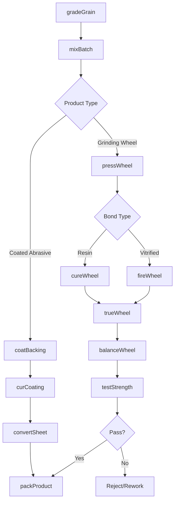
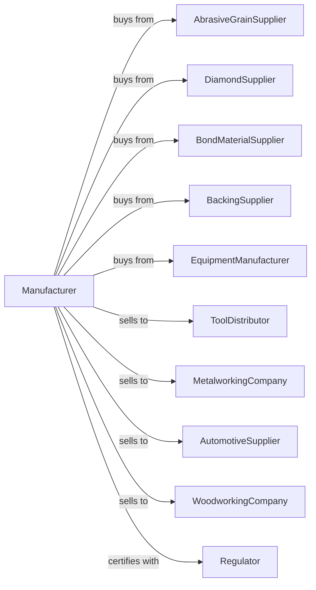

# Abrasive Product Manufacturing

> Business-as-Code definition for abrasive product manufacturing operations. Models the complete production lifecycle from raw abrasive processing through finished grinding wheel and coated abrasive production.

## Overview

Abrasive product manufacturing involves producing grinding wheels, coated abrasives, and other abrasive products from natural or synthetic materials including aluminum oxide, silicon carbide, diamond, and cubic boron nitride. Products serve metalworking, woodworking, and precision finishing applications. This definition exposes actions for each phase of production, events for workflow automation, and searches for data retrieval.

## Actors

| Actor | Description |
|-------|-------------|
| AbrasiveGrainSupplier | Provides aluminum oxide, silicon carbide, and synthetic grains |
| DiamondSupplier | Supplies natural and synthetic diamond abrasives |
| BondMaterialSupplier | Provides resin, vitrified, and metal bond systems |
| BackingSupplier | Supplies paper, cloth, and film backings for coated abrasives |
| EquipmentManufacturer | Sells presses, kilns, and coating equipment |
| ToolDistributor | Distributes abrasive products to industrial markets |
| MetalworkingCompany | Uses grinding wheels for machining and finishing |
| AutomotiveSupplier | Purchases abrasives for manufacturing and refinishing |
| WoodworkingCompany | Uses coated abrasives for sanding operations |
| Regulator | Oversees product safety and workplace standards |

## Roles

| Role | Description |
|------|-------------|
| PlantManager | Directs abrasive product manufacturing operations |
| ProductEngineer | Develops abrasive formulations and specifications |
| QualityManager | Ensures products meet speed and safety ratings |
| MixingOperator | Blends abrasive grain with bond materials |
| PressOperator | Molds grinding wheels and bonded products |
| KilnOperator | Fires vitrified bond products to specification |
| CoatingOperator | Applies abrasive grain to backing materials |
| BalancingTechnician | Tests and balances grinding wheels |

## Entities

| Entity | Description |
|--------|-------------|
| AbrasiveGrain | Cutting material providing material removal |
| BondSystem | Material holding abrasive grains together |
| GrindingWheel | Bonded abrasive product for grinding operations |
| CoatedAbrasive | Abrasive grain adhered to flexible backing |
| Backing | Paper, cloth, or film supporting coated abrasives |
| Mold | Form determining grinding wheel shape |
| Kiln | Furnace for vitrified bond firing |
| SpeedRating | Maximum safe operating speed for wheels |
| GritSize | Particle size classification for abrasives |
| ProductionLot | Manufacturing batch with specific specifications |

## Actions

| Action | Description |
|--------|-------------|
| gradeGrain | Sort and classify abrasive grain by size |
| mixBatch | Blend abrasive grain with bond materials |
| pressWheel | Mold grinding wheel in hydraulic press |
| fireWheel | Heat vitrified bond wheels in kiln |
| cureWheel | Harden resin bond wheels at temperature |
| trueWheel | Machine wheel to final dimensions |
| balanceWheel | Test and correct wheel balance |
| testStrength | Verify wheel speed rating and safety |
| coatBacking | Apply adhesive and abrasive to backing |
| curCoating | Dry and cure coated abrasive products |
| convertSheet | Cut and shape coated abrasives to form |
| packProduct | Prepare products for shipping |

## Events

| Event | Description |
|-------|-------------|
| grainGraded | Abrasive grain sorted by size specification |
| batchMixed | Grain and bond materials blended |
| wheelPressed | Grinding wheel molded to shape |
| wheelFired | Vitrified wheel firing completed |
| wheelCured | Resin bond wheel hardened |
| wheelTrued | Dimensions machined to specification |
| wheelBalanced | Balance verified within tolerance |
| strengthApproved | Wheel passes speed and safety test |
| strengthFailed | Wheel fails burst or speed test |
| coatingApplied | Abrasive adhered to backing |
| productPacked | Items prepared for shipment |
| orderShipped | Products delivered to customer |

## Searches

| Search | Description |
|--------|-------------|
| findProducts | List abrasives by type, grit, bond, and application |
| getInventory | Query stock levels by product and location |
| findOrders | Retrieve orders by customer, product, or delivery date |
| getProductionSchedule | View planned runs by product type |
| checkQualityData | Access strength tests, speed ratings, and dimensions |
| getMoldStatus | Query mold availability and condition |
| getMaterialInventory | Query grain, bond, and backing stock |
| getSafetyRecords | Review wheel testing and certification data |

## Workflow



## Actor Relationships



## Usage

### Calling Actions

```typescript
import { manufactureAbrasiveProduct } from '@headlessly/manufacture-abrasive-product'

const plant = manufactureAbrasiveProduct()

// Check available stock
const stock = await plant.findProducts({ status: 'available' })

// Check finished goods inventory
const inventory = await plant.getInventory({ lowStockOnly: true })

// Mix batch for vitrified grinding wheel
const batch = await plant.mixBatch({
  grain: 'aluminum-oxide',
  grit: 60,
  gradeHardness: 'M',
  bond: 'vitrified',
  bondPercent: 12,
  porosity: 'medium'
})

// Press and fire grinding wheel
const wheel = await plant.pressWheel({
  batchId: batch.id,
  moldId: '12x1x3',
  pressure: 2000,
  density: 2.4
})

await plant.fireWheel({
  wheelId: wheel.id,
  peakTemp: 1250,
  holdTime: 8,
  coolingRate: 50
})

// Test and certify wheel
await plant.testStrength({
  wheelId: wheel.id,
  maxSpeed: 3600,
  burstTest: true
})
```

### Event-Driven Automation

```typescript
// Auto-reject on strength failure
plant.strengthFailed(async ({ wheelId, testType, reading, requirement }) => {
  await plant.quarantineWheel({
    wheelId,
    reason: `${testType} failure`,
    reading,
    requirement
  })
  await plant.notifyQuality({
    issue: 'wheel-strength-failure',
    wheelId,
    priority: 'high'
  })
})

// Auto-adjust on balance issues
plant.wheelBalanced(async ({ wheelId, imbalance, tolerance }) => {
  if (imbalance > tolerance * 0.8) {
    await plant.scheduleRebalance({
      wheelId,
      priority: 'standard'
    })
  }
})
```
