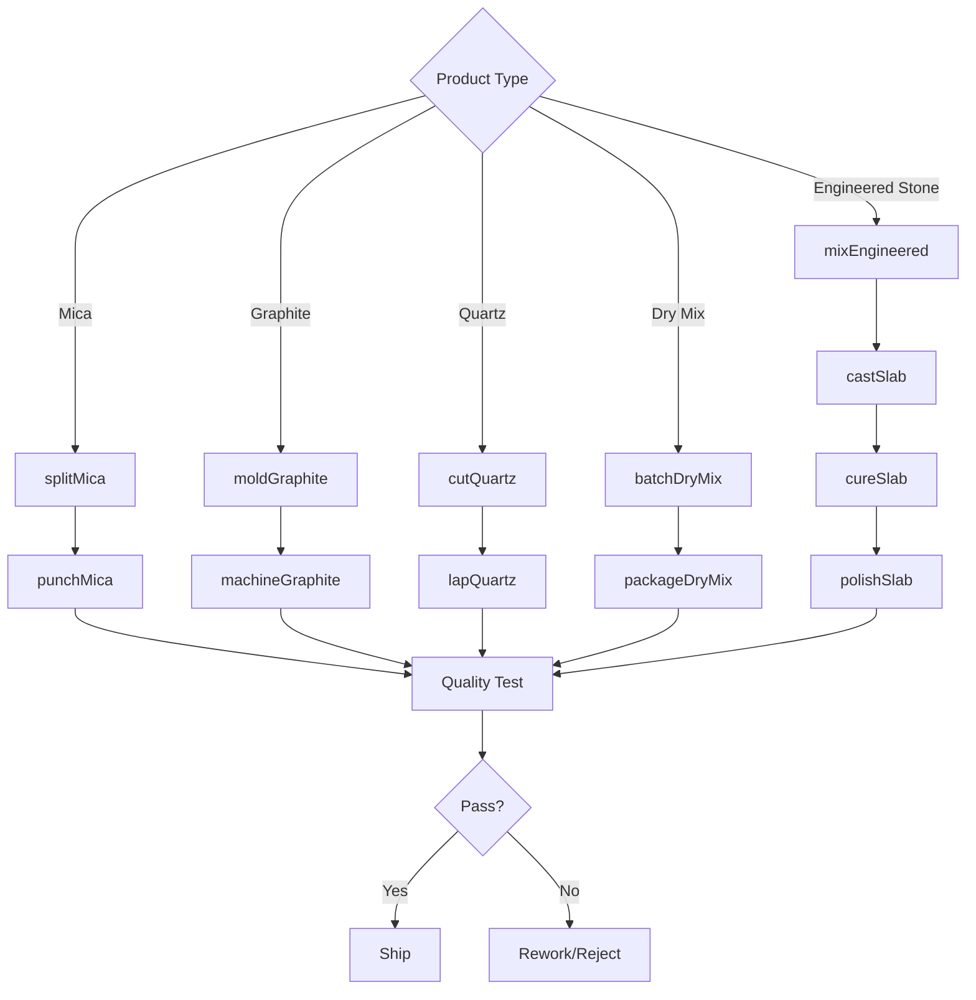
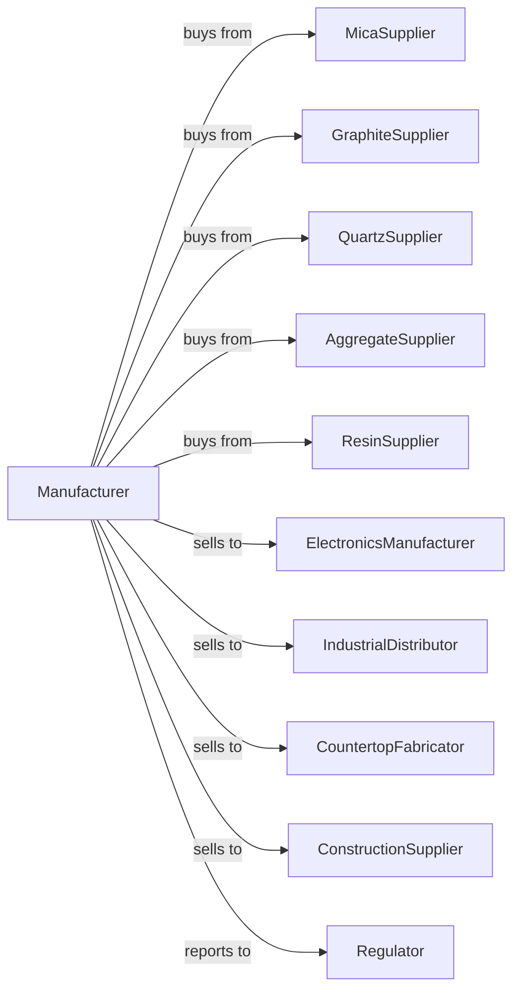

# All Other Miscellaneous Nonmetallic Mineral Product Manufacturing

> Business-as-Code definition for miscellaneous nonmetallic mineral product manufacturing operations. Models the complete production lifecycle for specialty mineral products including mica, graphite, quartz, and engineered stone.

## Overview

Miscellaneous nonmetallic mineral product manufacturing encompasses specialty products not classified elsewhere, including mica products, graphite components, quartz crystals, dry mix concrete, engineered stone countertops, and other mineral-based products. This definition exposes actions for each phase of production, events for workflow automation, and searches for data retrieval.

## Actors

| Actor | Description |
|-------|-------------|
| MicaSupplier | Provides mica sheets and flakes for electrical and thermal products |
| GraphiteSupplier | Supplies natural and synthetic graphite for industrial products |
| QuartzSupplier | Provides piezoelectric quartz crystals and blanks |
| AggregateSupplier | Supplies materials for dry mix and engineered stone |
| ResinSupplier | Provides polymer resins for engineered stone |
| ElectronicsManufacturer | Purchases mica and quartz for electronic components |
| IndustrialDistributor | Distributes specialty mineral products |
| CountertopFabricator | Uses engineered stone for kitchen and bath surfaces |
| ConstructionSupplier | Distributes dry mix concrete and mortar products |
| Regulator | Oversees product safety and environmental compliance |

## Roles

| Role | Description |
|------|-------------|
| PlantManager | Directs specialty mineral manufacturing operations |
| ProductEngineer | Develops formulations and product specifications |
| QualityManager | Ensures products meet performance requirements |
| ProcessingOperator | Operates splitting, grinding, and forming equipment |
| MixingOperator | Batches and blends dry mix products |
| CastingOperator | Produces engineered stone slabs |
| PolishingOperator | Finishes engineered stone surfaces |
| PackagingOperator | Prepares products for distribution |

## Entities

| Entity | Description |
|--------|-------------|
| MicaSheet | Split mica for electrical insulation |
| GraphiteBlock | Molded or machined graphite product |
| QuartzCrystal | Piezoelectric resonator blank |
| DryMixConcrete | Pre-packaged cement, aggregate, and additive blend |
| EngineeredStone | Quartz aggregate bonded with polymer resin |
| Mold | Form for casting engineered stone slabs |
| Mixer | Equipment for blending dry mix products |
| Press | Compaction equipment for engineered stone |
| QualitySpec | Performance and dimensional standards |
| ProductionBatch | Manufacturing lot with specific properties |

## Actions

| Action | Description |
|--------|-------------|
| splitMica | Separate mica into thin sheets |
| punchMica | Cut mica sheets to shapes |
| moldGraphite | Form graphite into blocks and shapes |
| machineGraphite | Cut graphite to precision dimensions |
| cutQuartz | Orient and slice quartz crystals |
| lapQuartz | Polish quartz blanks to frequency |
| batchDryMix | Proportion cement, aggregate, and additives |
| packageDryMix | Bag or bulk load dry mix products |
| mixEngineered | Combine quartz aggregate with resin |
| castSlab | Form engineered stone in vibro-compaction press |
| cureSlab | Harden resin binder |
| polishSlab | Apply surface finish to engineered stone |

## Events

| Event | Description |
|-------|-------------|
| micaSplit | Mica separated into sheets |
| micaPunched | Mica shapes cut to specification |
| graphiteMolded | Graphite formed to shape |
| graphiteMachined | Graphite machined to dimensions |
| quartzCut | Crystal blanks sliced to orientation |
| quartzLapped | Blanks polished to frequency |
| dryMixBatched | Blend proportioned to specification |
| dryMixPackaged | Product bagged or loaded |
| engineeredMixed | Aggregate and resin combined |
| slabCast | Engineered stone formed |
| slabCured | Resin hardened |
| slabPolished | Surface finish applied |
| qualityApproved | Product meets specifications |
| orderShipped | Products delivered to customer |

## Searches

| Search | Description |
|--------|-------------|
| findProducts | List products by type, specification, and application |
| getInventory | Query stock levels by product and location |
| findOrders | Retrieve orders by customer, product, or delivery date |
| getProductionSchedule | View schedules by product line |
| checkQualityData | Access test results and certifications |
| getMaterialInventory | Query raw material and component stock |
| getYieldData | Analyze material utilization |
| getProductionMetrics | Monitor output and efficiency |

## Workflow



## Actor Relationships



## Usage

### Calling Actions

```typescript
import { manufactureNonmetallicMineral } from '@headlessly/manufacture-nonmetallic-mineral'

const plant = manufactureNonmetallicMineral()

// Check available stock
const stock = await plant.findProducts({ status: 'available' })

// Check finished goods inventory
const inventory = await plant.getInventory({ lowStockOnly: true })

// Mix engineered quartz stone
const mix = await plant.mixEngineered({
  quartzPercent: 93,
  resinType: 'polyester',
  resinPercent: 7,
  pigment: 'veined-marble',
  batchSize: 500
})

// Cast slab in vibro-compaction press
const slab = await plant.castSlab({
  mixId: mix.id,
  slabSize: { length: 120, width: 55, thickness: 1.2 },
  pressTime: 90,
  vacuum: true
})

// Cure and polish
await plant.cureSlab({
  slabId: slab.id,
  temperature: 90,
  duration: 45
})

await plant.polishSlab({
  slabId: slab.id,
  finish: 'polished',
  grits: [50, 100, 200, 400, 800, 1500, 3000]
})
```

### Event-Driven Automation

```typescript
// Auto-adjust on quality deviation
plant.qualityApproved(async ({ batchId, product, metrics }) => {
  if (metrics.yield < 0.95) {
    await plant.reviewProcess({
      batchId,
      product,
      focus: 'yield-improvement',
      priority: 'standard'
    })
  }
})

// Auto-schedule retest on marginal results
plant.slabPolished(async ({ slabId, surfaceScore, threshold }) => {
  if (surfaceScore < threshold * 1.1) {
    await plant.scheduleRepolish({
      slabId,
      startGrit: 1500,
      priority: 'standard'
    })
  }
})
```
