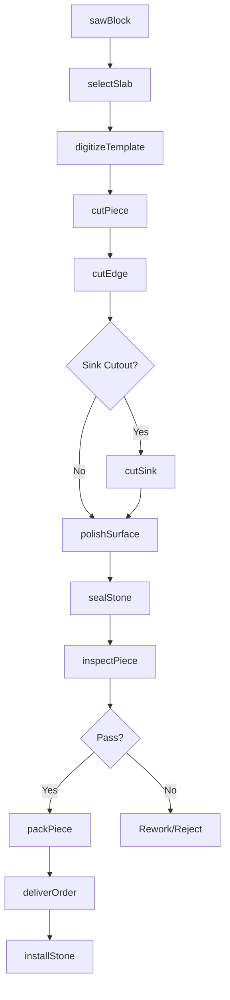
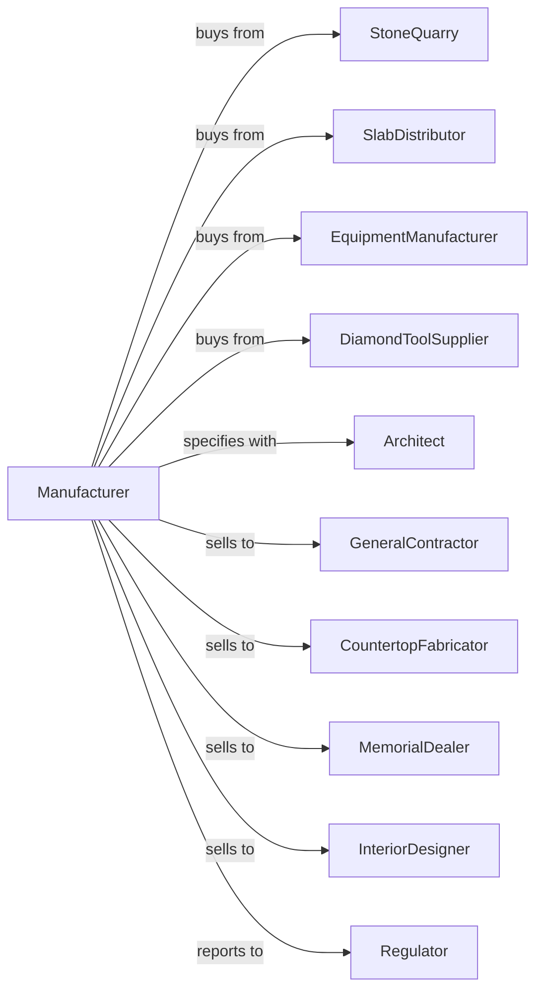

# Cut Stone and Stone Product Manufacturing

> Business-as-Code definition for cut stone and stone product manufacturing operations. Models the complete production lifecycle from raw stone processing through finished architectural and memorial products.

## Overview

Cut stone and stone product manufacturing involves cutting, shaping, and finishing granite, marble, limestone, slate, and other natural stone for building cladding, countertops, monuments, memorials, and decorative applications. Operations include sawing blocks, polishing surfaces, and fabricating to specification. This definition exposes actions for each phase of production, events for workflow automation, and searches for data retrieval.

## Actors

| Actor | Description |
|-------|-------------|
| StoneQuarry | Supplies raw stone blocks in various types and colors |
| SlabDistributor | Provides pre-cut stone slabs for fabrication |
| EquipmentManufacturer | Sells saws, polishers, and CNC stone equipment |
| DiamondToolSupplier | Provides diamond blades, pads, and tooling |
| Architect | Specifies stone types for building projects |
| GeneralContractor | Purchases fabricated stone for construction |
| CountertopFabricator | Produces kitchen and bath countertops |
| MemorialDealer | Orders monuments and memorial products |
| InteriorDesigner | Specifies stone for residential projects |
| Regulator | Oversees workplace safety and environmental compliance |

## Roles

| Role | Description |
|------|-------------|
| PlantManager | Directs stone fabrication operations |
| ProductionManager | Schedules cutting and finishing operations |
| SawOperator | Operates block saws and gang saws |
| CNCProgrammer | Programs and operates CNC cutting equipment |
| PolishingOperator | Runs polishing and finishing equipment |
| TemplateDigitizer | Creates digital templates from field measurements |
| QualityInspector | Verifies dimensions and surface finish |
| InstallationCoordinator | Manages delivery and installation scheduling |

## Entities

| Entity | Description |
|--------|-------------|
| StoneBlock | Raw quarried stone for processing |
| Slab | Large flat piece cut from block |
| CutPiece | Fabricated stone component |
| Template | Pattern for custom fabrication |
| Edge Profile | Decorative edge shape specification |
| Finish | Surface treatment type (polished, honed, flamed) |
| DiamondBlade | Cutting tool for stone sawing |
| PolishingPad | Abrasive pad for surface finishing |
| WorkOrder | Customer job specifications and requirements |
| InstallKit | Hardware and materials for installation |

## Actions

| Action | Description |
|--------|-------------|
| sawBlock | Cut raw blocks into slabs |
| selectSlab | Choose slabs matching customer requirements |
| digitizeTemplate | Create digital pattern from field template |
| cutPiece | Shape stone to dimensions using CNC or manual methods |
| cutEdge | Apply decorative edge profiles |
| cutSink | Create cutouts for sinks and fixtures |
| polishSurface | Apply finish to stone surfaces |
| sealStone | Apply protective sealant |
| inspectPiece | Verify dimensions and finish quality |
| packPiece | Prepare fabricated stone for delivery |
| deliverOrder | Transport stone to job site |
| installStone | Place and secure stone at final location |

## Events

| Event | Description |
|-------|-------------|
| blockSawn | Raw block cut into slabs |
| slabSelected | Material chosen for fabrication |
| templateReceived | Digital pattern created for job |
| pieceCut | Stone shaped to specification |
| edgeApplied | Decorative edge profile completed |
| piecePolished | Surface finish applied |
| pieceSealed | Protective treatment applied |
| inspectionPassed | Piece meets quality specifications |
| inspectionFailed | Piece rejected for defects |
| orderPacked | Fabricated stone ready for delivery |
| orderDelivered | Stone delivered to job site |
| installationComplete | Stone placed and secured |

## Searches

| Search | Description |
|--------|-------------|
| findMaterials | List available stone by type, color, and origin |
| getInventory | Query slab and block inventory by specification |
| findOrders | Retrieve jobs by customer, status, or delivery date |
| getProductionSchedule | View cutting and finishing schedules |
| checkSlabYield | Analyze material utilization by job |
| findTemplates | List pending templates awaiting digitization |
| getInstallSchedule | View installation appointments |
| trackWarranty | Manage warranty claims and service requests |

## Workflow



## Actor Relationships



## Usage

### Calling Actions

```typescript
import { manufactureCutStone } from '@headlessly/manufacture-cut-stone'

const plant = manufactureCutStone()

// Check available stock
const stock = await plant.findMaterials({ status: 'available' })

// Check finished goods inventory
const inventory = await plant.getInventory({ lowStockOnly: true })

// Select slab for kitchen countertop project
const slab = await plant.selectSlab({
  stoneType: 'granite',
  color: 'absolute-black',
  thickness: 3,
  minimumSize: { length: 120, width: 60 },
  finish: 'polished'
})

// Digitize field template
const template = await plant.digitizeTemplate({
  jobId: 'smith-kitchen',
  slabId: slab.id,
  templateFile: 'smith-kitchen-template.dxf'
})

// Cut and finish countertop
await plant.cutPiece({
  templateId: template.id,
  pieces: ['main-top', 'island', 'backsplash'],
  edgeProfile: 'ogee',
  sinkCutout: 'undermount-33x22'
})
```

### Event-Driven Automation

```typescript
// Auto-schedule delivery on inspection pass
plant.inspectionPassed(async ({ jobId, pieces }) => {
  await plant.scheduleDelivery({
    jobId,
    pieces,
    coordinate: 'with-installer'
  })
})

// Auto-alert on inspection failure
plant.inspectionFailed(async ({ pieceId, defectType, severity }) => {
  await plant.notifyProduction({
    pieceId,
    issue: defectType,
    action: severity === 'minor' ? 'rework' : 'recut'
  })
})
```
