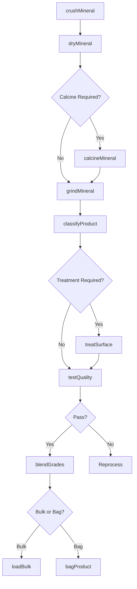
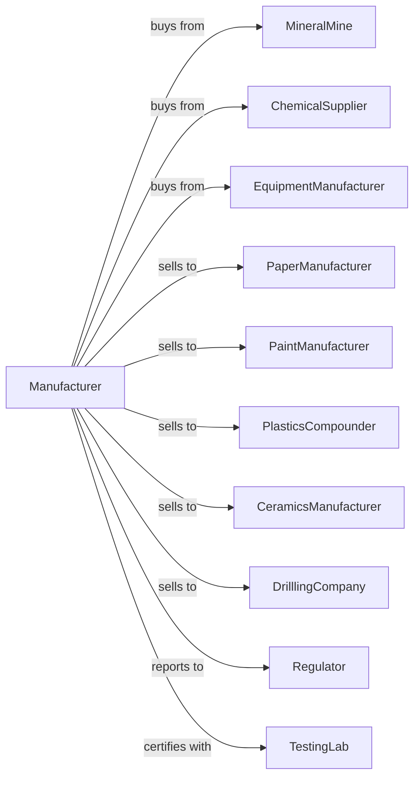

# Ground or Treated Mineral and Earth Manufacturing

> Business-as-Code definition for ground or treated mineral and earth manufacturing operations. Models the complete production lifecycle from raw mineral processing through finished specialty mineral products.

## Overview

Ground or treated mineral manufacturing involves calcining, dead burning, or processing clays, ceramic minerals, barite, and other nonmetallic minerals beyond basic beneficiation. Products include calcined clays, processed diatomaceous earth, treated kaolin, and specialty mineral fillers for industrial applications. This definition exposes actions for each phase of production, events for workflow automation, and searches for data retrieval.

## Actors

| Actor | Description |
|-------|-------------|
| MineralMine | Supplies raw clay, kaolin, barite, and specialty minerals |
| ChemicalSupplier | Provides treatment chemicals and processing aids |
| EquipmentManufacturer | Sells mills, calciners, and classification equipment |
| PaperManufacturer | Purchases kaolin and fillers for paper coating |
| PaintManufacturer | Uses mineral extenders and pigments |
| PlasticsCompounder | Purchases mineral fillers for plastic formulations |
| CeramicsManufacturer | Uses processed clays for ceramic bodies |
| DrilllingCompany | Purchases barite for drilling mud weighting |
| Regulator | Oversees mining permits and environmental compliance |
| TestingLab | Provides mineral analysis and certification |

## Roles

| Role | Description |
|------|-------------|
| PlantManager | Directs mineral processing operations |
| ProcessEngineer | Optimizes grinding, calcining, and treatment processes |
| QualityManager | Ensures products meet particle size and purity specifications |
| MillOperator | Operates grinding and pulverizing equipment |
| CalcinerOperator | Controls calcining temperature and retention time |
| ClassifierOperator | Runs air classification and screening equipment |
| TreatmentOperator | Manages chemical treatment and surface modification |
| PackagingOperator | Bags and bulk loads finished products |

## Entities

| Entity | Description |
|--------|-------------|
| RawMineral | Unprocessed clay, barite, or specialty mineral |
| CalcinedMinite | Mineral heated to remove water or modify properties |
| GroundMineral | Material reduced to specified particle size |
| TreatedMineral | Surface-modified or chemically treated product |
| Mill | Equipment for particle size reduction |
| Calciner | High-temperature processing furnace |
| Classifier | Equipment separating particles by size |
| Silo | Storage vessel for bulk products |
| QualitySpec | Particle size, brightness, and purity standards |
| ProductionBatch | Manufacturing lot with specific properties |

## Actions

| Action | Description |
|--------|-------------|
| crushMineral | Primary size reduction of raw material |
| dryMineral | Remove moisture before processing |
| calcineMineral | Heat mineral to modify properties |
| grindMineral | Reduce to target particle size |
| classifyProduct | Separate particles by size distribution |
| treatSurface | Apply chemical modification or coating |
| bleachMineral | Improve brightness through chemical treatment |
| blendGrades | Combine products to meet specifications |
| testQuality | Analyze particle size, brightness, and purity |
| bagProduct | Package in bags for shipment |
| loadBulk | Fill trucks or railcars for bulk delivery |
| storeProduct | Transfer to silos or covered storage |

## Events

| Event | Description |
|-------|-------------|
| mineralCrushed | Raw material reduced to processing size |
| mineralDried | Moisture removed from feedstock |
| calciningCompleted | Heat treatment finished |
| mineralGround | Particle size reduction completed |
| productClassified | Material separated by size |
| surfaceTreated | Chemical modification applied |
| qualityApproved | Product meets specifications |
| qualityRejected | Product fails specification tests |
| productStored | Material transferred to storage |
| orderShipped | Product delivered to customer |
| processAdjusted | Operating parameters modified |
| equipmentMaintenancePerformed | Mill or calciner service required |

## Searches

| Search | Description |
|--------|-------------|
| findProducts | List minerals by type, grade, and application |
| getInventory | Query stock levels by product and location |
| findOrders | Retrieve orders by customer, product, or delivery date |
| getProductionSchedule | View processing schedules by mineral type |
| checkQualityData | Access particle size, brightness, and purity tests |
| getMaterialInventory | Query raw mineral and chemical stock |
| getProcessMetrics | Analyze mill and calciner efficiency |
| getEnergyData | Monitor fuel and power consumption |

## Workflow



## Actor Relationships



## Usage

### Calling Actions

```typescript
import { manufactureMineralEarths } from '@headlessly/manufacture-mineral-earths'

const plant = manufactureMineralEarths()

// Check available stock
const stock = await plant.findProducts({ status: 'available' })

// Check finished goods inventory
const inventory = await plant.getInventory({ lowStockOnly: true })

// Calcine kaolin for paper coating grade
const calcined = await plant.calcineMineral({
  source: 'georgia-kaolin',
  temperature: 1050,
  residenceTime: 60,
  targetBrightness: 92
})

// Grind to ultrafine particle size
const ground = await plant.grindMineral({
  feedId: calcined.id,
  millType: 'jet-mill',
  targetD50: 0.8,
  maxD98: 5
})

// Apply surface treatment for plastic applications
await plant.treatSurface({
  productId: ground.id,
  treatment: 'silane-coupling',
  loadingPercent: 1.5,
  application: 'plastic-filler'
})
```

### Event-Driven Automation

```typescript
// Auto-adjust mill on quality deviation
plant.qualityRejected(async ({ batchId, parameter, reading, target }) => {
  await plant.adjustProcess({
    parameter,
    currentValue: reading,
    targetValue: target,
    notifyOperator: true
  })
})

// Auto-schedule maintenance on efficiency drop
plant.processAdjusted(async ({ equipmentId, efficiency, threshold }) => {
  if (efficiency < threshold) {
    await plant.scheduleMaintenance({
      equipmentId,
      priority: 'standard',
      issue: 'efficiency-degradation'
    })
  }
})
```
