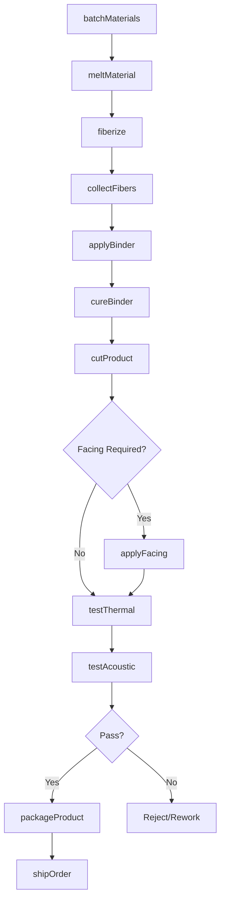
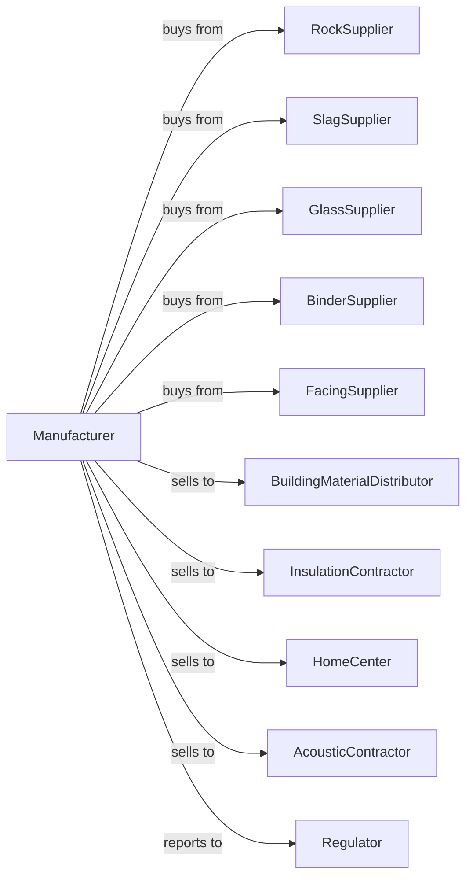

# Mineral Wool Manufacturing

> Business-as-Code definition for mineral wool manufacturing operations. Models the complete production lifecycle from raw material melting through finished insulation product fabrication.

## Overview

Mineral wool manufacturing involves melting rock, slag, or glass and spinning or blowing the molten material into fibers for insulation products. Products include fiberglass batts, rock wool boards, loose-fill insulation, and acoustic ceiling tiles. This definition exposes actions for each phase of production, events for workflow automation, and searches for data retrieval.

## Actors

| Actor | Description |
|-------|-------------|
| RockSupplier | Provides basalt, diabase, and other ignite rocks |
| SlagSupplier | Supplies blast furnace slag for rock wool production |
| GlassSupplier | Provides cullet and glass batch materials |
| BinderSupplier | Supplies phenolic and formaldehyde-free binders |
| FacingSupplier | Provides kraft paper, foil, and membrane facings |
| BuildingMaterialDistributor | Distributes insulation to retail and contractor markets |
| InsulationContractor | Installs insulation in residential and commercial buildings |
| HomeCenter | Retails insulation products to consumers |
| AcousticContractor | Installs acoustic panels and ceiling systems |
| Regulator | Oversees product standards and environmental compliance |

## Roles

| Role | Description |
|------|-------------|
| PlantManager | Directs mineral wool manufacturing operations |
| ProcessEngineer | Optimizes melting and fiberization processes |
| QualityManager | Ensures products meet thermal and acoustic ratings |
| FurnaceOperator | Controls melting temperature and throughput |
| SpinningOperator | Manages fiberization and collection equipment |
| BinderOperator | Applies and cures binder on fiber mats |
| CuttingOperator | Runs slitting and packaging equipment |
| WarehouseManager | Coordinates inventory and shipping |

## Entities

| Entity | Description |
|--------|-------------|
| RawRock | Basalt or diabase for rock wool production |
| Slag | Steel mill byproduct for mineral wool |
| GlassBatch | Silica, soda, and limestone for fiberglass |
| Cupola | Furnace for melting rock and slag |
| ElectricFurnace | Glass melting equipment |
| Spinner | Rotating disk or rotor fiberizing molten material |
| FiberMat | Collected fibers before binder application |
| Batt | Finished insulation panel |
| RValue | Thermal resistance rating |
| STC | Sound transmission class rating |

## Actions

| Action | Description |
|--------|-------------|
| batchMaterials | Proportion raw materials for melting |
| meltMaterial | Heat rock, slag, or glass to fiberizing temperature |
| fiberize | Spin or blow molten material into fibers |
| collectFibers | Gather fibers on conveyor to form mat |
| applyBinder | Spray binder onto fiber mat |
| cureBinder | Heat mat to set binder and stabilize fibers |
| cutProduct | Slit mat to standard widths |
| applyFacing | Add kraft, foil, or membrane facing |
| packageProduct | Compress and wrap batts for shipping |
| testThermal | Measure R-value and thermal performance |
| testAcoustic | Verify sound absorption and STC rating |
| shipOrder | Deliver products to customers |

## Events

| Event | Description |
|-------|-------------|
| materialMelted | Rock, slag, or glass reached fiberizing temperature |
| fiberized | Fibers produced from molten material |
| fibersCollected | Mat formed on collection conveyor |
| binderApplied | Binder sprayed onto fiber mat |
| binderCured | Mat heated and binder set |
| productCut | Insulation trimmed to standard size |
| facingApplied | Paper, foil, or membrane adhered |
| thermalApproved | Product meets R-value specification |
| acousticApproved | Product meets sound rating |
| productPackaged | Insulation compressed and wrapped |
| orderShipped | Products delivered to customer |
| furnaceIssue | Temperature or throughput anomaly detected |

## Searches

| Search | Description |
|--------|-------------|
| findProducts | List insulation by type, R-value, and facing |
| getInventory | Query stock levels by product and warehouse |
| findOrders | Retrieve orders by customer, product, or delivery date |
| getProductionSchedule | View line schedules by product type |
| checkQualityData | Access thermal and acoustic test results |
| getFurnaceStatus | Monitor melting temperature and throughput |
| getMaterialInventory | Query rock, slag, glass, and binder stock |
| getLineEfficiency | Analyze production rates and downtime |

## Workflow



## Actor Relationships



## Usage

### Calling Actions

```typescript
import { manufactureMineralWool } from '@headlessly/manufacture-mineral-wool'

const plant = manufactureMineralWool()

// Check available stock
const stock = await plant.findProducts({ status: 'available' })

// Check finished goods inventory
const inventory = await plant.getInventory({ lowStockOnly: true })

// Melt basalt for rock wool production
const melt = await plant.meltMaterial({
  material: 'basalt',
  furnaceType: 'cupola',
  temperature: 1500,
  throughput: 12
})

// Fiberize and collect
const mat = await plant.fiberize({
  meltId: melt.id,
  method: 'spinning',
  fiberDiameter: 5,
  collectionSpeed: 30
})

// Apply binder and cure
await plant.applyBinder({
  matId: mat.id,
  binderType: 'formaldehyde-free',
  loadingPercent: 4
})

await plant.cureBinder({
  matId: mat.id,
  temperature: 200,
  duration: 5
})

// Cut and package R-30 batts
await plant.cutProduct({
  matId: mat.id,
  width: 15,
  length: 93,
  thickness: 10,
  rValue: 30
})
```

### Event-Driven Automation

```typescript
// Auto-adjust on furnace anomaly
plant.furnaceIssue(async ({ furnaceId, parameter, reading, target }) => {
  await plant.adjustFurnace({
    furnaceId,
    parameter,
    adjustment: target - reading,
    notifyOperator: true
  })
})

// Auto-route to acoustic testing for ceiling products
plant.binderCured(async ({ matId, productType }) => {
  if (productType === 'acoustic-panel') {
    await plant.testAcoustic({
      matId,
      testType: 'NRC',
      priority: 'standard'
    })
  }
})
```
