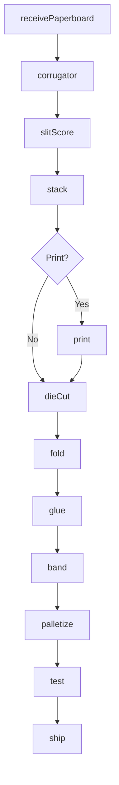
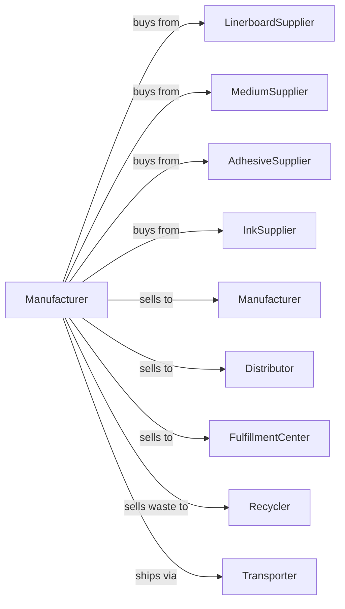

# Corrugated and Solid Fiber Box Manufacturing

> Business-as-Code definition for corrugated and solid fiber box manufacturing operations. Models the complete production process from paperboard procurement through corrugating, converting, printing, and box assembly.

## Overview

This U.S. industry comprises establishments primarily engaged in laminating purchased paper or paperboard into corrugated or solid fiber boxes and related products, such as pads, partitions, pallets, and corrugated paper without manufacturing paperboard. These boxes are generally used for shipping. Cross-References. Establishments primarily engaged in--

## Actors

| Actor | Description |
|-------|-------------|
| LinerboardSupplier | Provides linerboard for corrugated facing |
| MediumSupplier | Provides corrugating medium for fluting |
| AdhesiveSupplier | Provides starch adhesive for lamination |
| InkSupplier | Provides flexographic inks for printing |
| Manufacturer | Purchases boxes for product packaging |
| Distributor | Buys boxes for regional distribution |
| FulfillmentCenter | Purchases boxes for e-commerce shipping |
| Recycler | Collects and processes OCC waste |
| Transporter | Delivers finished boxes to customers |

## Roles

| Role | Description |
|------|-------------|
| PlantOwner | Owns facility and directs business strategy |
| PlantManager | Oversees daily production operations |
| CorrugatorOperator | Operates corrugating line for combined board |
| PrinterOperator | Runs flexographic printing presses |
| DieOperator | Manages die cutting and scoring |
| FolderGluerOperator | Operates box folding and gluing equipment |
| DesignEngineer | Creates box designs and specifications |
| QualityInspector | Verifies box strength and print quality |

## Entities

| Entity | Description |
|--------|-------------|
| Linerboard | Outer facing material for corrugated |
| Medium | Fluted center material |
| CombinedBoard | Laminated corrugated sheet |
| Flute | Corrugated wave profile (A, B, C, E, F) |
| Box | Finished container product |
| Die | Cutting tool for box blanks |
| Blank | Cut and scored sheet before folding |
| Print | Graphics and text applied to box |
| ECT | Edge crush test strength rating |
| Mullen | Burst strength rating |

## Actions

| Action | Description |
|--------|-------------|
| receivePaperboard | Accept linerboard and medium rolls |
| corrugator | Form flutes and laminate into combined board |
| slitScore | Cut and score combined board to size |
| stack | Organize board sheets for conversion |
| print | Apply graphics using flexographic press |
| dieCut | Cut box blanks from printed sheets |
| fold | Crease and fold box blanks |
| glue | Apply adhesive and join box panels |
| band | Bundle finished boxes for shipping |
| palletize | Stack bundles on pallets |
| test | Verify box strength and quality |
| ship | Deliver boxes to customers |

## Events

| Event | Description |
|-------|-------------|
| paperboardReceived | Linerboard and medium accepted |
| boardCorrugated | Combined board produced |
| boardSlitScored | Sheets cut and scored |
| boardStacked | Sheets organized for conversion |
| boxesPrinted | Graphics applied to sheets |
| boxesDieCut | Blanks cut from sheets |
| boxesFolded | Blanks creased and folded |
| boxesGlued | Panels joined with adhesive |
| boxesBanded | Bundles created for shipping |
| boxesPalletized | Pallets loaded and wrapped |
| qualityTested | Strength and quality verified |
| orderShipped | Boxes delivered to customer |

## Searches

| Search | Description |
|--------|-------------|
| findPaperboard | List available linerboard and medium |
| getInventory | Retrieve box stock by size and style |
| getOrders | List pending customer orders |
| getProduction | Monitor line output and efficiency |
| getDieLibrary | Retrieve available die specifications |
| getQuality | Check ECT and Mullen test results |
| getWaste | Track trim and defect waste rates |

## Workflow



## Actor Relationships



## Usage

### Calling Actions

```typescript
import { manufactureCorrugatedBoxes } from '@headlessly/manufacture-corrugated-boxes'

const plant = manufactureCorrugatedBoxes()

// Run corrugator to produce combined board
const board = await plant.corrugator({
  liner: { roll: 'liner-42-kraft', side: 'both' },
  medium: { roll: 'medium-26-semi', flute: 'C' },
  adhesive: 'cornstarch',
  speed: 600
})

// Print customer graphics
const printed = await plant.print({
  boardId: board.id,
  pressId: 'flexo-01',
  colors: ['process-cyan', 'process-magenta', 'process-yellow', 'process-black'],
  design: 'customer-abc-v2'
})

// Die cut box blanks
await plant.dieCut({
  sheetId: printed.id,
  dieId: 'die-rsc-12x12x8',
  boxesPerSheet: 4
})
```

### Event-Driven Automation

```typescript
// Auto-convert after corrugating
plant.boardCorrugated(async ({ boardId, orderId, flute }) => {
  const order = await plant.getOrders({ orderId })

  await plant.slitScore({
    boardId,
    width: order.sheetWidth,
    length: order.sheetLength,
    scores: order.scorePattern
  })
})

// Auto-ship when palletized
plant.boxesPalletized(async ({ palletId, boxCount, orderId }) => {
  const testResult = await plant.test({
    palletId,
    tests: ['ECT', 'Mullen', 'moisture', 'print-quality']
  })

  if (testResult.allPassed) {
    await plant.ship({
      palletId,
      orderId,
      carrier: 'ltl-standard'
    })
  }
})
```
