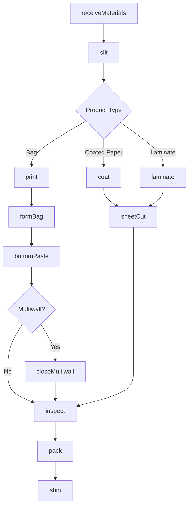
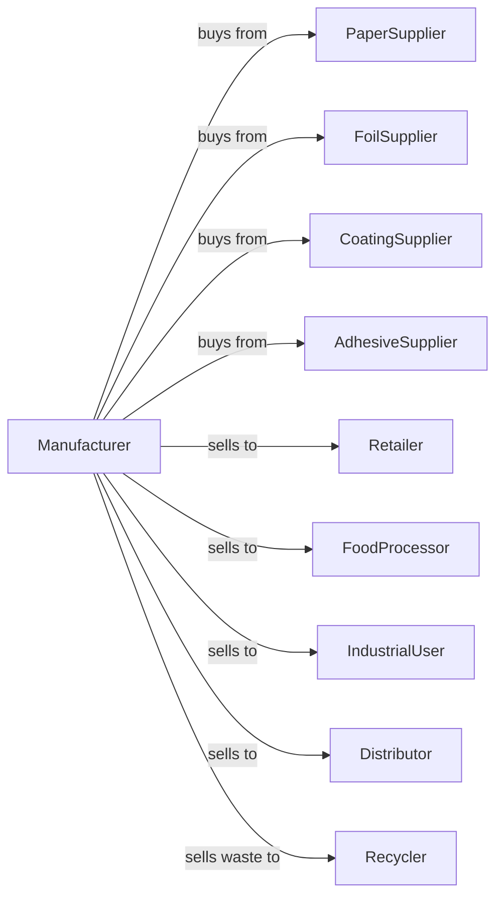

# Paper Bag and Coated and Treated Paper Manufacturing

> Business-as-Code definition for paper bag and coated paper manufacturing operations. Models the production of shopping bags, multiwall sacks, and coated papers from cutting, laminating, and converting purchased paper and foils.

## Overview

This industry comprises establishments primarily engaged in one or more of the following: (1) cutting and coating paper and paperboard; (2) cutting and laminating paper, paperboard, and other flexible materials (except plastics film to plastics film); (3) manufacturing bags, multiwall bags, sacks of paper, metal foil, coated paper, laminates, or coated combinations of paper and foil with plastics film; (4) manufacturing laminated aluminum and other converted metal foils from purchased foils; and

## Actors

| Actor | Description |
|-------|-------------|
| PaperSupplier | Provides kraft and specialty papers |
| FoilSupplier | Provides aluminum and metallic foils |
| CoatingSupplier | Provides wax, poly, and barrier coatings |
| AdhesiveSupplier | Provides laminating adhesives |
| Retailer | Purchases shopping and merchandise bags |
| FoodProcessor | Buys multiwall sacks and coated papers |
| IndustrialUser | Purchases multiwall bags for chemicals and minerals |
| Distributor | Wholesales bag and coated paper products |
| Recycler | Handles paper and foil waste streams |

## Roles

| Role | Description |
|------|-------------|
| PlantOwner | Owns facility and directs business strategy |
| PlantManager | Oversees daily production operations |
| CoatingOperator | Operates coating and laminating equipment |
| BagMachineOperator | Runs bag forming and bottom-pasting machines |
| PrintingOperator | Operates flexographic printing presses |
| SlittingOperator | Cuts rolls to specified widths |
| QualityTech | Tests coating weights and barrier properties |

## Entities

| Entity | Description |
|--------|-------------|
| Paper | Base substrate for coating or bag making |
| Foil | Aluminum or metallic barrier material |
| Coating | Wax, poly, or specialty barrier layer |
| Laminate | Multi-layer composite material |
| Bag | Formed paper container product |
| MultiWall | Multi-ply industrial sack |
| Sealant | Heat-seal coating for closure |
| Barrier | Moisture or oxygen resistance property |
| Caliper | Material thickness measurement |
| CoatWeight | Applied coating amount per area |

## Actions

| Action | Description |
|--------|-------------|
| receiveMaterials | Accept paper, foil, and coating supplies |
| slit | Cut rolls to required widths |
| coat | Apply wax, poly, or barrier coatings |
| laminate | Bond multiple material layers |
| print | Apply graphics to paper or laminate |
| formBag | Shape and seal paper into bags |
| bottomPaste | Apply and seal bag bottoms |
| tubeMultiwall | Form tubes for multiwall sacks |
| closeMultiwall | Seal multiwall bag ends |
| sheetCut | Cut laminate into sheets |
| inspect | Verify coating and seal quality |
| pack | Package products for shipping |
| ship | Deliver products to customers |

## Events

| Event | Description |
|-------|-------------|
| materialsReceived | Paper and supplies accepted |
| rollsSlit | Material cut to width |
| paperCoated | Coating applied to substrate |
| materialsLaminated | Layers bonded together |
| productPrinted | Graphics applied |
| bagsFormed | Bags shaped and sealed |
| bottomsApplied | Bag bottoms sealed |
| tubesFormed | Multiwall tubes created |
| sacksSealed | Multiwall ends closed |
| sheetsCut | Laminate cut to size |
| qualityInspected | Tests completed |
| orderPacked | Products packaged |
| orderShipped | Products delivered |

## Searches

| Search | Description |
|--------|-------------|
| findMaterials | List available paper and foil sources |
| getInventory | Retrieve product stock by type and size |
| getOrders | List pending customer orders |
| getProduction | Monitor line output |
| getCoatingSpecs | Retrieve barrier requirements |
| getQuality | Check test results |
| getWaste | Track material waste rates |

## Workflow



## Actor Relationships



## Usage

### Calling Actions

```typescript
import { manufacturePaperBag } from '@headlessly/manufacture-paper-bag'

const plant = manufacturePaperBag()

// Coat paper with wax barrier
const coated = await plant.coat({
  rollId: 'kraft-40-roll',
  coating: 'microcrystalline-wax',
  weight: 8,
  side: 'one'
})

// Form shopping bags
const bags = await plant.formBag({
  paperId: coated.id,
  style: 'SOS',
  width: 12,
  depth: 7,
  height: 17,
  handles: 'twisted-paper'
})

// Apply bag bottoms
await plant.bottomPaste({
  bagIds: bags.ids,
  bottomType: 'square',
  adhesive: 'dextrin'
})
```

### Event-Driven Automation

```typescript
// Auto-print after coating
plant.paperCoated(async ({ rollId, orderId }) => {
  const order = await plant.getOrders({ orderId })

  if (order.printRequired) {
    await plant.print({
      rollId,
      design: order.artwork,
      colors: order.inkColors,
      registration: 0.010
    })
  }
})

// Auto-ship when inspected
plant.qualityInspected(async ({ batchId, orderId, testResults }) => {
  if (testResults.allPassed) {
    await plant.pack({
      batchId,
      unitCount: 500,
      packaging: 'banded-bundles'
    })

    await plant.ship({
      batchId,
      orderId,
      carrier: 'ltl-standard'
    })
  }
})
```
