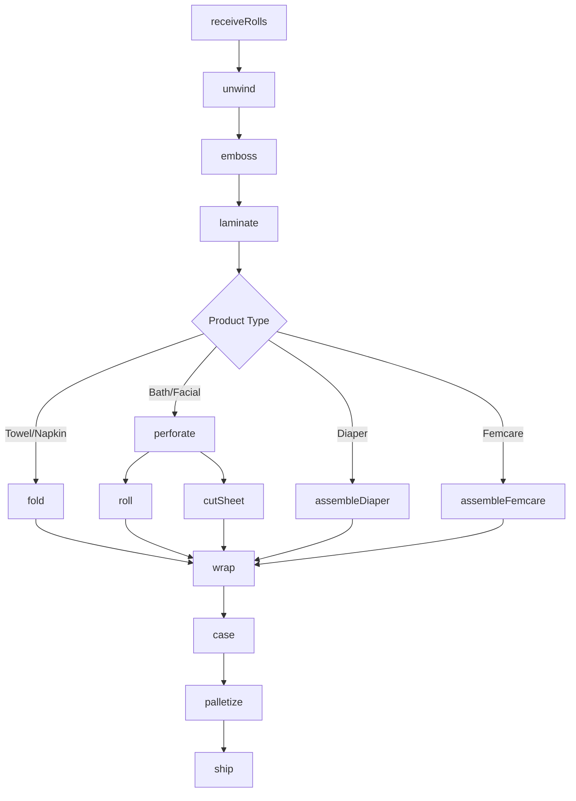
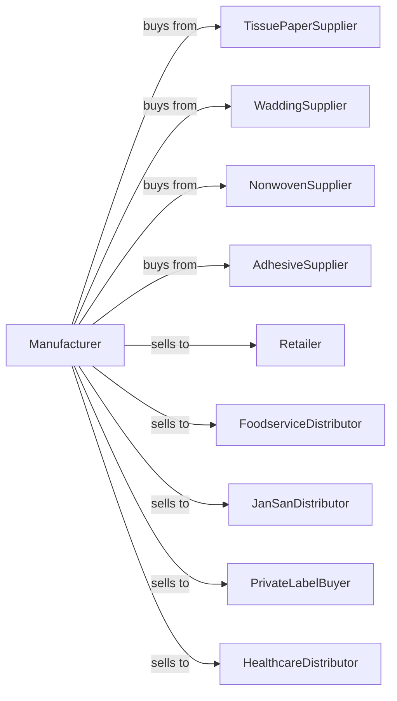

# Sanitary Paper Product Manufacturing

> Business-as-Code definition for sanitary paper product manufacturing operations. Models the production of tissue, towels, napkins, and disposable hygiene products from purchased tissue paper and wadding.

## Overview

This U.S. industry comprises establishments primarily engaged in converting purchased sanitary paper stock or wadding into sanitary paper products, such as facial tissues, handkerchiefs, table napkins, toilet paper, towels, disposable diapers, sanitary napkins, and tampons.

## Actors

| Actor | Description |
|-------|-------------|
| TissuePaperSupplier | Provides parent tissue rolls |
| WaddingSupplier | Provides absorbent core materials |
| NonwovenSupplier | Provides topsheets and backsheets |
| AdhesiveSupplier | Provides laminating and construction adhesives |
| Retailer | Purchases branded consumer products |
| FoodserviceDistributor | Buys napkins and towels for foodservice |
| JanSanDistributor | Purchases away-from-home tissue products |
| PrivateLabelBuyer | Orders store-brand tissue products |
| HealthcareDistributor | Buys medical-grade hygiene products |

## Roles

| Role | Description |
|------|-------------|
| PlantOwner | Owns facility and directs business strategy |
| PlantManager | Oversees daily production operations |
| ConvertingOperator | Runs tissue converting equipment |
| EmbossingOperator | Operates embossing and laminating lines |
| FoldingOperator | Manages interfolding and fanfold equipment |
| HygieneLineOperator | Runs diaper and feminine care lines |
| PackagingOperator | Operates wrapping and casing equipment |
| QualityTech | Tests softness, absorbency, and strength |

## Entities

| Entity | Description |
|--------|-------------|
| ParentRoll | Large tissue roll input for converting |
| Tissue | Soft paper for facial and bath products |
| Towel | Absorbent paper for drying |
| Napkin | Disposable dining paper product |
| Diaper | Absorbent disposable baby product |
| FeminineCare | Sanitary napkin or tampon product |
| Wadding | Absorbent core material |
| Embossing | Surface texture pattern |
| Ply | Layer count in finished product |
| Softness | Tactile quality measurement |

## Actions

| Action | Description |
|--------|-------------|
| receiveRolls | Accept parent tissue roll shipments |
| unwind | Feed parent rolls into converting line |
| emboss | Apply surface texture patterns |
| laminate | Bond tissue plies together |
| perforate | Create tear lines in tissue |
| fold | Interfold or fanfold towels and napkins |
| roll | Wind toilet paper and towel rolls |
| cutSheet | Cut tissue into facial tissue sheets |
| assembleDiaper | Build diaper with core, topsheet, tabs |
| assembleFemcare | Construct feminine care products |
| wrap | Package individual products |
| case | Pack wrapped products into cases |
| palletize | Stack cases on pallets |
| ship | Deliver products to customers |

## Events

| Event | Description |
|-------|-------------|
| rollsReceived | Parent rolls accepted |
| tissueUnwound | Converting line fed |
| tissueEmbossed | Surface pattern applied |
| pliesLaminated | Layers bonded together |
| tissuePerforated | Tear lines created |
| productsFolded | Towels or napkins folded |
| rollsWound | Toilet or towel rolls created |
| sheetsCut | Facial tissues cut |
| diapersAssembled | Diapers constructed |
| femcareAssembled | Feminine products made |
| productsWrapped | Individual packaging completed |
| casesPacked | Cases filled |
| palletized | Pallets loaded |
| orderShipped | Products delivered |

## Searches

| Search | Description |
|--------|-------------|
| findRolls | List available parent roll inventory |
| getInventory | Retrieve finished product stock |
| getOrders | List pending customer orders |
| getProduction | Monitor converting line output |
| getQuality | Retrieve softness and absorbency tests |
| getMachineStatus | Check line efficiency and downtime |
| getPackagingSpecs | Retrieve wrapper and case requirements |

## Workflow



## Actor Relationships



## Usage

### Calling Actions

```typescript
import { manufactureSanitaryPaper } from '@headlessly/manufacture-sanitary-paper'

const plant = manufactureSanitaryPaper()

// Convert parent roll to bath tissue
const converted = await plant.unwind({
  parentRollId: 'pr-tissue-2ply',
  lineId: 'convert-01',
  speed: 600
})

// Emboss and laminate plies
await plant.emboss({
  tissueId: converted.id,
  pattern: 'nested-diamond',
  depth: 'medium'
})

await plant.laminate({
  tissueId: converted.id,
  adhesive: 'mechanical',
  bondStrength: 'standard'
})

// Wind into consumer rolls
await plant.roll({
  tissueId: converted.id,
  sheetCount: 352,
  coreDiameter: 1.5,
  perfSpacing: 4.5
})
```

### Event-Driven Automation

```typescript
// Auto-wrap after winding
plant.rollsWound(async ({ rollIds, productType, orderId }) => {
  await plant.wrap({
    rollIds,
    wrapperType: productType === 'premium' ? 'printed-poly' : 'clear-poly',
    rollsPerPack: 12
  })
})

// Auto-ship when palletized
plant.palletized(async ({ palletId, orderId, caseCount }) => {
  const order = await plant.getOrders({ orderId })

  if (caseCount >= order.minShipQuantity) {
    await plant.ship({
      palletId,
      orderId,
      carrier: order.preferredCarrier,
      appointment: order.deliveryAppointment
    })
  }
})
```
