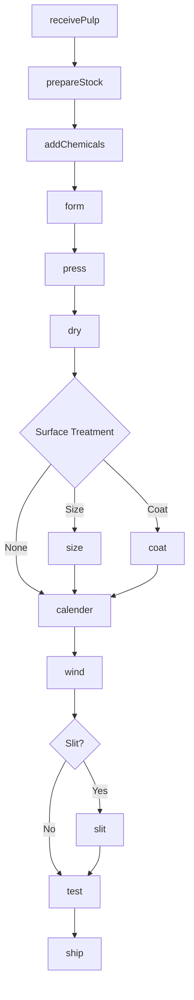
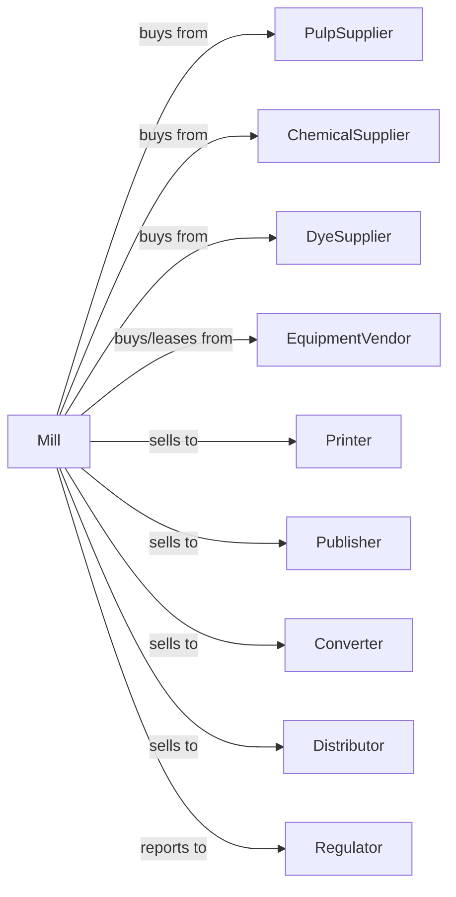

# Paper Mills

> Business-as-Code definition for paper mill operations. Models the complete papermaking process from pulp preparation through forming, pressing, drying, and finishing into various paper grades.

## Overview

This industry comprises establishments primarily engaged in manufacturing paper from pulp. These establishments may manufacture or purchase pulp. In addition, the establishments may convert the paper they make. The activity of making paper classifies an establishment into this industry regardless of the output. Cross-References. Establishments primarily engaged in--

## Actors

| Actor | Description |
|-------|-------------|
| PulpSupplier | Provides market pulp for paper production |
| ChemicalSupplier | Provides sizing, fillers, and coating chemicals |
| DyeSupplier | Provides colorants for specialty papers |
| EquipmentVendor | Sells and services paper machines and winders |
| Printer | Purchases printing and writing papers |
| Publisher | Buys newsprint and publication grades |
| Converter | Purchases paper for converting operations |
| Distributor | Wholesales paper products |
| Regulator | Oversees environmental compliance |

## Roles

| Role | Description |
|------|-------------|
| MillOwner | Owns facility and directs business strategy |
| MillManager | Oversees daily production operations |
| StockPrepOperator | Manages pulp preparation and blending |
| MachineOperator | Operates paper machine wet and dry ends |
| CoatingOperator | Manages coating and sizing applications |
| FinishingOperator | Operates calendering and winding equipment |
| QualityTech | Tests paper properties and grades |
| BackTender | Operates the dry end of the paper machine and controls reel changes |
| MaintenanceTech | Maintains paper machine and equipment |

## Entities

| Entity | Description |
|--------|-------------|
| Pulp | Fiber input for paper production |
| Stock | Prepared pulp slurry for paper machine |
| Sheet | Continuous web of paper on machine |
| Roll | Finished paper wound on core |
| BasisWeight | Paper weight per unit area |
| Caliper | Paper thickness measurement |
| Brightness | Measure of paper whiteness |
| Opacity | Paper's ability to block show-through |
| Coating | Surface treatment for print quality |
| Grade | Paper classification by properties and use |

## Actions

| Action | Description |
|--------|-------------|
| receivePulp | Accept pulp deliveries or produce on site |
| prepareStock | Blend and refine pulp for paper machine |
| addChemicals | Incorporate sizing, fillers, and additives |
| form | Create paper sheet on forming section |
| press | Remove water through pressing |
| dry | Remove remaining moisture on dryer section |
| size | Apply surface sizing for ink holdout |
| coat | Apply coating for improved printability |
| calender | Smooth paper surface for finish |
| wind | Roll finished paper onto cores |
| slit | Cut rolls to customer widths |
| test | Verify paper properties meet specifications |
| ship | Deliver paper to customers |

## Events

| Event | Description |
|-------|-------------|
| pulpReceived | Pulp accepted and inventoried |
| stockPrepared | Pulp blended and refined for machine |
| sheetFormed | Paper web created on forming section |
| sheetPressed | Water removed through press section |
| sheetDried | Moisture reduced to target level |
| paperSized | Surface sizing applied |
| paperCoated | Coating application completed |
| paperCalendered | Surface smoothing completed |
| rollWound | Paper wound onto core |
| rollSlit | Roll cut to customer specification |
| qualityTested | Paper properties verified |
| orderShipped | Paper delivered to customer |

## Searches

| Search | Description |
|--------|-------------|
| findPulp | List available pulp sources and grades |
| getInventory | Retrieve paper stock by grade and size |
| getProduction | Monitor paper machine output |
| getQuality | Retrieve test results by roll or lot |
| findOrders | List pending customer orders |
| getMachineStatus | Check paper machine efficiency |
| getBreakHistory | Analyze sheet breaks and downtime |

## Workflow



## Actor Relationships



## Usage

### Calling Actions

```typescript
import { millPaperMills } from '@headlessly/mill-paper-mills'

const mill = millPaperMills()

// Prepare stock for paper machine
const stock = await mill.prepareStock({
  pulpBlend: [
    { type: 'softwood-kraft', percentage: 40 },
    { type: 'hardwood-kraft', percentage: 60 }
  ],
  refiningTarget: 450,
  consistency: 4.0
})

// Add chemical additives
await mill.addChemicals({
  stockId: stock.id,
  additives: [
    { type: 'sizing', product: 'ASA', dose: 2.5 },
    { type: 'filler', product: 'PCC', dose: 15 },
    { type: 'retention', product: 'PAM', dose: 0.3 }
  ]
})

// Form paper on machine
await mill.form({
  stockId: stock.id,
  machineId: 'PM-2',
  basisWeight: 75,
  targetSpeed: 800
})
```

### Event-Driven Automation

```typescript
// Auto-coat after drying
mill.sheetDried(async ({ runId, machineId, grade }) => {
  if (grade.includes('coated')) {
    await mill.coat({
      runId,
      coatWeight: 12,
      coaterType: 'blade',
      formula: 'gloss-C2S'
    })
  }
})

// Auto-test and release rolls
mill.rollWound(async ({ rollId, grade, basisWeight }) => {
  const testResult = await mill.test({
    rollId,
    tests: ['basisWeight', 'caliper', 'brightness', 'opacity', 'smoothness']
  })

  if (testResult.allWithinSpec) {
    const orders = await mill.findOrders({
      grade,
      basisWeight,
      status: 'pending'
    })

    if (orders.length > 0) {
      await mill.slit({
        rollId,
        widths: orders[0].requiredWidths
      })
    }
  }
})
```
