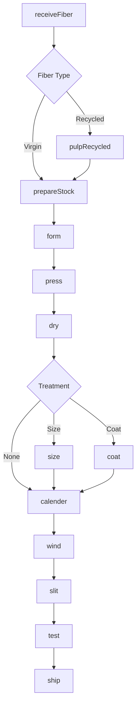
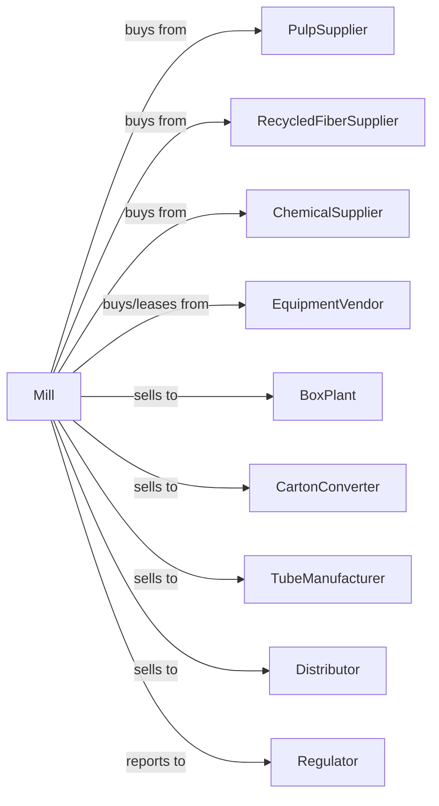

# Paperboard Mills

> Business-as-Code definition for paperboard mill operations. Models the complete production process from pulp and recycled fiber through multi-ply forming, coating, and finishing into containerboard and carton stock grades.

## Overview

This industry comprises establishments primarily engaged in manufacturing paperboard (e.g., can/drum stock, container board, corrugating medium, folding carton stock, linerboard, tube) from pulp. These establishments may manufacture or purchase pulp. In addition, the establishments may also convert the paperboard they make. Cross-References. Establishments primarily engaged in--

## Actors

| Actor | Description |
|-------|-------------|
| PulpSupplier | Provides virgin pulp for board production |
| RecycledFiberSupplier | Provides OCC and mixed paper bales |
| ChemicalSupplier | Provides starch, sizing, and coating chemicals |
| EquipmentVendor | Sells and services board machines |
| BoxPlant | Purchases linerboard and medium for boxes |
| CartonConverter | Buys folding carton stock |
| TubeManufacturer | Purchases tube and core stock |
| Distributor | Wholesales paperboard products |
| Regulator | Oversees environmental compliance |

## Roles

| Role | Description |
|------|-------------|
| MillOwner | Owns facility and directs business strategy |
| MillManager | Oversees daily production operations |
| StockPrepOperator | Manages fiber preparation and blending |
| BoardMachineOperator | Operates multi-ply forming and drying |
| CoatingOperator | Manages clay coating application |
| FinishingOperator | Operates calendering and slitting |
| QualityTech | Tests board properties and grades |
| RecyclingCoordinator | Manages fiber recovery and quality |

## Entities

| Entity | Description |
|--------|-------------|
| Pulp | Virgin fiber input for board production |
| OCC | Old corrugated container recycled fiber |
| Stock | Prepared fiber slurry for board machine |
| Board | Multi-ply paperboard product |
| Linerboard | Outer facing of corrugated board |
| Medium | Fluted center layer of corrugated |
| CartonStock | Folding carton grade board |
| Caliper | Board thickness measurement |
| BurstStrength | Resistance to puncture |
| RingCrush | Edge compression strength |

## Actions

| Action | Description |
|--------|-------------|
| receiveFiber | Accept pulp and recycled fiber |
| pulpRecycled | Process OCC and mixed paper |
| prepareStock | Blend and refine fiber for board machine |
| form | Create multi-ply board on forming section |
| press | Remove water and consolidate plies |
| dry | Remove moisture on dryer section |
| size | Apply starch for strength and printability |
| coat | Apply clay coating for print surface |
| calender | Control caliper and surface finish |
| wind | Roll finished board onto cores |
| slit | Cut rolls to customer specifications |
| test | Verify board properties meet specifications |
| ship | Deliver board to customers |

## Events

| Event | Description |
|-------|-------------|
| fiberReceived | Pulp and OCC accepted and inventoried |
| recycledPulped | OCC processed into furnish |
| stockPrepared | Fiber blended for board machine |
| boardFormed | Multi-ply sheet created |
| boardPressed | Plies consolidated and water removed |
| boardDried | Moisture reduced to target level |
| boardSized | Starch application completed |
| boardCoated | Clay coating applied |
| boardCalendered | Caliper and finish controlled |
| rollWound | Board wound onto core |
| rollSlit | Roll cut to specification |
| orderShipped | Board delivered to customer |

## Searches

| Search | Description |
|--------|-------------|
| findFiber | List available pulp and OCC sources |
| getInventory | Retrieve board stock by grade and caliper |
| getProduction | Monitor board machine output |
| getQuality | Retrieve test results by roll or lot |
| findOrders | List pending customer orders |
| getMachineEfficiency | Check board machine productivity |
| getRecycledContent | Track recycled fiber percentages |

## Workflow



## Actor Relationships



## Usage

### Calling Actions

```typescript
import { millPaperboard } from '@headlessly/mill-paperboard'

const mill = millPaperboard()

// Process recycled fiber
const recycled = await mill.pulpRecycled({
  sourceType: 'OCC',
  quantity: 500,
  targetFreeness: 450,
  cleaningStages: 3
})

// Prepare stock for board machine
const stock = await mill.prepareStock({
  furnish: [
    { type: 'recycled', source: recycled.id, percentage: 70 },
    { type: 'virgin-softwood', percentage: 30 }
  ],
  refiningTarget: 500
})

// Form multi-ply board
await mill.form({
  stockId: stock.id,
  machineId: 'BM-1',
  plies: 3,
  targetCaliper: 0.024,
  targetBasisWeight: 42
})
```

### Event-Driven Automation

```typescript
// Auto-coat for carton grades
mill.boardDried(async ({ runId, grade, targetCaliper }) => {
  if (grade === 'SBS' || grade === 'CUK') {
    await mill.coat({
      runId,
      coatWeight: 18,
      sides: 'C1S',
      formula: 'print-gloss'
    })
  }
})

// Auto-test and release production
mill.rollWound(async ({ rollId, grade, caliper }) => {
  const testResult = await mill.test({
    rollId,
    tests: ['caliper', 'basisWeight', 'burstStrength', 'ringCrush', 'moisture']
  })

  if (testResult.allWithinSpec) {
    const orders = await mill.findOrders({
      grade,
      caliperRange: [caliper - 0.001, caliper + 0.001],
      status: 'pending'
    })

    if (orders.length > 0) {
      await mill.slit({
        rollId,
        widths: orders[0].requiredWidths
      })
      await mill.ship({ rollId, orderId: orders[0].id })
    }
  }
})
```
