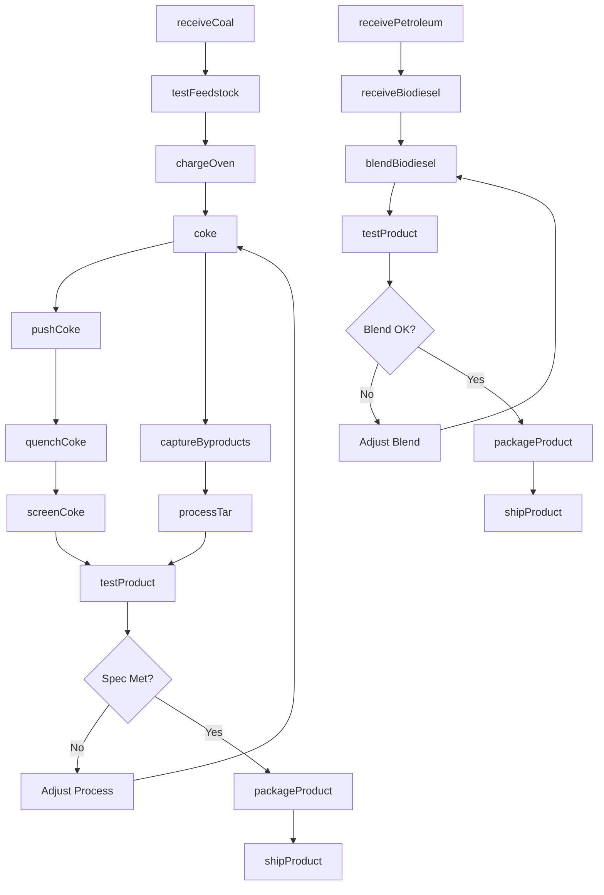
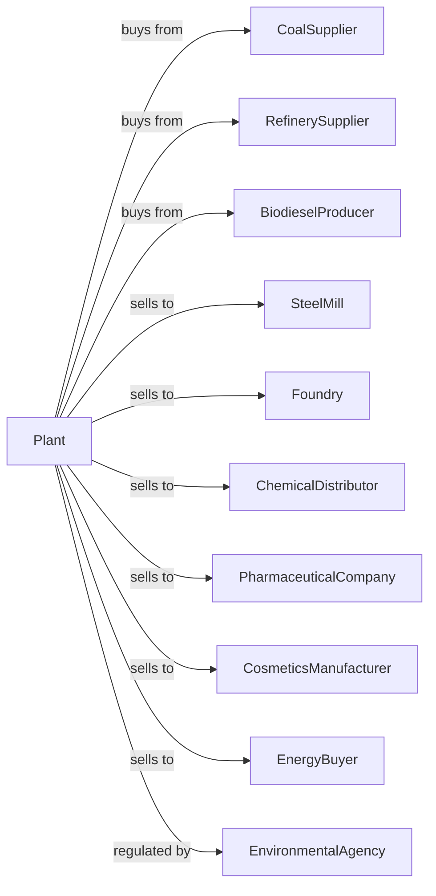

# All Other Petroleum and Coal Products Manufacturing

> Business-as-Code definition for specialty petroleum and coal products manufacturing. Models operations producing coke, biodiesel blends, petroleum briquettes, and other specialty products.

## Overview

This U.S. industry comprises establishments primarily engaged in manufacturing petroleum products (except asphalt paving, roofing, and saturated materials and lubricating oils and greases) from refined petroleum and coal products made in coke ovens not integrated with a steel mill. Illustrative examples include biodiesel fuels blended with purchased refined petroleum, coke oven products (e.g., coke, gases, tars), petroleum briquettes, and petroleum jelly.

## Actors

| Actor | Description |
|-------|-------------|
| RefinerySupplier | Provides refined petroleum feedstocks |
| CoalSupplier | Provides metallurgical coal for coking |
| BiodieselProducer | Supplies biodiesel for blending |
| ChemicalDistributor | Purchases coke oven chemicals and tars |
| SteelMill | Major purchaser of metallurgical coke |
| Foundry | Uses coke for metal casting |
| PharmaceuticalCompany | Purchases petroleum jelly and waxes |
| CosmeticsManufacturer | Uses petroleum-derived ingredients |
| EnvironmentalAgency | Regulates emissions from coke ovens |
| EnergyBuyer | Purchases coke oven gas for fuel |

## Roles

| Role | Description |
|------|-------------|
| PlantManager | Oversees facility operations |
| CokeOvenOperator | Manages coking process and oven batteries |
| BlendingOperator | Operates biodiesel blending systems |
| ProcessEngineer | Optimizes production processes |
| LabTechnician | Tests feedstocks and finished products |
| MaintenanceTechnician | Maintains equipment and ovens |
| EnvironmentalEngineer | Manages emissions and compliance |
| LogisticsCoordinator | Manages material flow and shipments |
| SafetyManager | Oversees plant safety programs |

## Entities

| Entity | Description |
|--------|-------------|
| MetCoke | Metallurgical coke for steel and foundry use |
| CokeOvenGas | Byproduct fuel gas from coking |
| CoalTar | Byproduct from coal distillation |
| Biodiesel | Renewable fuel from biological sources |
| BlendedFuel | Petroleum-biodiesel mixture |
| PetroleumJelly | Semi-solid petroleum product |
| PetroleumWax | Solid wax from petroleum |
| Briquette | Compressed fuel product |
| CokeOven | High-temperature carbonization chamber |
| BlendTank | Vessel for mixing fuels |

## Actions

| Action | Description |
|--------|-------------|
| receiveCoal | Accept metallurgical coal delivery |
| receivePetroleum | Accept refined petroleum feedstock |
| receiveBiodiesel | Accept biodiesel for blending |
| testFeedstock | Analyze incoming materials |
| chargeOven | Load coal into coke oven |
| coke | Carbonize coal at high temperature |
| pushCoke | Remove finished coke from oven |
| quenchCoke | Cool hot coke with water or dry quench |
| screenCoke | Size coke for different applications |
| captureByproducts | Collect gases and tars from coking |
| processTar | Distill coal tar into products |
| blendBiodiesel | Mix biodiesel with petroleum diesel |
| testProduct | Verify product meets specifications |
| packageProduct | Fill containers or load bulk |
| shipProduct | Deliver finished goods to customer |
| monitorEmissions | Track and report environmental data |

## Events

| Event | Description |
|-------|-------------|
| coalReceived | Coal delivery completed |
| petroleumReceived | Petroleum feedstock received |
| biodieselReceived | Biodiesel delivery completed |
| ovenCharged | Coal loaded into oven |
| cokingCompleted | Carbonization cycle finished |
| cokePushed | Coke discharged from oven |
| cokeQuenched | Coke cooled to handling temperature |
| cokeScreened | Coke sized and graded |
| byproductsCaptured | Gases and tars collected |
| blendCompleted | Biodiesel blend finished |
| productTested | Quality analysis completed |
| productShipped | Order delivered to customer |
| emissionLimitExceeded | Emission level exceeded permitted threshold |
| ovenMaintenancePerformed | Oven scheduled for repairs |

## Searches

| Search | Description |
|--------|-------------|
| findInventory | Query feedstock and product levels |
| getOvenStatus | View coke oven operating status |
| findBatches | List production batches by date or product |
| getTestResults | Retrieve quality records |
| findOrders | List customer orders by status |
| getByproducts | Track coal tar and gas volumes |
| getEmissionsLog | Query environmental monitoring data |
| findShipments | List completed and pending shipments |

## Workflow

## Actor Relationships

