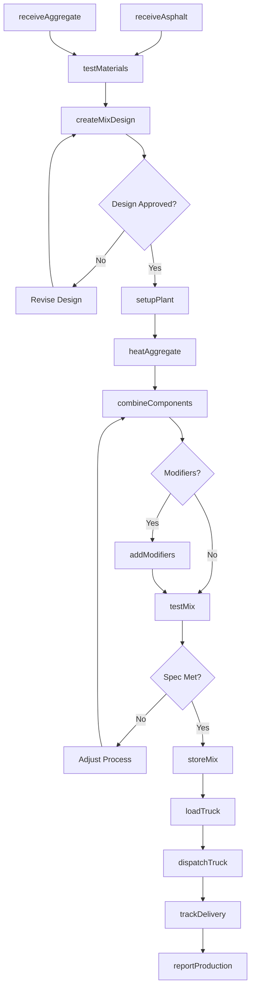
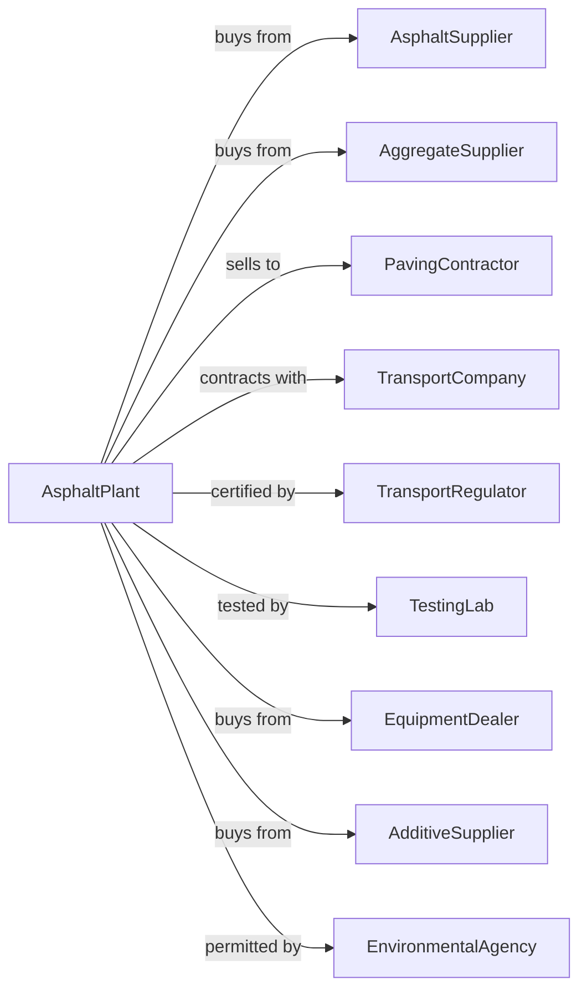

# Asphalt Paving Mixture and Block Manufacturing

> Business-as-Code definition for hot mix asphalt plant operations. Models the complete production workflow from raw materials through delivery to paving projects.

## Overview

This U.S. industry comprises establishments primarily engaged in manufacturing asphalt and tar paving mixtures and blocks from purchased asphaltic materials. Products include hot mix asphalt, warm mix asphalt, cold patch, and asphalt paving blocks used in road construction, parking lots, and other paving applications.

## Actors

| Actor | Description |
|-------|-------------|
| AsphaltSupplier | Refinery or terminal providing liquid asphalt cement |
| AggregateSupplier | Quarry providing stone, sand, and gravel |
| PavingContractor | Construction company purchasing mix for projects |
| TransportCompany | Hauls mix from plant to job site |
| TransportRegulator | State department of transportation specifying standards |
| TestingLab | Third-party laboratory for quality certification |
| EquipmentDealer | Supplies and services plant equipment |
| AdditiveSupplier | Provides polymers, fibers, and other modifiers |
| EnvironmentalAgency | Regulates emissions and permits |

## Roles

| Role | Description |
|------|-------------|
| PlantManager | Oversees all plant operations and business |
| PlantOperator | Controls batch or drum mix plant systems |
| LabTechnician | Tests materials and mix quality |
| LoadoutOperator | Weighs and loads trucks |
| MaintenanceMech | Maintains and repairs plant equipment |
| Dispatcher | Schedules truck deliveries to job sites |
| QualityManager | Ensures mix meets specifications |
| SalesManager | Manages contractor relationships and pricing |

## Entities

| Entity | Description |
|--------|-------------|
| AsphaltCement | Liquid binder from petroleum refining |
| Aggregate | Stone, sand, and mineral filler |
| HotMix | Asphalt concrete produced at elevated temperature |
| WarmMix | Reduced temperature asphalt using additives |
| ColdPatch | Ambient temperature repair material |
| MixDesign | Formula specifying aggregate gradation and binder content |
| Batch | Single production cycle of asphalt mix |
| Silo | Heated storage for finished mix |
| Truck | Haul vehicle delivering mix to site |
| RAP | Reclaimed Asphalt Pavement for recycling |

## Actions

| Action | Description |
|--------|-------------|
| receiveAsphalt | Accept liquid asphalt delivery to storage |
| receiveAggregate | Accept aggregate delivery and stockpile |
| testMaterials | Analyze incoming materials for compliance |
| createMixDesign | Develop formula meeting project specifications |
| setupPlant | Configure plant for specific mix design |
| heatAggregate | Dry and heat aggregate in drum or batch tower |
| combineComponents | Mix heated aggregate with asphalt cement |
| addModifiers | Incorporate polymers, fibers, or warm mix additives |
| testMix | Sample and test production for quality |
| storeMix | Hold finished mix in heated silo |
| loadTruck | Weigh and load mix into haul vehicle |
| dispatchTruck | Send truck to job site with delivery ticket |
| trackDelivery | Monitor truck location and delivery status |
| processRAP | Prepare reclaimed asphalt for reuse |
| reportProduction | Document tonnage and quality records |

## Events

| Event | Description |
|-------|-------------|
| asphaltReceived | Liquid asphalt delivery completed |
| aggregateReceived | Aggregate stockpile replenished |
| materialsTested | Incoming materials verified |
| mixDesignApproved | Formula accepted by engineer |
| productionStarted | Plant began producing mix |
| batchCompleted | Single batch finished mixing |
| mixTested | Quality sample analyzed |
| mixStored | Batch transferred to silo |
| truckLoaded | Haul vehicle filled and weighed |
| truckDispatched | Vehicle departed for job site |
| deliveryCompleted | Mix delivered and accepted |
| plantShutDown | Production stopped for day or maintenance |
| tempDeviated | Mix temperature outside specification |
| specFailed | Mix failed quality test |

## Searches

| Search | Description |
|--------|-------------|
| findInventory | Query asphalt and aggregate stock levels |
| getMixDesigns | List approved mix designs by project or spec |
| getProduction | View daily and weekly tonnage records |
| findDeliveries | List deliveries by contractor or date |
| getTruckStatus | Check location and status of haul trucks |
| getTestResults | Retrieve quality test records |
| findOrders | List open orders by contractor and project |

## Workflow

## Actor Relationships

