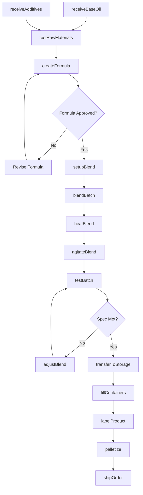
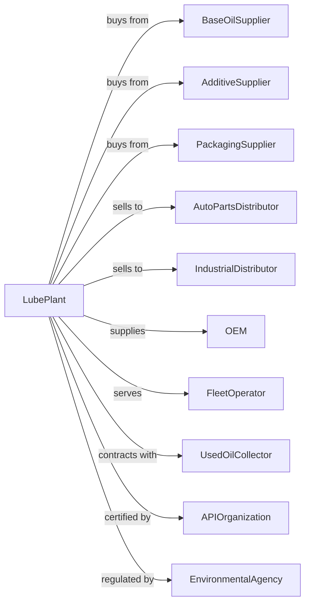

# Petroleum Lubricating Oil and Grease Manufacturing

> Business-as-Code definition for lubricant blending operations. Models the complete production workflow from base oil sourcing through finished lubricant distribution.

## Overview

This U.S. industry comprises establishments primarily engaged in blending or compounding refined petroleum to make lubricating oils and greases and/or re-refining used petroleum lubricating oils. Products include motor oils, industrial lubricants, metalworking fluids, greases, and specialty lubricants for automotive, industrial, and marine applications.

## Actors

| Actor | Description |
|-------|-------------|
| BaseOilSupplier | Refinery providing Group I-IV base oils |
| AdditiveSupplier | Chemical company providing additive packages |
| PackagingSupplier | Provides containers, drums, and bulk tanks |
| AutoPartsDistributor | Distributes motor oils to retail and installers |
| IndustrialDistributor | Serves manufacturing and commercial accounts |
| OEM | Original equipment manufacturer requiring factory fill |
| FleetOperator | Manages vehicle or equipment fleet |
| UsedOilCollector | Picks up used oil for re-refining |
| APIOrganization | American Petroleum Institute for certifications |
| EnvironmentalAgency | Regulates waste oil and emissions |

## Roles

| Role | Description |
|------|-------------|
| PlantManager | Oversees blending facility operations |
| Blender | Operates blending kettles and mixing equipment |
| LabTechnician | Tests base oils, additives, and finished products |
| QualityManager | Ensures products meet specifications and certifications |
| FormulationEngineer | Develops and optimizes lubricant formulas |
| PackagingOperator | Fills containers and operates packaging lines |
| WarehouseWorker | Manages raw material and finished goods inventory |
| TechnicalSalesRep | Provides application expertise to customers |
| ProcurementManager | Sources base oils and additives |

## Entities

| Entity | Description |
|--------|-------------|
| BaseOil | Refined petroleum feedstock for blending |
| Additive | Chemical package providing performance properties |
| MotorOil | Lubricant for internal combustion engines |
| IndustrialLube | Lubricant for machinery and equipment |
| Grease | Semi-solid lubricant with thickener |
| MetalworkingFluid | Cutting and forming fluid for machining |
| Formula | Recipe specifying components and proportions |
| Batch | Single production run of lubricant |
| Container | Package size from quart to bulk tank |
| Certification | API, OEM, or industry approval |

## Actions

| Action | Description |
|--------|-------------|
| receiveBaseOil | Accept base oil delivery to storage tanks |
| receiveAdditives | Accept additive package delivery |
| testRawMaterials | Analyze incoming materials for quality |
| createFormula | Develop blend recipe meeting specifications |
| setupBlend | Configure kettles for specific formula |
| blendBatch | Combine base oils and additives |
| heatBlend | Apply heat if required for blending |
| agitateBlend | Mix components to achieve homogeneity |
| testBatch | Sample and analyze finished batch |
| adjustBlend | Modify blend to meet specification |
| transferToStorage | Move approved batch to bulk tank |
| fillContainers | Package product into specified containers |
| labelProduct | Apply labels with product and lot information |
| palletize | Prepare finished goods for shipment |
| shipOrder | Deliver products to customer |
| collectUsedOil | Receive used lubricant for re-refining |
| reRefine | Process used oil into base stock |

## Events

| Event | Description |
|-------|-------------|
| baseOilReceived | Base oil delivery completed |
| additivesReceived | Additive delivery completed |
| rawMaterialsTested | Incoming materials verified |
| formulaApproved | New formula qualified for production |
| blendStarted | Batch blending began |
| blendCompleted | Mixing finished |
| batchTested | Quality analysis completed |
| batchApproved | Product met specifications |
| batchRejected | Product failed specifications |
| fillingCompleted | Container packaging finished |
| palletCompleted | Shipment unit prepared |
| orderShipped | Customer delivery dispatched |
| certificationReceived | API or OEM approval granted |
| usedOilReceived | Used lubricant collected |
| reRefiningCompleted | Recycled base oil available |

## Searches

| Search | Description |
|--------|-------------|
| findInventory | Query base oil and additive stock levels |
| getProductStock | Check finished goods by SKU |
| findFormulas | Search formulas by application or spec |
| getBatches | List batches by product or date |
| getTestResults | Retrieve quality records by batch |
| findOrders | List customer orders by status |
| getCertifications | View product certifications and approvals |
| getUsedOilRecords | Track collected used oil volumes |

## Workflow

## Actor Relationships

