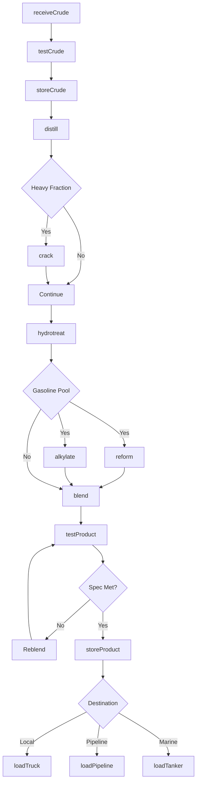
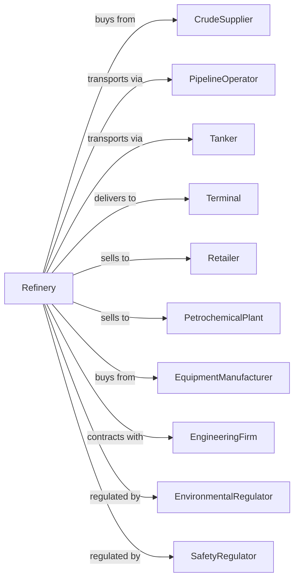

# Petroleum Refineries

> Business-as-Code definition for petroleum refinery operations. Models the complete refining process from crude oil intake through finished product distribution.

## Overview

This industry comprises establishments primarily engaged in refining crude petroleum into refined petroleum. Petroleum refining involves one or more of the following activities: (1) fractionation; (2) straight distillation of crude oil; and (3) cracking. Products include gasoline, diesel fuel, jet fuel, heating oil, lubricant base stocks, asphalt, and petrochemical feedstocks.

## Actors

| Actor | Description |
|-------|-------------|
| CrudeSupplier | Oil producers and traders providing crude feedstock |
| PipelineOperator | Transports crude to refinery and products to terminals |
| Tanker | Marine vessel transporting crude or products |
| Terminal | Storage and distribution facility for refined products |
| Retailer | Gas stations and fuel distributors |
| PetrochemicalPlant | Purchases feedstocks for chemical production |
| EquipmentManufacturer | Supplies process equipment and replacement parts |
| EngineeringFirm | Provides design and construction services |
| EnvironmentalRegulator | Environmental Protection Agency regulating emissions |
| SafetyRegulator | Occupational Safety and Health Administration |

## Roles

| Role | Description |
|------|-------------|
| RefineryManager | Oversees entire refinery operations |
| ProcessEngineer | Optimizes unit operations and yields |
| Operator | Monitors and controls process units |
| MaintenanceTechnician | Repairs and maintains equipment |
| SafetyEngineer | Manages safety programs and incident prevention |
| EnvironmentalEngineer | Ensures regulatory compliance and emissions control |
| LabTechnician | Tests crude and product quality |
| SupplyPlanner | Manages crude procurement and product sales |
| Scheduler | Optimizes production and logistics timing |
| Inspector | Conducts equipment integrity inspections |

## Entities

| Entity | Description |
|--------|-------------|
| CrudeOil | Unrefined petroleum feedstock |
| Distillate | Fuel fraction from distillation |
| Gasoline | Light motor fuel product |
| DieselFuel | Middle distillate motor fuel |
| JetFuel | Aviation turbine fuel |
| HeatingOil | Fuel for residential and commercial heating |
| Asphalt | Heavy residual used in paving |
| Feedstock | Intermediate for petrochemical production |
| ProcessUnit | Equipment system for specific refining operation |
| Tank | Storage vessel for crude or products |
| Catalyst | Material enabling chemical reactions |

## Actions

| Action | Description |
|--------|-------------|
| receiveCrude | Accept crude oil delivery via pipeline or tanker |
| testCrude | Analyze crude quality and characteristics |
| storeCrude | Tank crude oil awaiting processing |
| distill | Separate crude into fractions by boiling point |
| crack | Break heavy molecules into lighter products |
| reform | Reshape molecules to increase octane |
| hydrotreat | Remove sulfur and improve product quality |
| alkylate | Combine molecules to boost gasoline octane |
| blend | Mix components to meet product specifications |
| testProduct | Verify product meets quality standards |
| storeProduct | Tank finished products awaiting shipment |
| loadTruck | Fill tank trucks for local delivery |
| loadPipeline | Send product to pipeline for distribution |
| loadTanker | Fill marine vessel for export or coastal delivery |
| reportEmissions | Submit environmental compliance data |
| performTurnaround | Conduct scheduled maintenance shutdown |

## Events

| Event | Description |
|-------|-------------|
| crudeReceived | Crude oil delivery completed |
| crudeTested | Quality analysis completed |
| distillationStarted | Crude unit began processing |
| crackingCompleted | FCC or hydrocracker run finished |
| productBlended | Finished product batch ready |
| productTested | Quality specification verified |
| shipmentLoaded | Product loaded for transport |
| emissionLimitReached | Threshold approached or exceeded |
| equipmentAlarmTriggered | Process deviation detected |
| unitTripped | Safety shutdown activated |
| turnaroundStarted | Maintenance shutdown began |
| turnaroundCompleted | Unit returned to operation |
| spillDetected | Product release identified |
| inspectionBecameDue | Equipment inspection scheduled |

## Searches

| Search | Description |
|--------|-------------|
| findCrude | Query crude inventory by grade and tank |
| getProductInventory | Check finished product stocks |
| getUnitStatus | View operating status of process units |
| findShipments | List scheduled and completed shipments |
| getAlarms | Retrieve active and historical process alarms |
| findInspections | List upcoming and past equipment inspections |
| getEmissionsData | Query emissions monitoring records |
| getYields | Analyze production yields by unit and period |

## Workflow

## Actor Relationships

