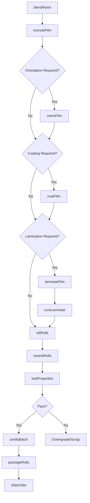
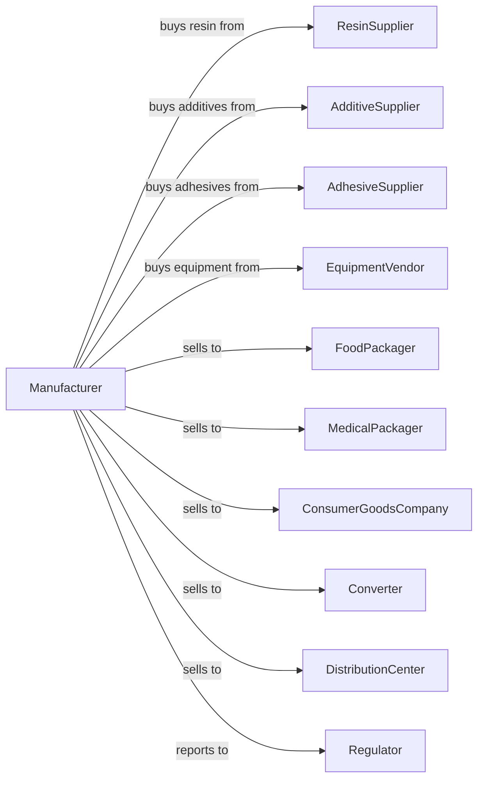

# Plastics Packaging Film and Sheet (including Laminated) Manufacturing

> Business-as-Code definition for plastics packaging film and sheet production operations. Models the complete manufacturing process from resin extrusion through laminated film delivery.

## Overview

This U.S. industry comprises establishments primarily engaged in converting plastics resins into plastics packaging (flexible) film and packaging sheet. Products include stretch wrap, shrink film, laminated barrier films, and flexible packaging substrates used throughout food, medical, and consumer goods industries.

## Actors

| Actor | Description |
|-------|-------------|
| ResinSupplier | Provides polyethylene, polypropylene, PET, and specialty resins |
| AdditiveSupplier | Supplies slip agents, antiblock, UV stabilizers, and colorants |
| AdhesiveSupplier | Provides laminating adhesives for multi-layer films |
| EquipmentVendor | Sells extruders, laminators, and converting equipment |
| FoodPackager | Purchases barrier films for food preservation |
| MedicalPackager | Buys sterile packaging films for medical devices |
| ConsumerGoodsCompany | Uses films for product wrapping and bundling |
| Converter | Purchases base films for further processing |
| DistributionCenter | Uses stretch wrap for pallet unitization |
| Regulator | Oversees FDA compliance and environmental standards |

## Roles

| Role | Description |
|------|-------------|
| PlantManager | Directs manufacturing operations and resource allocation |
| ExtrusionEngineer | Optimizes extrusion parameters for film quality |
| ExtrusionOperator | Runs blown or cast film extrusion lines |
| LaminationOperator | Operates adhesive and extrusion laminating equipment |
| SlittingOperator | Cuts master rolls to customer-specified widths |
| QualityEngineer | Develops and monitors quality control protocols |
| LabTechnician | Performs physical and barrier property testing |
| ProductDeveloper | Creates new film structures for customer applications |

## Entities

| Entity | Description |
|--------|-------------|
| Resin | Base polymer pellets for film extrusion |
| Additive | Chemical modifiers blended with resin for properties |
| Film | Extruded plastics web in roll form |
| Laminate | Multi-layer film bonded by adhesive or heat |
| MasterRoll | Full-width roll from extrusion line |
| SlitRoll | Finished roll cut to customer width |
| Adhesive | Bonding agent for lamination process |
| BarrierLayer | Specialized layer providing oxygen or moisture barrier |
| Specification | Customer requirements for thickness, width, and properties |
| TestSample | Film specimen for laboratory analysis |

## Actions

| Action | Description |
|--------|-------------|
| blendResin | Mix base resin with additives and colorants |
| extrudeFilm | Convert resin blend into film through die and cooling |
| orientFilm | Stretch film to improve strength and clarity |
| coatFilm | Apply functional coatings for barrier or sealing |
| laminateFilm | Bond multiple film layers using adhesive or heat |
| cureLaminate | Allow adhesive to fully bond during cure period |
| slitRolls | Cut master rolls to specified widths |
| rewindRolls | Transfer film to customer-specified core and length |
| testProperties | Measure thickness, tensile strength, and barrier values |
| certifyBatch | Document quality data for regulatory compliance |
| packageRolls | Wrap and protect rolls for shipment |
| shipOrder | Deliver finished rolls to customer facility |

## Events

| Event | Description |
|-------|-------------|
| resinBlended | Raw materials combined and ready for extrusion |
| filmExtruded | Base film produced on extrusion line |
| filmOriented | Stretching process completed for enhanced properties |
| filmCoated | Functional coating applied successfully |
| filmLaminated | Multiple layers bonded into composite structure |
| laminateCured | Adhesive fully bonded after cure period |
| rollsSlit | Master roll converted to customer widths |
| qualityApproved | Testing confirmed product meets specification |
| qualityRejected | Testing revealed out-of-spec conditions |
| orderFulfilled | Complete order packaged and shipped |
| equipmentWentDown | Production line stopped for maintenance |

## Searches

| Search | Description |
|--------|-------------|
| findOrders | List orders by customer, product type, or due date |
| getInventory | Check resin, additive, and finished goods stock |
| findFilmStructures | List available film configurations and specifications |
| getProductionSchedule | View planned extrusion and lamination runs |
| checkQualityData | Retrieve test results for batches and rolls |
| findCustomers | List customers by application or purchase volume |
| getEquipmentStatus | Check availability and condition of production lines |
| findCertifications | Retrieve compliance documents for regulated products |

## Workflow

## Actor Relationships

