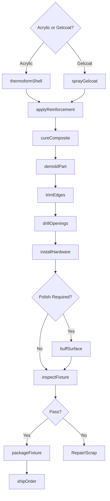
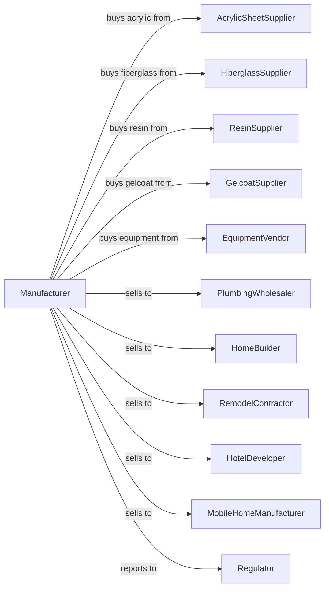

# Plastics Plumbing Fixture Manufacturing

> Business-as-Code definition for plastics plumbing fixture production operations. Models the complete manufacturing process from composite layup through finished fixture delivery.

## Overview

This U.S. industry comprises establishments primarily engaged in manufacturing plastics or fiberglass plumbing fixtures. Examples of products made by these establishments are plastics or fiberglass bathtubs, hot tubs, portable toilets, and shower stalls. Products include acrylic and fiberglass tubs, shower surrounds, spa shells, and sanitary fixtures for residential and commercial construction.

## Actors

| Actor | Description |
|-------|-------------|
| AcrylicSheetSupplier | Provides cast and extruded acrylic sheet materials |
| FiberglassSupplier | Supplies fiberglass mat and roving for reinforcement |
| ResinSupplier | Provides polyester and vinyl ester resins |
| GelcoatSupplier | Supplies pigmented surface coating materials |
| EquipmentVendor | Sells thermoforming and spray-up equipment |
| PlumbingWholesaler | Distributes fixtures to contractors and retailers |
| HomeBuilder | Purchases fixtures for new residential construction |
| RemodelContractor | Buys replacement and upgrade fixtures |
| HotelDeveloper | Specifies fixtures for hospitality properties |
| MobileHomeManufacturer | Uses fixtures for manufactured housing |
| Regulator | Oversees plumbing codes and product safety |

## Roles

| Role | Description |
|------|-------------|
| PlantManager | Directs manufacturing operations and quality systems |
| ProcessEngineer | Develops forming and layup procedures |
| ThermoformOperator | Runs vacuum forming equipment for acrylic shells |
| LaminationTechnician | Applies fiberglass reinforcement to formed shells |
| GelcoatOperator | Sprays surface coating in open molds |
| TrimmingOperator | Cuts and finishes formed parts |
| AssemblyTechnician | Installs drains, fittings, and hardware |
| QualityInspector | Checks surface finish and dimensional accuracy |

## Entities

| Entity | Description |
|--------|-------------|
| AcrylicSheet | Thermoformable surface material for tubs and showers |
| FiberglassMat | Chopped strand reinforcement for structural backing |
| Resin | Liquid polymer that bonds fiberglass reinforcement |
| Gelcoat | Pigmented surface layer applied to mold |
| Shell | Formed acrylic or gelcoat surface shape |
| Reinforcement | Fiberglass backing that provides structural strength |
| Mold | Tooling that defines fixture shape and features |
| Drain | Plumbing connection point in fixture |
| Surround | Wall panel system for tub or shower enclosure |
| Frame | Structural support for freestanding fixtures |

## Actions

| Action | Description |
|--------|-------------|
| thermoformShell | Vacuum form acrylic sheet over mold |
| sprayGelcoat | Apply pigmented surface coating to open mold |
| applyReinforcement | Spray or hand-lay fiberglass and resin |
| cureComposite | Allow resin to fully harden and crosslink |
| demoldPart | Remove cured fixture from mold |
| trimEdges | Cut and finish part perimeter |
| drillOpenings | Create holes for drains and fittings |
| installHardware | Mount drains, overflows, and accessories |
| buffSurface | Polish surfaces for uniform finish |
| inspectFixture | Check for defects and dimensional accuracy |
| packageFixture | Protect finished product for shipping |
| shipOrder | Deliver fixtures to customer or distributor |

## Events

| Event | Description |
|-------|-------------|
| shellFormed | Acrylic thermoformed to shape |
| gelcoatSprayed | Surface coating applied to mold |
| reinforcementApplied | Fiberglass backing laminated |
| compositeCured | Resin fully hardened |
| partDemolded | Fixture removed from mold |
| edgesTrimmed | Part perimeter finished |
| openingsDrilled | Plumbing holes created |
| hardwareInstalled | Drains and fittings mounted |
| qualityApproved | Inspection confirmed specification compliance |
| orderShipped | Products delivered to customer |
| moldPrepared | Tooling cleaned and waxed for next cycle |

## Searches

| Search | Description |
|--------|-------------|
| findFixtures | List products by type, size, and material |
| getInventory | Check stock of materials and finished goods |
| findOrders | List orders by customer, product, or ship date |
| getMoldSchedule | View mold availability and production queue |
| checkQuality | Retrieve inspection data for specific lots |
| findCustomers | List customers by channel or volume |
| getProductCatalog | Access specifications and dimensions |
| getCapacity | Calculate available production capacity |

## Workflow

## Actor Relationships

