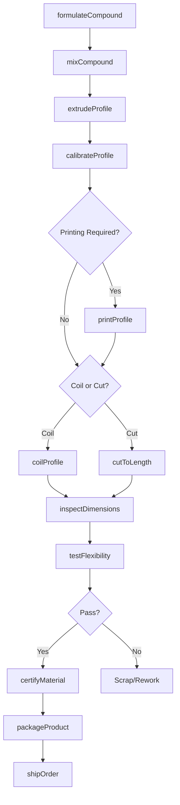
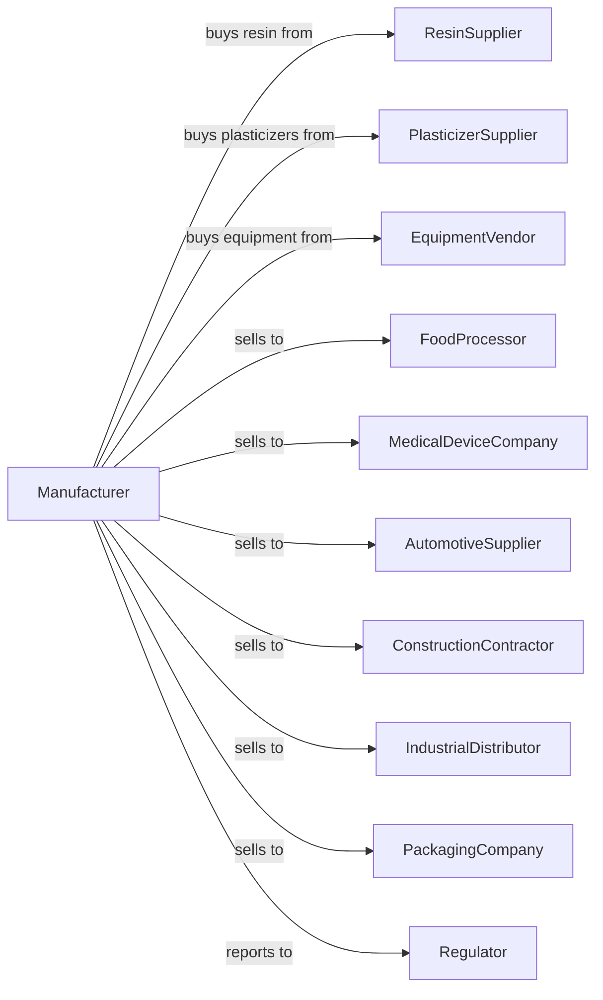

# Unlaminated Plastics Profile Shape Manufacturing

> Business-as-Code definition for unlaminated plastics profile shape production operations. Models the complete manufacturing process from resin extrusion through finished profile delivery.

## Overview

This U.S. industry comprises establishments primarily engaged in converting plastics resins into nonrigid plastics profile shapes (except film, sheet, bags, and hoses), such as rod, tube, and sausage casings. Products include flexible tubing, straws, weatherstripping, and specialty profiles for industrial and consumer applications.

## Actors

| Actor | Description |
|-------|-------------|
| ResinSupplier | Provides PVC, polyethylene, polypropylene, and specialty resins |
| PlasticizerSupplier | Supplies plasticizers for flexible compound formulations |
| EquipmentVendor | Sells extrusion lines, dies, and downstream equipment |
| FoodProcessor | Purchases sausage casings and food-grade tubing |
| MedicalDeviceCompany | Buys flexible tubing for medical applications |
| AutomotiveSupplier | Uses profiles for weatherstripping and trim |
| ConstructionContractor | Purchases tubing and profiles for building applications |
| IndustrialDistributor | Wholesales profiles for various industrial uses |
| PackagingCompany | Buys straws and dispensing components |
| Regulator | Oversees FDA, ASTM, and environmental compliance |

## Roles

| Role | Description |
|------|-------------|
| PlantManager | Directs manufacturing operations and business performance |
| ExtrusionEngineer | Designs and optimizes extrusion processes |
| ExtrusionOperator | Runs profile extrusion lines and monitors quality |
| DieDesigner | Creates tooling for specific profile geometries |
| CompoundingTechnician | Formulates and mixes plastics compounds |
| QualityTechnician | Inspects dimensions and material properties |
| ToolingMaker | Fabricates and maintains extrusion dies |
| PackagingOperator | Cuts, bundles, and packages finished profiles |

## Entities

| Entity | Description |
|--------|-------------|
| Resin | Base polymer material for profile production |
| Plasticizer | Additive that provides flexibility to rigid plastics |
| Compound | Blended mixture of resin and additives |
| Profile | Continuous extruded shape with specific cross-section |
| Rod | Solid cylindrical profile shape |
| Tube | Hollow cylindrical profile shape |
| Casing | Flexible tube used as food casing |
| Die | Precision tooling that forms profile shape |
| Coil | Wound length of flexible profile |
| CutLength | Profile cut to specified length |

## Actions

| Action | Description |
|--------|-------------|
| formulateCompound | Develop resin and additive mixture for specifications |
| mixCompound | Blend resins, plasticizers, and additives |
| extrudeProfile | Force molten compound through die to form shape |
| calibrateProfile | Size and cool profile to final dimensions |
| printProfile | Apply markings or identification to profile surface |
| cutToLength | Sever continuous profile into specified lengths |
| coilProfile | Wind flexible profile onto spools or reels |
| inspectDimensions | Measure profile cross-section and tolerances |
| testFlexibility | Verify flexibility and recovery properties |
| packageProduct | Bundle and protect profiles for shipment |
| certifyMaterial | Document compliance with specifications |
| shipOrder | Deliver finished profiles to customer |

## Events

| Event | Description |
|-------|-------------|
| compoundFormulated | Recipe developed for new product |
| compoundMixed | Raw materials blended and ready for extrusion |
| profileExtruded | Continuous profile produced from die |
| profileCalibrated | Final dimensions achieved through sizing |
| profilePrinted | Surface marking applied successfully |
| profileCut | Lengths separated from continuous extrusion |
| profileCoiled | Flexible material wound onto spool |
| qualityApproved | Inspection confirmed specification compliance |
| qualityRejected | Product failed to meet tolerance limits |
| orderShipped | Products delivered to customer location |
| dieChanged | Tooling swapped for different profile |

## Searches

| Search | Description |
|--------|-------------|
| findProfiles | List available profile shapes by geometry and material |
| getInventory | Check stock of compounds and finished profiles |
| findOrders | List orders by customer, profile type, or due date |
| getDieLibrary | List available extrusion dies and specifications |
| getProductionRuns | View scheduled and active extrusion runs |
| checkQuality | Retrieve dimensional and test data for lots |
| findMaterials | List compounds suitable for specific applications |
| getCompliance | Retrieve certifications for regulated products |

## Workflow

## Actor Relationships

