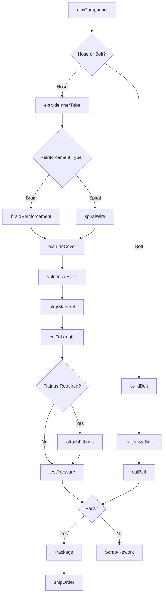
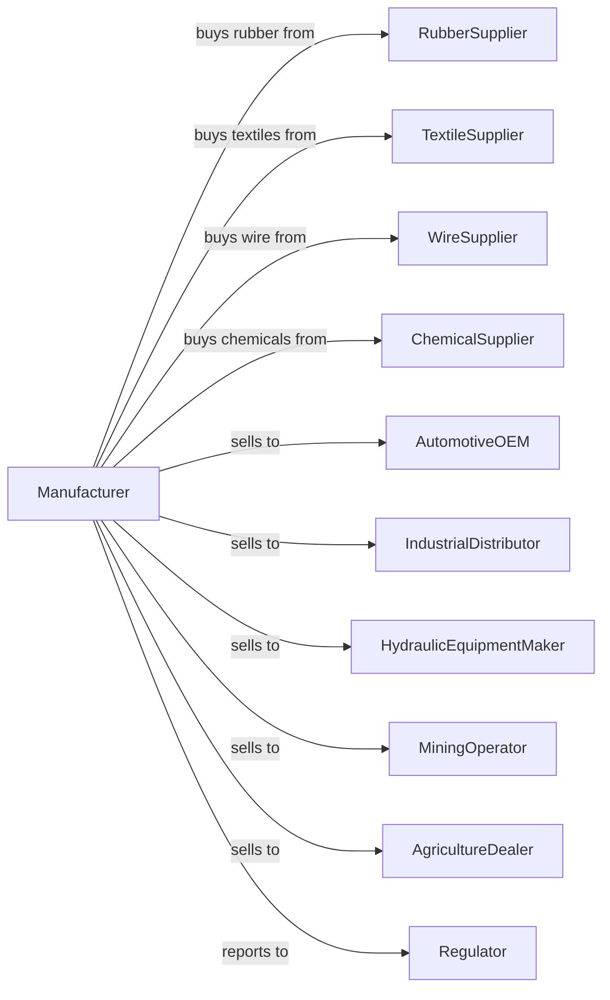

# Rubber and Plastics Hoses and Belting Manufacturing

> Business-as-Code definition for rubber and plastics hoses and belting production operations. Models the complete manufacturing process from rubber compounding through finished hose and belt delivery.

## Overview

This industry comprises establishments primarily engaged in manufacturing rubber hose and/or plastics (reinforced) hose and belting from natural and synthetic rubber and/or plastics resins. Products include hydraulic hoses, industrial hoses, automotive hoses, garden hoses, conveyor belts, power transmission belts, and specialty belting for diverse applications.

## Actors

| Actor | Description |
|-------|-------------|
| RubberSupplier | Provides natural and synthetic rubber polymers |
| TextileSupplier | Supplies reinforcing fabrics and cords |
| WireSupplier | Provides steel wire for hose reinforcement |
| ChemicalSupplier | Supplies curatives, plasticizers, and additives |
| AutomotiveOEM | Purchases hoses for vehicle assembly |
| IndustrialDistributor | Wholesales hoses and belts to end users |
| HydraulicEquipmentMaker | Buys high-pressure hydraulic hoses |
| MiningOperator | Purchases conveyor belts for material handling |
| AgricultureDealer | Distributes irrigation and farm equipment hoses |
| Regulator | Oversees safety standards and product certification |

## Roles

| Role | Description |
|------|-------------|
| PlantManager | Directs manufacturing operations and quality systems |
| CompoundEngineer | Develops rubber formulations for specific applications |
| ExtrusionOperator | Runs hose and belt extrusion equipment |
| BraidingOperator | Operates wire and textile braiding machines |
| VulcanizingOperator | Cures hoses and belts in autoclaves or presses |
| CuttingOperator | Cuts hose and belt to specified lengths |
| AssemblyTechnician | Attaches fittings and couplings to hoses |
| QualityTechnician | Tests pressure ratings and physical properties |

## Entities

| Entity | Description |
|--------|-------------|
| Rubber | Base polymer for hose and belt compounds |
| Reinforcement | Textile, wire, or cord layer for strength |
| InnerTube | Interior rubber layer contacting conveyed fluid |
| Cover | Outer protective rubber layer |
| Braid | Woven reinforcement layer in hose construction |
| Belt | Continuous loop for power transmission or conveying |
| Hose | Flexible tube for fluid conveyance |
| Fitting | End connector for hose attachment |
| Mandrel | Internal support during hose manufacture |
| Compound | Blended rubber formulation for specific properties |

## Actions

| Action | Description |
|--------|-------------|
| mixCompound | Blend rubber with fillers and curatives |
| extrudeInnerTube | Form inner rubber layer on mandrel |
| braidReinforcement | Apply woven textile or wire layer |
| spiralWire | Wind steel wire reinforcement on hose |
| extrudeCover | Apply outer protective rubber layer |
| vulcanizeHose | Cure hose in autoclave under pressure |
| stripMandrel | Remove internal support from cured hose |
| cutToLength | Cut hose to customer-specified lengths |
| attachFittings | Crimp or swage connectors to hose ends |
| testPressure | Verify hose can withstand rated pressure |
| buildBelt | Assemble belt layers and reinforcement |
| shipOrder | Deliver finished products to customer |

## Events

| Event | Description |
|-------|-------------|
| compoundMixed | Rubber batch completed and ready for processing |
| innerTubeExtruded | Interior layer formed on mandrel |
| reinforcementApplied | Braiding or spiraling completed |
| coverExtruded | Outer layer applied to hose |
| hoseVulcanized | Curing completed in autoclave |
| mandrelStripped | Internal support removed |
| hoseCut | Lengths separated from production run |
| fittingsAttached | Connectors crimped to hose ends |
| pressureTestPassed | Hose verified to rated pressure |
| beltBuilt | Belt assembly completed |
| orderShipped | Products delivered to customer |

## Searches

| Search | Description |
|--------|-------------|
| findHoses | List hoses by type, size, and pressure rating |
| findBelts | List belts by type, width, and application |
| getInventory | Check stock of materials and finished products |
| findOrders | List orders by customer, product, or ship date |
| getProductionSchedule | View planned extrusion and curing runs |
| checkQuality | Retrieve pressure test and inspection data |
| findCustomers | List customers by industry or volume |
| getCompounds | List rubber formulations by application |

## Workflow

## Actor Relationships

