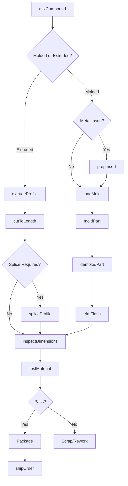
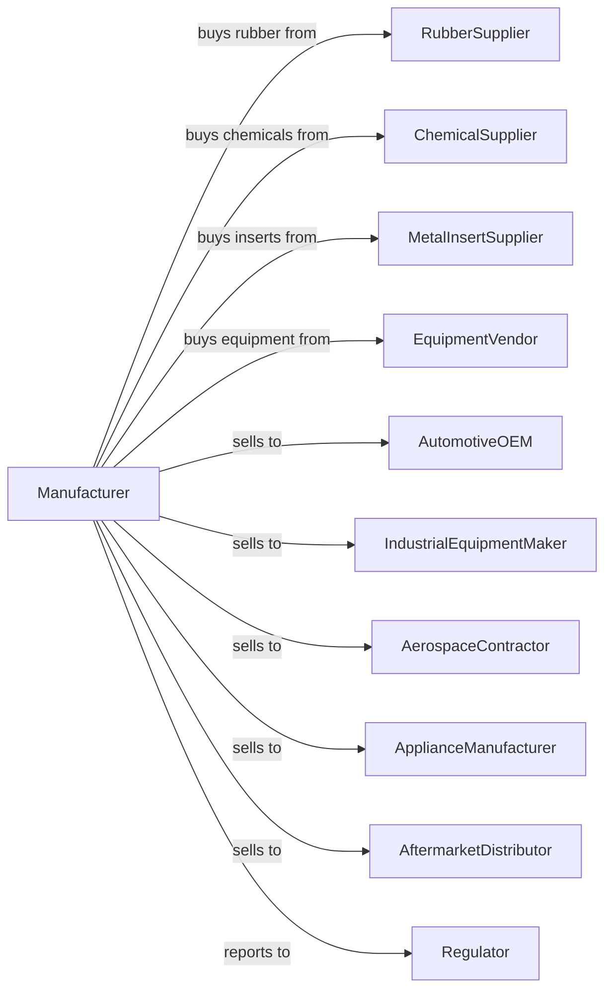

# Rubber Product Manufacturing for Mechanical Use

> Business-as-Code definition for mechanical rubber goods production operations. Models the complete manufacturing process from rubber compounding through precision molded part delivery.

## Overview

This U.S. industry comprises establishments primarily engaged in manufacturing rubber goods (except tubing) for mechanical applications, using the processes of molding, extruding or lathe-cutting. Products of this industry are generally parts for motor vehicles, machinery, and equipment including seals, gaskets, bushings, mounts, vibration dampeners, and precision molded components.

## Actors

| Actor | Description |
|-------|-------------|
| RubberSupplier | Provides natural and synthetic rubber polymers |
| ChemicalSupplier | Supplies curatives, antioxidants, and processing aids |
| MetalInsertSupplier | Provides metal components for bonded parts |
| EquipmentVendor | Sells molding presses and processing equipment |
| AutomotiveOEM | Purchases seals, mounts, and components for vehicles |
| IndustrialEquipmentMaker | Buys rubber parts for machinery |
| AerospaceContractor | Uses precision seals and gaskets for aircraft |
| ApplianceManufacturer | Purchases vibration mounts and seals |
| AftermarketDistributor | Wholesales replacement seals and gaskets |
| Regulator | Oversees product safety and material compliance |

## Roles

| Role | Description |
|------|-------------|
| PlantManager | Oversees manufacturing operations and customer programs |
| CompoundEngineer | Develops rubber formulations for application requirements |
| MixingOperator | Runs internal mixers to blend rubber compounds |
| MoldingOperator | Operates compression, transfer, or injection presses |
| ExtrusionOperator | Runs profile extrusion for seals and gaskets |
| BondingTechnician | Prepares and bonds rubber to metal inserts |
| QualityEngineer | Manages dimensional and material testing |
| ToolingTechnician | Maintains molds and extrusion dies |

## Entities

| Entity | Description |
|--------|-------------|
| Rubber | Natural or synthetic polymer base material |
| Compound | Blended rubber mixture formulated for specific properties |
| Seal | Component that prevents fluid or gas leakage |
| Gasket | Flat sealing element between mating surfaces |
| Mount | Vibration isolating component with metal bonding |
| Bushing | Cylindrical sleeve that reduces friction or vibration |
| ORing | Circular cross-section sealing ring |
| Grommet | Protective ring for wire or cable passages |
| Mold | Precision tooling cavity for part formation |
| Insert | Metal component bonded to rubber part |

## Actions

| Action | Description |
|--------|-------------|
| mixCompound | Blend rubber with curatives and additives |
| prepInsert | Clean and prime metal inserts for bonding |
| loadMold | Place compound and inserts in mold cavity |
| moldPart | Form and cure part under heat and pressure |
| demolodPart | Remove cured part from mold cavity |
| trimFlash | Remove excess rubber from parting lines |
| extrudeProfile | Form continuous seal or gasket profile |
| cutToLength | Sever extrusion to specified dimensions |
| spliceProfile | Join extruded profile ends for closed rings |
| inspectDimensions | Verify critical dimensions against specification |
| testMaterial | Verify hardness, tensile, and compression properties |
| shipOrder | Deliver finished parts to customer |

## Events

| Event | Description |
|-------|-------------|
| compoundMixed | Rubber batch completed and ready for molding |
| insertPrepped | Metal components cleaned and primed |
| moldLoaded | Compound and inserts placed in cavity |
| partMolded | Curing completed under pressure |
| partDemolded | Finished part removed from mold |
| flashTrimmed | Excess material removed |
| profileExtruded | Continuous seal profile produced |
| profileCut | Extrusion cut to length |
| profileSpliced | Ends joined for closed ring |
| qualityApproved | Inspection confirmed specification compliance |
| orderShipped | Parts delivered to customer |
| moldChanged | Tooling swapped for different part |

## Searches

| Search | Description |
|--------|-------------|
| findParts | List parts by type, material, and application |
| getInventory | Check stock of compounds and finished parts |
| findOrders | List orders by customer, part number, or due date |
| getMoldLibrary | List available molds and specifications |
| getProductionSchedule | View planned molding and extrusion runs |
| checkQuality | Retrieve dimensional and material test data |
| findCompounds | List rubber formulations by property requirements |
| getCapacity | Calculate available press hours |

## Workflow

## Actor Relationships

