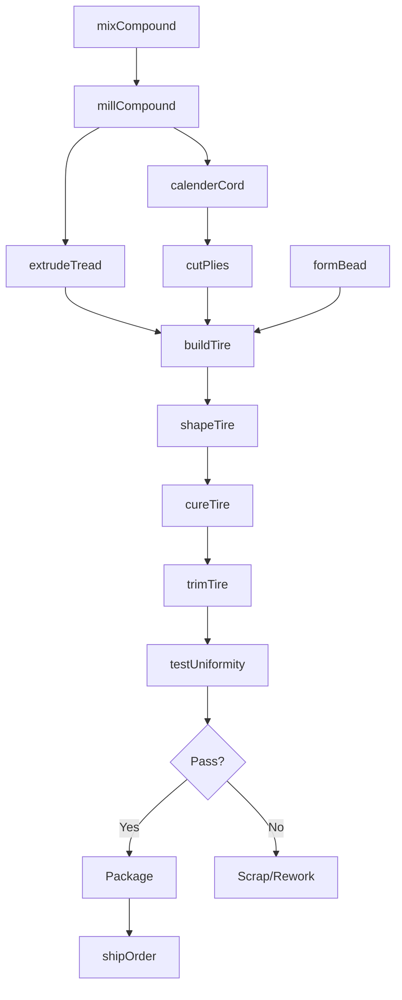
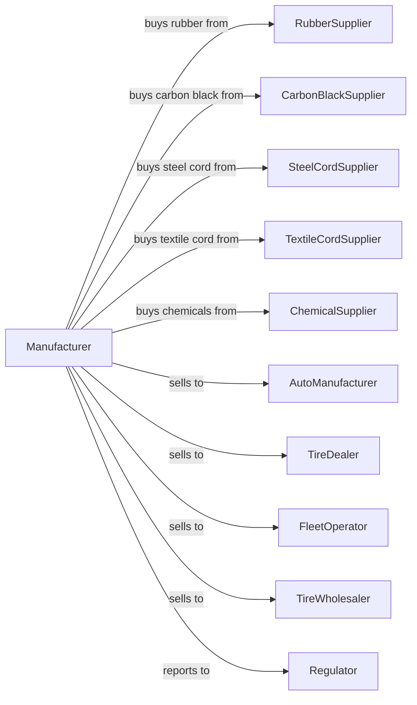

# Tire Manufacturing (except Retreading)

> Business-as-Code definition for new tire production operations. Models the complete manufacturing process from rubber compounding through finished tire delivery.

## Overview

This U.S. industry comprises establishments primarily engaged in manufacturing tires and inner tubes from natural and synthetic rubber. Products include passenger car tires, light truck tires, commercial truck and bus tires, aircraft tires, agricultural and off-road tires, and specialty tires for industrial and recreational applications.

## Actors

| Actor | Description |
|-------|-------------|
| RubberSupplier | Provides natural and synthetic rubber polymers |
| CarbonBlackSupplier | Supplies reinforcing filler for tire compounds |
| SteelCordSupplier | Provides steel belts and bead wire |
| TextileCordSupplier | Supplies nylon, polyester, and rayon tire cords |
| ChemicalSupplier | Provides curatives, antioxidants, and processing aids |
| AutoManufacturer | Purchases tires for original equipment fitment |
| TireDealer | Retails replacement tires to consumers |
| FleetOperator | Buys tires for commercial vehicles |
| TireWholesaler | Distributes tires to retail network |
| Regulator | Oversees safety standards and labeling requirements |

## Roles

| Role | Description |
|------|-------------|
| PlantManager | Directs manufacturing operations and quality systems |
| CompoundEngineer | Develops rubber formulations for performance requirements |
| MixingOperator | Runs Banbury mixers to blend rubber compounds |
| BuildingOperator | Assembles tire components on building drums |
| CuringOperator | Operates vulcanizing presses for tire molding |
| QualityEngineer | Manages testing protocols and uniformity standards |
| FinishingOperator | Inspects and prepares tires for shipment |
| CalenderOperator | Operates calender rolls to coat fabric and steel cord with rubber |
| MaintenanceTechnician | Maintains mixing, building, and curing equipment |

## Entities

| Entity | Description |
|--------|-------------|
| Rubber | Natural or synthetic polymer base material |
| CarbonBlack | Reinforcing filler that provides strength and wear resistance |
| Compound | Blended rubber mixture for specific tire component |
| Tread | Outer layer with pattern for road grip and wear |
| Sidewall | Flexible component connecting tread to bead |
| Bead | Steel wire bundle that anchors tire to wheel |
| Belt | Steel or fabric reinforcement under tread |
| Carcass | Body plies that form tire structure |
| GreenTire | Uncured assembled tire ready for vulcanization |
| Mold | Tooling that imparts tread pattern and sidewall markings |

## Actions

| Action | Description |
|--------|-------------|
| mixCompound | Blend rubber with fillers and chemicals in Banbury mixer |
| millCompound | Process mixed compound on roll mills |
| extrudeTread | Form tread and sidewall profiles through extrusion |
| calenderCord | Coat textile or steel cords with rubber |
| cutPlies | Cut calendered fabric to bias or radial angles |
| formBead | Wind and coat bead wire bundles |
| buildTire | Assemble components on tire building drum |
| shapeTire | Expand green tire to final shape |
| cureTire | Vulcanize tire in heated mold under pressure |
| trimTire | Remove flash and inspect for defects |
| testUniformity | Measure force variation and balance |
| shipOrder | Deliver finished tires to customer |

## Events

| Event | Description |
|-------|-------------|
| compoundMixed | Rubber batch completed in mixer |
| treadExtruded | Tread and sidewall profiles produced |
| cordCalendered | Reinforcing fabric coated with rubber |
| pliesCut | Components cut to specification |
| beadsFormed | Bead bundles produced |
| tireBuilt | Green tire assembled on drum |
| tireShaped | Green tire expanded to final dimensions |
| tireCured | Vulcanization completed in press |
| tireTrimmed | Flash removed and inspection completed |
| uniformityPassed | Force variation within specification |
| orderShipped | Tires delivered to customer |
| moldChanged | Press tooling swapped for different tire |

## Searches

| Search | Description |
|--------|-------------|
| findTires | List tires by size, type, and application |
| getInventory | Check stock of materials and finished tires |
| findOrders | List orders by customer, tire, or ship date |
| getCompounds | List rubber formulations by component |
| getProductionSchedule | View planned building and curing runs |
| checkQuality | Retrieve uniformity and test data |
| findCustomers | List customers by channel or volume |
| getCapacity | Calculate available production capacity |

## Workflow

## Actor Relationships

