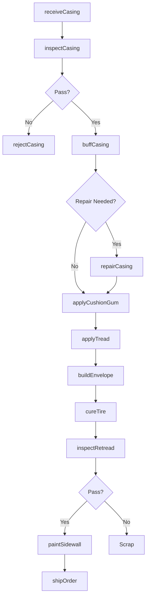
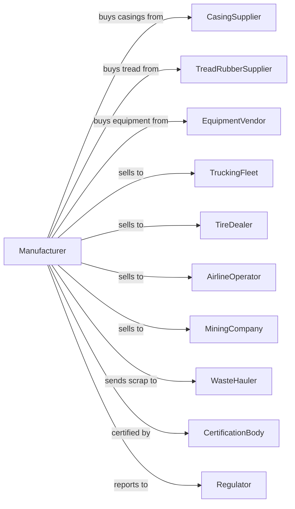

# Tire Retreading

> Business-as-Code definition for tire retreading and rebuilding operations. Models the complete manufacturing process from casing inspection through retreaded tire delivery.

## Overview

This U.S. industry comprises establishments primarily engaged in retreading or rebuilding tires. Products include retreaded truck and bus tires, aircraft tires, off-road equipment tires, and specialty retreads that extend tire life by applying new tread to structurally sound casings.

## Actors

| Actor | Description |
|-------|-------------|
| CasingSupplier | Provides used tire casings for retreading |
| TreadRubberSupplier | Supplies pre-cured tread strips and cushion gum |
| EquipmentVendor | Sells retreading machinery and curing equipment |
| TruckingFleet | Purchases retreads for commercial vehicles |
| TireDealer | Retails retreaded tires to customers |
| AirlineOperator | Uses retreaded aircraft tires |
| MiningCompany | Purchases retreaded off-road equipment tires |
| WasteHauler | Collects and processes scrap casings |
| CertificationBody | Inspects and certifies retreading processes |
| Regulator | Oversees safety standards and product labeling |

## Roles

| Role | Description |
|------|-------------|
| PlantManager | Oversees retreading operations and quality systems |
| CasingInspector | Examines incoming casings for suitability |
| BuffingOperator | Prepares casing surface for new tread application |
| TreadBuilder | Applies tread rubber to buffed casings |
| CuringOperator | Operates autoclaves or mold cure equipment |
| QualityTechnician | Inspects finished retreads for defects |
| SkiveRepairTechnician | Repairs casing injuries before retreading |
| ShippingCoordinator | Manages casing logistics and deliveries |

## Entities

| Entity | Description |
|--------|-------------|
| Casing | Used tire body structure suitable for retreading |
| TreadRubber | Pre-cured or uncured rubber for new tread surface |
| CushionGum | Bonding layer between casing and new tread |
| BuffedCasing | Casing with old tread removed and surface prepared |
| GreenTire | Assembled casing with uncured tread applied |
| RetreadedTire | Finished tire with new tread vulcanized to casing |
| Envelope | Flexible curing chamber for mold cure process |
| Autoclave | Pressure vessel for pre-cure tread bonding |
| Inspection | Quality check performed at each process stage |
| Defect | Damage or condition that disqualifies casing |

## Actions

| Action | Description |
|--------|-------------|
| receiveCasing | Accept and document incoming tire casings |
| inspectCasing | Examine casing for structural integrity and damage |
| rejectCasing | Disqualify unsuitable casings for scrap |
| buffCasing | Remove old tread and prepare bonding surface |
| repairCasing | Fix minor injuries with skive and fill process |
| applyCushionGum | Bond rubber layer to prepared casing surface |
| applyTread | Position pre-cured or uncured tread on casing |
| buildEnvelope | Encase assembled tire in curing envelope |
| cureTire | Vulcanize tread to casing under heat and pressure |
| inspectRetread | Examine finished tire for bonding and defects |
| paintSidewall | Apply protective coating and identification |
| shipOrder | Deliver retreaded tires to customer |

## Events

| Event | Description |
|-------|-------------|
| casingReceived | Used tire accepted into inventory |
| casingApproved | Inspection confirmed casing suitable for retreading |
| casingRejected | Casing failed inspection and sent to scrap |
| casingBuffed | Old tread removed and surface prepared |
| casingRepaired | Injuries fixed and ready for retreading |
| cushionApplied | Bonding layer attached to casing |
| treadApplied | New tread positioned on casing |
| tireCured | Vulcanization completed |
| retreadApproved | Final inspection passed |
| retreadRejected | Finished tire failed quality check |
| orderShipped | Retreaded tires delivered to customer |

## Searches

| Search | Description |
|--------|-------------|
| findCasings | List casings by size, brand, and condition |
| getInventory | Check stock of casings and tread rubber |
| findOrders | List orders by customer, tire size, or due date |
| getProductionQueue | View casings in process by stage |
| checkQuality | Retrieve inspection records for specific tires |
| findCustomers | List customers by volume or application |
| getCasingHistory | Track casing through multiple retread cycles |
| getRejectionRate | Analyze casing rejection statistics |

## Workflow

## Actor Relationships

