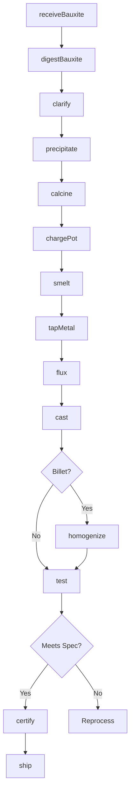
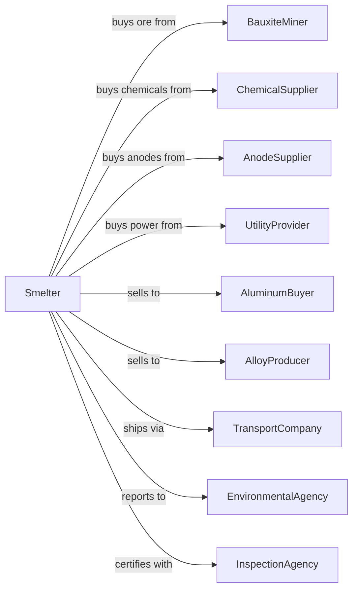

# Alumina Refining and Primary Aluminum Production

> Business-as-Code definition for primary aluminum production operations. Models the complete production process from bauxite refining through aluminum smelting and casting.

## Overview

This U.S. industry comprises establishments primarily engaged in one or more of the following: (1) refining alumina (i.e., aluminum oxide) generally from bauxite; (2) making aluminum from alumina; and/or (3) making aluminum from alumina and rolling, drawing, extruding, or casting the aluminum they make into primary forms.

## Actors

| Actor | Description |
|-------|-------------|
| BauxiteMiner | Supplies bauxite ore for alumina refining |
| ChemicalSupplier | Provides caustic soda and other processing chemicals |
| AnodeSupplier | Provides carbon anodes for electrolytic cells |
| UtilityProvider | Supplies electricity for smelting operations |
| AluminumBuyer | Purchases primary aluminum for downstream processing |
| AlloyProducer | Purchases aluminum for alloy production |
| TransportCompany | Ships bauxite, alumina, and finished aluminum |
| EnvironmentalAgency | Regulates emissions and waste management |
| EquipmentVendor | Supplies and maintains smelting equipment |
| InspectionAgency | Certifies aluminum purity and specifications |

## Roles

| Role | Description |
|------|-------------|
| PlantManager | Oversees refinery and smelter operations |
| ProcessEngineer | Optimizes Bayer process and smelting efficiency |
| PotlineOperator | Manages electrolytic reduction cells |
| RefineryOperator | Controls alumina refining processes |
| CastingOperator | Operates ingot and billet casting equipment |
| QualityAnalyst | Tests alumina purity and aluminum chemistry |
| MaintenanceTechnician | Maintains cells, furnaces, and equipment |
| EnvironmentalEngineer | Manages emissions and waste treatment |

## Entities

| Entity | Description |
|--------|-------------|
| Bauxite | Aluminum ore containing aluminum hydroxide |
| Alumina | Aluminum oxide intermediate product |
| Cryolite | Molten bath electrolyte for smelting |
| Anode | Carbon electrode consumed in smelting |
| Cathode | Carbon lining of electrolytic cell |
| Potline | Series of electrolytic cells for smelting |
| Ingot | Cast primary aluminum form |
| TSow | Large cast aluminum block |
| Billet | Cylindrical cast form for extrusion |
| Dross | Oxide waste from casting operations |

## Actions

| Action | Description |
|--------|-------------|
| receiveBauxite | Accept and stockpile incoming bauxite ore |
| digestBauxite | Dissolve aluminum hydroxide in caustic solution |
| clarify | Remove red mud solids from pregnant liquor |
| precipitate | Crystallize aluminum hydroxide from liquor |
| calcine | Convert hydroxide to alumina in rotary kiln |
| chargePot | Add alumina to electrolytic reduction cell |
| smelt | Reduce alumina to aluminum in molten cryolite |
| tapMetal | Remove molten aluminum from cells |
| flux | Remove impurities from molten aluminum |
| cast | Pour molten aluminum into ingot molds |
| homogenize | Heat treat billets for uniform properties |
| test | Verify chemistry and mechanical properties |
| certify | Issue certificates of analysis |
| ship | Dispatch primary aluminum to customers |

## Events

| Event | Description |
|-------|-------------|
| bauxiteReceived | Ore stockpiled and sampled |
| bauxiteDigested | Aluminum dissolved in caustic |
| liquorClarified | Red mud separated |
| aluminaPrecipitated | Hydroxide crystals formed |
| aluminaCalcined | Alumina produced from hydroxide |
| potCharged | Alumina added to cell |
| aluminumSmelted | Metal reduced from alumina |
| metalTapped | Molten aluminum collected |
| metalFluxed | Impurities removed |
| metalCast | Ingots or billets formed |
| billetHomogenized | Heat treatment completed |
| metalTested | Chemistry verified |
| certified | Certificate issued |
| shipped | Product dispatched |

## Searches

| Search | Description |
|--------|-------------|
| findBauxiteStock | List available bauxite by grade and source |
| getAluminaInventory | Check alumina stock by grade |
| getPotStatus | Monitor electrolytic cell performance |
| getMetalInventory | List primary aluminum by form and grade |
| findOrders | Retrieve customer orders by product type |
| getEnergyMetrics | View electricity consumption statistics |
| trackProduction | Monitor throughput by process stage |
| getQualityReports | Retrieve analysis certificates |

## Workflow



## Actor Relationships



## Usage

### Calling Actions

```typescript
import { refineAluminaRefining } from '@headlessly/refine-alumina-refining'

const smelter = refineAluminaRefining()

// Receive bauxite shipment
const bauxite = await smelter.receiveBauxite({
  shipmentId: 'BXT-2024-0892',
  origin: 'Guinea',
  tons: 50000,
  aluminaContent: 52.5
})

// Charge electrolytic cell
await smelter.chargePot({
  potId: 'POT-A-127',
  aluminaRate: 2.5,
  bathTemperature: 960
})

// Cast into billets
await smelter.cast({
  metalId: 'AL-2024-5678',
  form: 'billet',
  diameter: 8,
  length: 30,
  alloy: '6061'
})
```

### Event-Driven Automation

```typescript
// Auto-charge pot when alumina depleted
smelter.aluminumSmelted(async ({ potId, aluminaLevel }) => {
  if (aluminaLevel < 2.0) {
    await smelter.chargePot({
      potId,
      aluminaRate: 2.5,
      bathTemperature: 960
    })
  }
})

// Auto-certify when chemistry verified
smelter.metalTested(async ({ castId, purity, silicon, iron }) => {
  const spec = await smelter.getSpecification(castId)

  if (purity >= spec.minPurity && silicon <= spec.maxSi) {
    await smelter.certify({
      castId,
      grade: spec.grade,
      chemistry: { purity, silicon, iron }
    })
  }
})
```
