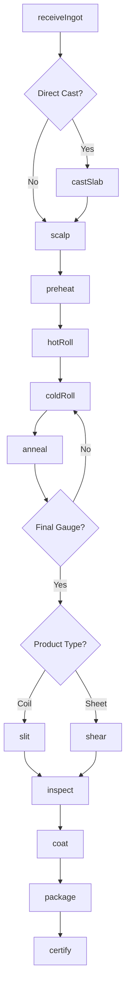
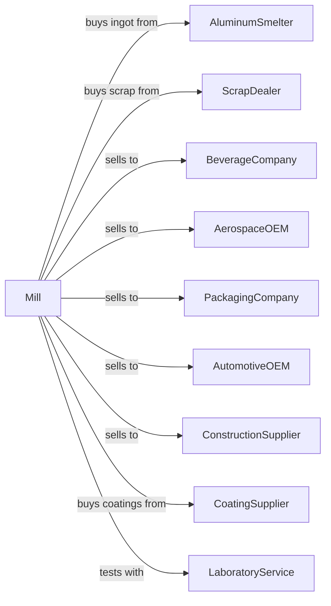

# Aluminum Sheet, Plate, and Foil Manufacturing

> Business-as-Code definition for aluminum flat rolling operations. Models the production of sheet, plate, and foil from aluminum ingots through rolling, annealing, and finishing.

## Overview

This U.S. industry comprises establishments primarily engaged in (1) flat rolling or continuous casting sheet, plate, foil and welded tube from purchased aluminum and/or (2) recovering aluminum from scrap and flat rolling or continuous casting sheet, plate, foil, and welded tube in integrated mills.

## Actors

| Actor | Description |
|-------|-------------|
| AluminumSmelter | Supplies primary ingot and slab for rolling |
| ScrapDealer | Provides aluminum scrap for secondary processing |
| BeverageCompany | Purchases can stock for beverage containers |
| AerospaceOEM | Purchases plate for aircraft structures |
| PackagingCompany | Purchases foil for flexible packaging |
| AutomotiveOEM | Purchases sheet for body panels and closures |
| ConstructionSupplier | Purchases sheet for building products |
| CoatingSupplier | Provides lubricants and surface treatments |
| EquipmentVendor | Supplies rolling mills and processing equipment |
| LaboratoryService | Provides metallurgical testing services |

## Roles

| Role | Description |
|------|-------------|
| PlantManager | Oversees rolling mill operations |
| RollingMillOperator | Controls hot and cold rolling equipment |
| CastingOperator | Operates continuous casting equipment |
| AnnealingOperator | Manages heat treatment furnaces |
| FinishingOperator | Operates slitting and cutting equipment |
| QualityEngineer | Tests mechanical properties and surface quality |
| MetallurgistEngineer | Controls alloy properties and grain structure |
| MaintenanceTechnician | Maintains mills and process equipment |

## Entities

| Entity | Description |
|--------|-------------|
| Ingot | Cast aluminum input for rolling |
| Slab | Flat cast form for hot rolling |
| Sheet | Flat product under 0.25 inch thick |
| Plate | Flat product over 0.25 inch thick |
| Foil | Very thin flat product under 0.006 inch |
| Coil | Rolled product wound on mandrel |
| Temper | Heat treatment condition designation |
| Gauge | Thickness measurement |
| Alloy | Specific aluminum composition |
| Surface | Finish quality designation |

## Actions

| Action | Description |
|--------|-------------|
| receiveIngot | Accept and verify incoming aluminum ingots |
| castSlab | Continuous cast molten aluminum into slab |
| scalp | Machine slab surfaces for quality |
| preheat | Heat slab to rolling temperature |
| hotRoll | Reduce thickness in hot rolling mill |
| coldRoll | Further reduce thickness in cold mill |
| anneal | Heat treat to achieve desired temper |
| slit | Cut wide coils to narrower widths |
| shear | Cut sheets to specified dimensions |
| levelCoil | Flatten coil for sheet conversion |
| inspect | Verify thickness, width, and surface quality |
| coat | Apply lubricants or protective coatings |
| package | Prepare coils and sheets for shipping |
| certify | Issue mill test reports |

## Events

| Event | Description |
|-------|-------------|
| ingotReceived | Material verified and accepted |
| slabCast | Continuous casting completed |
| slabScalped | Surfaces machined smooth |
| slabPreheated | Material at rolling temperature |
| hotRolled | Hot mill reduction completed |
| coldRolled | Cold mill reduction completed |
| annealed | Heat treatment completed |
| coilSlit | Coil cut to ordered width |
| sheetSheared | Sheets cut to size |
| leveledCoil | Coil flattened for sheet |
| inspected | Quality verification completed |
| coated | Surface treatment applied |
| packaged | Product prepared for shipping |
| certified | Test report issued |

## Searches

| Search | Description |
|--------|-------------|
| findIngotStock | List available ingot by alloy and size |
| getCoilInventory | Check coil stock by gauge and alloy |
| getOrders | Retrieve open orders by product type |
| getMillSchedule | View planned rolling campaigns |
| findTestReports | Retrieve mechanical test data |
| trackCoil | Locate coil through production |
| getYieldMetrics | View rolling efficiency statistics |
| getCapacity | Check available mill capacity |

## Workflow



## Actor Relationships



## Usage

### Calling Actions

```typescript
import { rollAluminumSheetPlateFoil } from '@headlessly/roll-aluminum-sheet-plate-foil'

const mill = rollAluminumSheetPlateFoil()

// Receive aluminum ingot
const ingot = await mill.receiveIngot({
  ingotId: 'ING-2024-5678',
  alloy: '3004',
  weight: 22000,
  dimensions: { length: 216, width: 60, height: 24 }
})

// Hot roll to transfer gauge
await mill.hotRoll({
  slabId: ingot.slabId,
  targetGauge: 0.200,
  temperature: 900,
  passes: 12
})

// Cold roll to final gauge
await mill.coldRoll({
  coilId: 'COIL-2024-1234',
  targetGauge: 0.0115,
  passes: 4,
  lubricant: 'rolling-oil'
})
```

### Event-Driven Automation

```typescript
// Auto-anneal after cold rolling
mill.coldRolled(async ({ coilId, gauge, hardness }) => {
  const order = await mill.getOrder(coilId)

  if (order.temper !== 'H19') {
    await mill.anneal({
      coilId,
      temperature: getAnnealTemp(order.temper),
      holdTime: getHoldTime(gauge)
    })
  }
})

// Auto-certify when inspection passes
mill.inspected(async ({ coilId, gauge, tensile, surface }) => {
  const spec = await mill.getSpecification(coilId)

  if (meetsSpec(gauge, tensile, surface, spec)) {
    await mill.certify({
      coilId,
      alloy: spec.alloy,
      temper: spec.temper,
      properties: { gauge, tensile }
    })
  }
})
```
