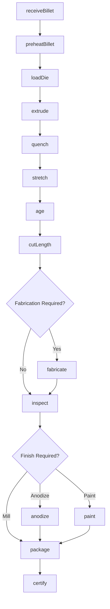
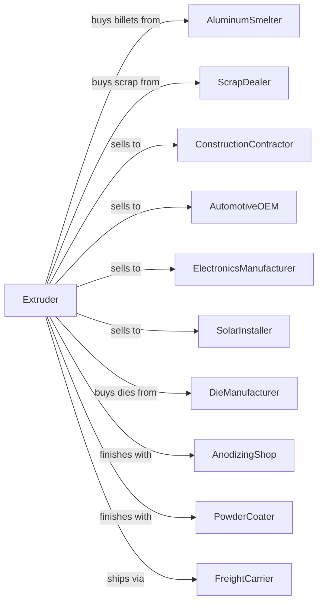

# Other Aluminum Rolling, Drawing, and Extruding

> Business-as-Code definition for aluminum extrusion and shape rolling operations. Models the production of profiles, bars, tubes, and wire from aluminum billets.

## Overview

This U.S. industry comprises establishments primarily engaged in (1) rolling, drawing, or extruding shapes (except flat rolled sheet, plate, foil, and welded tube) from purchased aluminum and/or (2) recovering aluminum from scrap and rolling, drawing, or extruding shapes in integrated mills.

## Actors

| Actor | Description |
|-------|-------------|
| AluminumSmelter | Supplies billets for extrusion |
| ScrapDealer | Provides aluminum scrap for recycling |
| ConstructionContractor | Purchases extrusions for windows and curtain walls |
| AutomotiveOEM | Purchases structural extrusions for vehicles |
| ElectronicsManufacturer | Purchases heat sinks and enclosures |
| SolarInstaller | Purchases frames for solar panels |
| DieManufacturer | Supplies extrusion dies |
| AnodizingShop | Provides surface finishing services |
| PowderCoater | Applies paint finishes to extrusions |
| FreightCarrier | Transports finished products |

## Roles

| Role | Description |
|------|-------------|
| PlantManager | Oversees extrusion operations |
| ExtrusionOperator | Operates extrusion press equipment |
| DieCorrector | Sets up and maintains extrusion dies |
| AgeingOperator | Manages heat treatment furnaces |
| FabricationOperator | Operates cutting and machining equipment |
| QualityInspector | Verifies dimensions and tolerances |
| MaintenanceTechnician | Maintains presses and handling equipment |
| ProductionScheduler | Plans press runs by alloy and profile |

## Entities

| Entity | Description |
|--------|-------------|
| Billet | Cylindrical cast aluminum input |
| Die | Tool that shapes extruded profile |
| Profile | Cross-sectional shape of extrusion |
| Extrusion | Shaped aluminum from press |
| Tube | Hollow extruded or drawn shape |
| Bar | Solid extruded shape |
| Wire | Drawn aluminum product |
| Temper | Heat treatment condition |
| RunoutTable | Cooling and stretching equipment |
| Lot | Production batch for traceability |

## Actions

| Action | Description |
|--------|-------------|
| receiveBillet | Accept and verify incoming billets |
| preheatBillet | Heat billet to extrusion temperature |
| loadDie | Install and heat extrusion die |
| extrude | Push heated billet through die |
| quench | Cool extrusion on runout table |
| stretch | Straighten and relieve stress |
| age | Heat treat to achieve final temper |
| cutLength | Saw extrusions to specified lengths |
| fabricate | Machine, punch, or bend extrusions |
| inspect | Verify dimensions and surface quality |
| anodize | Apply oxide coating for protection |
| paint | Apply powder coat finish |
| package | Prepare products for shipping |
| certify | Issue test reports and certifications |

## Events

| Event | Description |
|-------|-------------|
| billetReceived | Material verified and accepted |
| billetPreheated | Billet at extrusion temperature |
| dieLoaded | Die installed and heated |
| profileExtruded | Extrusion completed |
| extrusionQuenched | Cooling completed |
| extrusionStretched | Straightening completed |
| extrusionAged | Heat treatment completed |
| lengthsCut | Extrusions cut to size |
| partsFabricated | Secondary operations completed |
| inspected | Quality verification completed |
| anodized | Surface treatment completed |
| painted | Paint finish applied |
| packaged | Product prepared for shipping |
| certified | Documentation issued |

## Searches

| Search | Description |
|--------|-------------|
| findBilletStock | List available billets by alloy and size |
| getDieLibrary | Browse available extrusion dies |
| getOrders | Retrieve open orders by profile |
| getPressSchedule | View planned press runs |
| findTestReports | Retrieve mechanical test data |
| trackLot | Locate production lot through process |
| getYieldMetrics | View extrusion recovery statistics |
| getCapacity | Check available press capacity |

## Workflow



## Actor Relationships



## Usage

### Calling Actions

```typescript
import { extrudeAluminumShapes } from '@headlessly/extrude-aluminum-shapes'

const extruder = extrudeAluminumShapes()

// Receive aluminum billets
const billet = await extruder.receiveBillet({
  billetId: 'BLT-2024-8921',
  alloy: '6063',
  diameter: 8,
  length: 30,
  quantity: 50
})

// Extrude profile
await extruder.extrude({
  billetId: billet.id,
  dieId: 'DIE-CW-4521',
  profile: 'curtain-wall-mullion',
  pressSpeed: 25,
  exitTemperature: 980
})

// Age to T6 temper
await extruder.age({
  lotId: 'LOT-2024-0892',
  temperature: 350,
  holdTime: 480,
  targetTemper: 'T6'
})
```

### Event-Driven Automation

```typescript
// Auto-stretch after quenching
extruder.extrusionQuenched(async ({ lotId, profile, length }) => {
  await extruder.stretch({
    lotId,
    stretchPercent: calculateStretch(profile),
    finalLength: length * 1.005
  })
})

// Auto-schedule finishing when aged
extruder.extrusionAged(async ({ lotId, temper }) => {
  const order = await extruder.getOrder(lotId)

  if (order.finish === 'anodized') {
    await extruder.anodize({
      lotId,
      coatingThickness: order.anodizeSpec,
      color: order.anodizeColor
    })
  } else if (order.finish === 'painted') {
    await extruder.paint({
      lotId,
      color: order.paintColor,
      coatingType: 'AAMA-2604'
    })
  }
})
```
