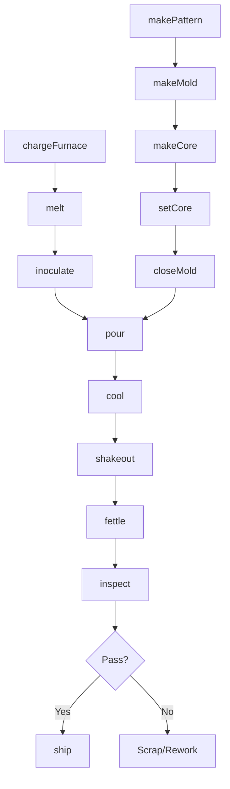
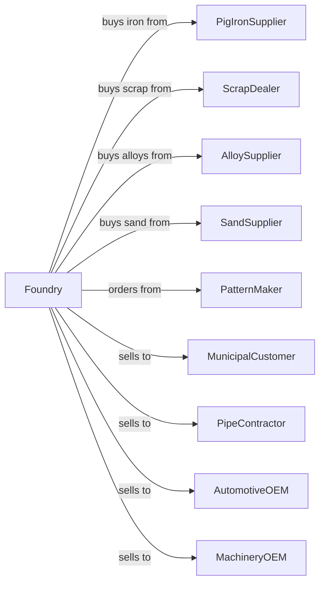

# Iron Foundries

> Business-as-Code definition for iron foundry operations. Models the production of gray iron, ductile iron, and malleable iron castings through sand and permanent mold processes.

## Overview

This U.S. industry comprises establishments primarily engaged in pouring molten pig iron or iron alloys into molds to manufacture castings (e.g., cast iron manhole covers, cast iron pipe, cast iron skillets). Establishments in this industry purchase iron made in other establishments.

## Actors

| Actor | Description |
|-------|-------------|
| PigIronSupplier | Supplies pig iron for melting |
| ScrapDealer | Provides cast iron and steel scrap |
| AlloySupplier | Provides ferrosilicon and inoculants |
| SandSupplier | Provides foundry sand and binders |
| PatternMaker | Fabricates patterns for sand molds |
| MunicipalCustomer | Purchases utility castings and infrastructure |
| PipeContractor | Purchases cast iron pipe and fittings |
| AutomotiveOEM | Purchases brake drums and engine blocks |
| MachineryOEM | Purchases industrial machine bases |
| HeatTreater | Provides annealing services for malleable iron |

## Roles

| Role | Description |
|------|-------------|
| FoundryManager | Oversees foundry operations |
| MeltSupervisor | Manages furnace operations and chemistry |
| CupolarOperator | Operates cupola furnace |
| MoldMaker | Produces sand molds from patterns |
| CoreMaker | Produces sand cores for hollow sections |
| Pourer | Controls molten metal pouring |
| ShakeoutOperator | Removes castings from molds |
| FettlingOperator | Cleans and finishes castings |
| Patternmaker | Crafts wood or metal patterns used to shape mold cavities |
| QualityInspector | Tests and inspects castings |

## Entities

| Entity | Description |
|--------|-------------|
| PigIron | Primary iron input material |
| Scrap | Recycled iron and steel |
| Melt | Batch of molten iron |
| Pattern | Template for creating mold cavity |
| Mold | Sand form for casting |
| Core | Sand insert for hollow sections |
| Casting | Solidified iron part |
| Gate | Channel for metal flow into mold |
| Riser | Reservoir feeding casting during solidification |
| Inoculant | Addition promoting graphite formation |

## Actions

| Action | Description |
|--------|-------------|
| chargeFurnace | Load pig iron, scrap, and alloys |
| melt | Liquefy charge in cupola or induction furnace |
| inoculate | Add graphite-promoting agents to melt |
| makePattern | Create or modify pattern for casting |
| makeMold | Form sand mold around pattern |
| makeCore | Produce sand cores for internal features |
| setCore | Position cores in mold cavity |
| closeMold | Assemble cope and drag halves |
| pour | Transfer molten iron into molds |
| cool | Allow castings to solidify |
| shakeout | Remove castings from sand |
| fettle | Remove gates, risers, and clean surface |
| inspect | Verify dimensions and soundness |
| ship | Dispatch finished castings |

## Events

| Event | Description |
|-------|-------------|
| furnaceCharged | Materials loaded for melting |
| ironMelted | Metal liquefied and ready |
| meltInoculated | Graphite treatment applied |
| patternCompleted | Pattern ready for use |
| moldMade | Sand mold produced |
| coresMade | Cores ready for setting |
| moldClosed | Mold assembled for pouring |
| metalPoured | Castings filled |
| castingsCooled | Solidification complete |
| castingsShaken | Castings removed from molds |
| castingsFettled | Cleaning completed |
| castingsInspected | Quality verified |
| castingsShipped | Products dispatched |

## Searches

| Search | Description |
|--------|-------------|
| findMaterialStock | List available iron and scrap |
| getOrders | Retrieve open orders by part number |
| getMoldSchedule | View planned molding runs |
| getPatternLibrary | Browse available patterns |
| findTestReports | Retrieve mechanical test data |
| trackCasting | Locate castings through production |
| getYieldMetrics | View pouring yield statistics |
| getCapacity | Check available melt and mold capacity |

## Workflow



## Actor Relationships



## Usage

### Calling Actions

```typescript
import { castIronFoundries } from '@headlessly/cast-iron-foundries'

const foundry = castIronFoundries()

// Charge and melt iron
await foundry.chargeFurnace({
  furnaceId: 'CUPOLA-1',
  pigIron: { pounds: 2000, grade: 'foundry-pig' },
  scrap: { pounds: 3000, type: 'clean-cast' },
  ferrosilicon: { pounds: 100, grade: '75%' }
})

const melt = await foundry.melt({
  furnaceId: 'CUPOLA-1',
  targetTemperature: 2700,
  targetCarbon: 3.4
})

// Pour castings
await foundry.pour({
  meltId: melt.id,
  moldIds: ['M-2024-001', 'M-2024-002', 'M-2024-003'],
  pouringTemperature: 2650,
  inoculant: 'ferrosilicon-barium'
})
```

### Event-Driven Automation

```typescript
// Auto-inoculate when melt ready
foundry.ironMelted(async ({ meltId, temperature, chemistry }) => {
  if (chemistry.carbon >= 3.2) {
    await foundry.inoculate({
      meltId,
      inoculant: 'ferrosilicon-barium',
      rate: 0.3
    })
  }
})

// Auto-schedule shakeout when cooled
foundry.metalPoured(async ({ moldId, partWeight }) => {
  const coolingTime = calculateCoolingTime(partWeight)

  setTimeout(async () => {
    await foundry.shakeout({
      moldId,
      line: 'shakeout-1'
    })
  }, coolingTime * 60000)
})
```
